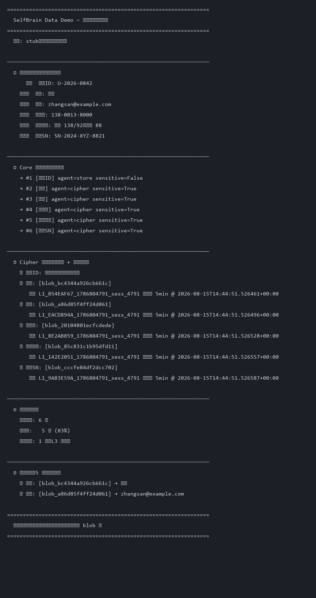

# SelfBrain - AI 隐私保护层

> "Your AI, Your Control" — 让企业完全掌控自己的 AI 使用

SelfBrain 是一个本地运行的 AI 隐私保护层，通过**架构分片 + 动态加密**实现银行级数据安全，并集成记忆管理能力实现智能 Token 优化。

## 核心架构

本地轻量模型引擎（微调策略注入），多组件协同：

```
本地模型引擎（Core 总调度）
├── 量化版引擎（Data Broker，Core 的量化版）
├── 轻量模型（Navigator，记忆检索）
└── 轻量模型（Cipher，加密分析）
```

- **Core** — 总调度：任务分解、策略融合
- **Navigator** — 记忆检索：语义查询 → 数据位置映射
- **Cipher** — 加密分析：动态密码生成与解密
- **Broker** — 数据协调：提取/加密/外部通信（策略校验）

## 核心创新

1. **多组件协同架构** — Navigator + Cipher + Data Broker 协同工作
2. **动态密码系统** — 类银行 U 盾，定期自动过期
3. **记忆管理集成** — 智能 Token 优化，降低调用成本
4. **可视化 Dashboard** — 实时安全监控

## 项目结构

```
SelfBrain/
├── .specs/          # 项目规格（02-goai-adapt：参赛工程证据）
├── src/             # 源代码（sb_api 桥接层 + agents + skills）
├── tests/           # 测试
├── agent_teams_sdk/ # 内置 AgentTeams 框架（自包含）
├── CHANGELOG.md     # 变更日志
├── LESSONS.md       # 经验教训
└── README.md        # 本文件
```

## 运行入口

```bash
pip install -e .            # 安装（框架内置）
python src/demo.py          # 运行 Demo（stub 引擎，无需闭源核心）
pytest                      # 运行全部测试
```

### 依赖

- Python >= 3.10
- 内置 agent_teams_sdk 框架（本仓库包含）
- 闭源引擎可选：`SB_SELFBRAIN_SRC` 环境变量注入主项目源码路径

### 样例输入输出

Demo 展示隐私保护多 Agent 协同闭环：用户请求 → Privacy Guardian 发布任务到黑板 → Workers（Memory Navigator / Cipher Generator 等）分工执行 → Validator 核查 → 整合返回。

**数据隐私保护闭环（真实运行截图，stub 模式零模型）**：



```bash
# 一键复现
python scripts/data_demo.py   # 或 python src/demo.py "我的隐私数据存在哪里"
```

### 运行证据

```
pytest
# 195 passed, 88% coverage
```

### 黑盒说明

本仓库**不包含**核心引擎源码与模型权重。评审运行 Demo 和测试无需闭源引擎：stub 模式零模型加载零推理；`--real` 模式通过 `SB_SELFBRAIN_SRC` 注入真实引擎，加载失败优雅降级回 stub。

### 品牌

- 对外品牌：**SelfBrain**
- 技术包名：selfbrain-goai

## License

Apache-2.0
