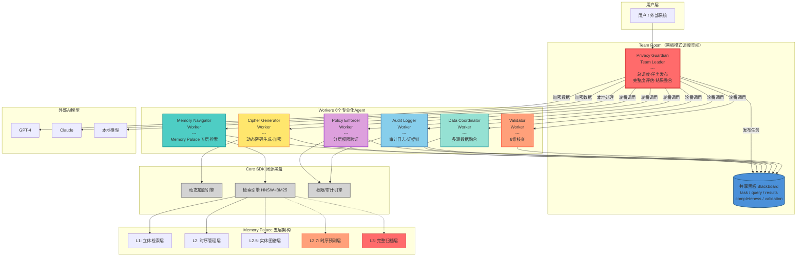
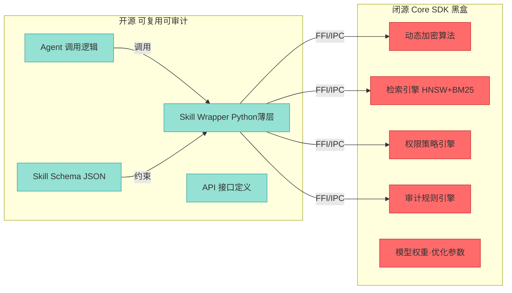
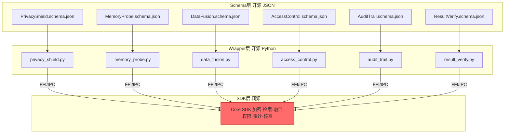
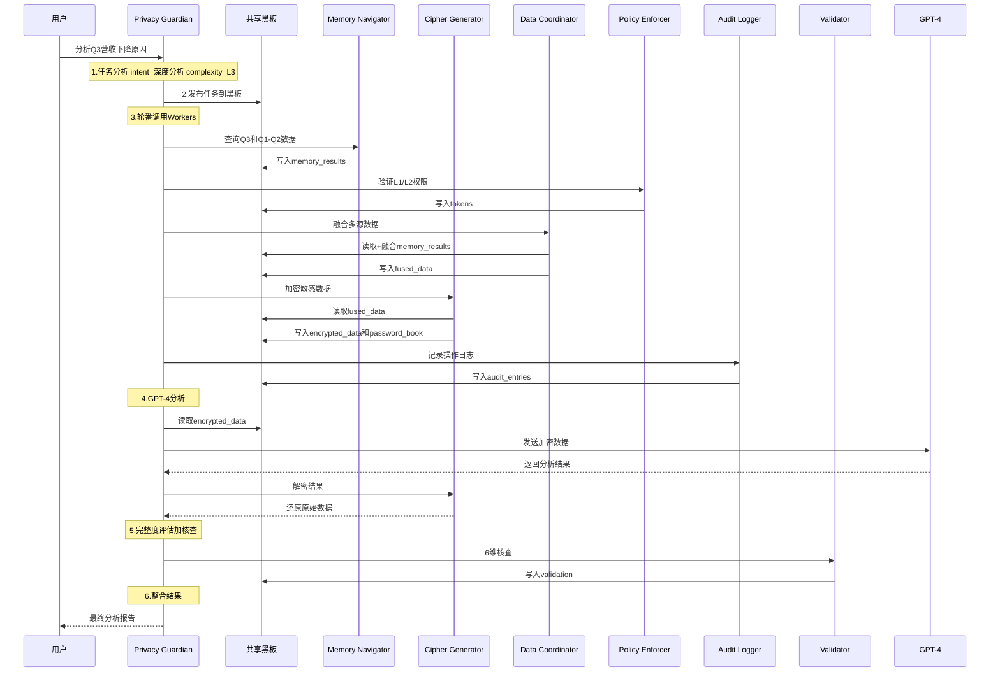

# 第2章：核心架构

**版本**: v2.0  
**更新日期**: 2026-08-03  
**重大变更**: 架构从「4组件」升级为「7-Agent + 黑板模式」

---

## 本章概述

本章阐述 SelfBrain 作为**隐私保护的多Agent协同系统（AgentInfra）**的整体架构设计，展示7个专业化Agent如何通过黑板模式（Team Room + 共享黑板）协同工作，实现银行级数据保护、智能Token优化和可复用Skill沉淀。

**核心内容**：
- 7-Agent + 黑板模式整体架构图
- Privacy Guardian（Team Leader）+ 6 Workers 协同机制
- 6-Skill 体系（Schema + Wrapper + SDK 三层）
- 开源/闭源边界划分
- 数据流转完整流程
- 插件化设计哲学与可插拔机制
- Memory Palace 深度集成
- ADR 决策记录

---

## 2.1 整体架构图

### 2.1.1 7-Agent + 黑板模式协同架构

SelfBrain 采用 **AgentTeams 黑板模式**，将复杂的AI数据保护任务分解为7个专业化Agent。每个Agent通过**共享黑板（Blackboard）**进行信息交互，由 **Privacy Guardian（Team Leader）** 统一调度和完整度评估。

> **架构演进说明**：从 v1.0 的4组件架构（Core + Broker + Navigator + Cipher）升级为7-Agent架构，以满足多Agent协同设计要求，同时保持核心隐私保护能力不变。详见 [ADR-001](#27-adr-决策记录)。



### 2.1.2 架构设计原则

**1. 黑板模式（Team Room + 共享黑板）**

所有Agent通过共享黑板进行信息交互，避免直接耦合：

| 机制 | 说明 | 优势 |
|------|------|------|
| **Team Room** | 调度空间，Privacy Guardian 统一管理 | 单一入口，清晰职责链 |
| **共享黑板** | 结构化状态：task / results / completeness | 松耦合，可观测，易扩展 |
| **轮番喊人** | Leader 按需调用 Workers | 最小化资源占用 |
| **完整度评估** | Leader 检查黑板状态，决定是否补充 | 确保结果质量 |

**2. 专业化分工**

| Agent | 核心职责 | 不负责的事情 |
|-------|----------|-------------|
| **Privacy Guardian** | 总调度、黑板发布、完整度评估 | ❌ 不做具体记忆、加密 |
| **Memory Navigator** | Memory Palace 五层检索 | ❌ 不做数据加密 |
| **Cipher Generator** | 动态密码生成、加密/解密 | ❌ 不做数据检索 |
| **Data Coordinator** | 多源数据融合、智能路由 | ❌ 不做复杂推理 |
| **Policy Enforcer** | 分层权限验证 | ❌ 不做数据加密 |
| **Audit Logger** | 审计日志、证据链 | ❌ 不做业务逻辑 |
| **Validator** | 结果一致性6维核查 | ❌ 不做数据检索 |

**3. 最小权限原则**

- 外部模型（GPT-4/Claude）：只能访问 L1/L2/L2.5
- SelfBrain 独占：L2.7（预测）+ L3（完整归档）
- 动态令牌：按任务分配，5分钟过期，精确到 key 级别
- Policy Enforcer 逐次验证，Audit Logger 全程记录

**4. 渐进式处理**

```
简单查询：
User → Privacy Guardian → 发布黑板 → Memory Navigator → 返回
(延迟: 50-100ms)

复杂分析：
User → Privacy Guardian → 发布黑板 → Memory Navigator + Cipher Generator + Data Coordinator
→ Policy Enforcer(权限验证) → Cipher(加密) → GPT-4(分析) → Cipher(解密)
→ Validator(6维核查) → Audit Logger(记录) → Privacy Guardian(整合) → 返回
(延迟: 2-5秒)
```

### 2.1.3 开源/闭源边界

SelfBrain 采用**开源接口 + 闭源核心**的黑盒保护策略：



| 层级 | 内容 | 状态 | 说明 |
|------|------|------|------|
| **Agent 调用逻辑** | Agent 定义、调度流程、黑板交互协议 | 🟢 开源 | 社区可审计、可贡献 |
| **Skill Schema** | JSON 格式的输入/输出规范 | 🟢 开源 | 标准化接口定义 |
| **Skill Wrapper** | Python 薄层（参数验证 + 调用 SDK） | 🟢 开源 | 可替换、可扩展 |
| **Core SDK** | 加密/检索/权限/审计核心算法 | 🔴 闭源 | .so/.dll 二进制 |
| **模型权重** | Navigator/Cipher/Coordinator 模型参数 | 🔴 闭源 | 6-24 个月追赶窗口 |

### 2.1.4 显存占用与硬件要求

**7-Agent 模型配置**：

| Agent | 角色 | 参数量 | 精度 | 显存占用 |
|-------|------|--------|------|---------|
| Privacy Guardian | Team Leader | 3B | FP16 | 6.0 GB |
| Memory Navigator | Worker | 1.5B | INT4 | 0.75 GB |
| Cipher Generator | Worker | 1.5B | INT4 | 0.75 GB |
| Data Coordinator | Worker | 3B (VibeThinker) | INT4 | ~1.5 GB |
| Policy Enforcer | Worker | 规则引擎 | - | 轻量 |
| Audit Logger | Worker | 日志引擎 | - | 轻量 |
| Validator | Worker | 核查引擎 | - | 轻量 |
| **总计** | **7 Agents** | **~6B** | **混合** | **≤ 9 GB** |

**推荐硬件**：

```
最低配置：
- GPU: RTX 4060 Ti 8GB（需INT4量化）
- RAM: 16GB
- 存储: 20GB SSD

推荐配置：
- GPU: RTX 4070 12GB
- RAM: 32GB
- 存储: 50GB NVMe SSD

企业配置：
- GPU: RTX 4090 24GB / A100 40GB
- RAM: 64GB+
- 存储: 100GB+ NVMe RAID
```

## 2.2 七Agent详解

### 2.2.1 Privacy Guardian：Team Leader（总调度）

**定位**: 整个系统的"大脑"，作为 Team Leader 接收用户请求、发布任务到黑板、轮番调度 Workers、评估完整度并整合结果。

**核心职责**:

1. **请求接收与分析**: 深度解析用户查询意图，评估复杂度和敏感度
2. **任务发布**: 将子任务写入共享黑板（Blackboard）
3. **Worker 调度**: 按需轮番调用6个Workers
4. **完整度评估**: 检查黑板上结果的完整性，决定是否需要补充调用
5. **结果整合**: 融合多源数据，生成最终响应

**黑板模式工作流**:

```python
class PrivacyGuardian:
    """Team Leader — 调度黑板模式的核心逻辑"""

    def process_request(self, user_query: str, session_id: str) -> str:
        # 步骤1: 任务分析
        analysis = self.analyze_query(user_query)

        # 步骤2: 发布任务到黑板
        self.blackboard.publish({
            "task_type": analysis["intent"],
            "user_query": user_query,
            "session_id": session_id,
            "sensitivity": analysis["sensitivity"],
            "results": {},
            "completeness": 0.0
        })

        # 步骤3: 轮番喊 Workers
        self._dispatch_workers(analysis)

        # 步骤4: 评估完整度
        while self.blackboard.completeness < 1.0:
            missing = self.blackboard.get_missing_tasks()
            self._dispatch_workers_for(missing)

        # 步骤5: 整合结果
        return self._integrate_results()

    def _dispatch_workers(self, analysis: dict):
        """按需调用 Workers"""
        self.memory_navigator.execute(analysis["data_requirements"])
        self.policy_enforcer.validate(analysis["permissions"])
        if analysis["requires_external_model"]:
            self.cipher_generator.encrypt_sensitive_data()
        self.data_coordinator.fuse(analysis["sources"])
        self.audit_logger.log(analysis["action"])
```

**为什么需要 3B 参数**:

| 决策能力 | 1.5B 表现 | 3B 表现 | 差距 |
|---------|----------|---------|------|
| 意图理解准确率 | 82% | 95% | +13% |
| Worker 路由准确率 | 78% | 94% | +16% |
| 完整度评估准确率 | 70% | 90% | +20% |
| 多步骤任务分解 | 勉强 | 流畅 | 质的差距 |

### 2.2.2 Memory Navigator：记忆导航员

**定位**: 维护 Memory Palace 五层架构的完整地图，<50ms 定位任意数据。

**核心能力**:

1. **地图记忆**: 学习五层架构的完整结构
2. **语义搜索**: "Q3营收" = "第三季度收入"
3. **路径查询**: 输入查询 → 输出精确路径
4. **增量学习**: LoRA 微调，每1000次查询优化一次

**查询示例**:

```python
class MemoryNavigator:
    """Worker — Memory Palace 五层检索"""

    def execute(self, data_requirements: list):
        results = {}
        for req in data_requirements:
            path, confidence = self.locate(req["query"], req.get("layer"))
            data = self.memory_palace.read(path)
            results[req["id"]] = {
                "data": data, "path": path, "confidence": confidence
            }
        self.blackboard.update("memory_results", results)

# 查询示例
navigator.locate("今天的会议安排")
# → ("L1/schedule/meetings/2026-08-03", 0.95)

navigator.locate("过去三个月销售趋势")
# → ("L2/sales/trend/2026_Q2_Q3", 0.92)

navigator.locate("和张三合作过的所有项目")
# → ("L2.5/relationships/person/张三/projects", 0.88)
```

**三级缓存架构**:

```
L1缓存（内存）：1000条热点查询，命中率60%，<1ms
└─ 未命中 ↓
L2缓存（Redis）：10000条历史查询，命中率30%，<10ms
└─ 未命中 ↓
L3搜索（向量）：完整地图，命中率100%，<50ms
```

### 2.2.3 Cipher Generator：密码生成器

**定位**: 类银行U盾的动态密码系统，负责密码生成、数据加密/解密。

**密码结构**:

```
标准格式：{TYPE}_{RANDOM}_{TIMESTAMP}_{SESSION}
示例：AMOUNT_C3D9F2_T1722240900_S7A4B

分层格式：{LAYER}_{TYPE}_{RANDOM}_{TIMESTAMP}_{SESSION}
示例：L2_REVENUE_8E2F91_T1722240905_S7A4B
```

**安全保证**:
- ✅ 密码不可预测（CSPRNG）
- ✅ 密码不可逆推（单向映射）
- ✅ 密码不可重放（时间戳+会话ID）
- ✅ 密码自动过期（5分钟TTL）
- ✅ 密码使用后销毁（一次性）

**加密示例**:

```python
class CipherGenerator:
    """Worker — 动态密码生成与加密"""

    def encrypt_sensitive_data(self):
        memory_results = self.blackboard.get("memory_results")
        encrypted_map = {}
        for key, item in memory_results.items():
            if item.get("sensitivity") != "public":
                encrypted = self.encrypt(str(item["data"]), layer=item["layer"])
                encrypted_map[key] = encrypted
        self.blackboard.update("encrypted_data", encrypted_map)
        self.blackboard.update("password_book", self.password_book)
```

**会话隔离**:

```python
cipher_a = MEMOCipher(session_id="AAA")
pwd_a = cipher_a.encrypt("敏感数据")
# 输出: TEXT_X1Y2Z3_T..._SAAA

cipher_b = MEMOCipher(session_id="BBB")
pwd_b = cipher_b.encrypt("敏感数据")
# 输出: TEXT_A4B5C6_T..._SBBB

# 密码完全不同，互相无法解密
assert pwd_a != pwd_b
```

### 2.2.4 Data Coordinator：数据协调员

**定位**: 负责多源数据的智能路由、格式转换和融合。

```python
class DataCoordinator:
    """Worker — 多源数据融合"""

    def fuse(self, sources: list):
        fused = {}
        for source in sources:
            intent = self.classify_intent(source["query"])
            layers = self.route(intent)
            results = {}
            for layer in layers:
                data = self.blackboard.get("memory_results", source["id"])
                results[layer] = data
            fused[source["id"]] = self.fuse_results(results)
        self.blackboard.update("fused_data", fused)

    def route(self, intent: str) -> list:
        routing_rules = {
            "RETRIEVE_RECENT": ["L1"],
            "RETRIEVE_HISTORICAL": ["L1", "L2"],
            "RETRIEVE_RELATED": ["L2.5"],
            "ANALYZE_TREND": ["L2"],
            "ANALYZE_COMPARISON": ["L1", "L2", "L2.5"],
        }
        return routing_rules.get(intent, ["L1"])
```

**性能指标**: 延迟 <50ms | 路由准确率 >95% | 吞吐量 >200 QPS

### 2.2.5 Policy Enforcer：策略执行器

**定位**: 逐次验证每个操作的权限，确保最小权限原则。

```python
class PolicyEnforcer:
    """Worker — 分层权限验证"""

    def validate(self, permissions: dict):
        for operation in permissions["operations"]:
            layer = operation["layer"]
            requester = operation["requester"]

            if layer in ["L2.7", "L3"] and requester != "SelfBrain":
                self.blackboard.update("permission_denied", {
                    "operation": operation,
                    "reason": f"{requester} cannot access {layer}"
                })
                continue

            token = self.allocate_token(
                task=operation, requester=requester,
                allowed_layers=[layer], allowed_keys=operation["keys"],
                ttl_minutes=5
            )
            self.blackboard.update("tokens", {operation["id"]: token})
```

**权限矩阵**:

| 层级 | GPT-4 | Claude | SelfBrain | 加密要求 |
|------|-------|--------|-----------|---------|
| **L1** 立体检索 | ✅ | ✅ | ✅ | ❌ |
| **L2** 时序管理 | ✅ | ✅ | ✅ | ✅ |
| **L2.5** 实体图谱 | ✅ | ✅ | ✅ | ✅ |
| **L2.7** 时序预测 | ❌ | ❌ | ✅ 独占 | ✅ |
| **L3** 完整归档 | ❌ | ❌ | ✅ 独占 | ✅ |

### 2.2.6 Audit Logger：审计日志

**定位**: 全程记录所有操作，形成完整证据链，支持合规审计。

```python
class AuditLogger:
    """Worker — 审计日志与证据链"""

    def log(self, action: dict):
        entry = {
            "timestamp": datetime.utcnow().isoformat(),
            "session_id": action["session_id"],
            "action": action["type"],
            "agent": action["agent"],
            "target": action.get("target"),
            "result": action.get("result"),
            "permissions_used": action.get("tokens", []),
            "ip_hash": hash(action.get("ip", "")),
        }
        self.audit_store.append(entry)
        self.blackboard.update("audit_entries", [entry])
```

### 2.2.7 Validator：结果验证器

**定位**: 对最终结果进行6维一致性核查，确保输出质量。

```python
class Validator:
    """Worker — 结果一致性6维核查"""

    def validate(self, results: dict) -> dict:
        checks = {
            "accuracy": self._check_accuracy(results),
            "completeness": self._check_completeness(results),
            "consistency": self._check_consistency(results),
            "timeliness": self._check_timeliness(results),
            "relevance": self._check_relevance(results),
            "security": self._check_security(results),
        }
        overall_score = sum(checks.values()) / len(checks)
        validation_result = {
            "checks": checks,
            "overall_score": overall_score,
            "passed": overall_score >= 0.8,
        }
        self.blackboard.update("validation", validation_result)
        return validation_result
```

**6维核查标准**:

| 维度 | 检查内容 | 权重 | 阈值 |
|------|---------|------|------|
| **准确性** | 数据与Memory Palace源一致 | 25% | ≥95% |
| **完整性** | 所有必需数据已获取 | 20% | ≥90% |
| **一致性** | 多源数据无矛盾 | 15% | ≥95% |
| **时效性** | 使用最新数据版本 | 10% | ≤5分钟 |
| **相关性** | 结果与查询意图匹配 | 15% | ≥85% |
| **安全性** | 无数据泄露，权限合规 | 15% | 100% |

---

## 2.3 6-Skill体系

SelfBrain 将核心能力沉淀为6个可复用Skill，每个Skill采用 **Schema + Wrapper + SDK** 三层架构。

### 2.3.1 Skill 清单

| Skill | 功能 | 对应Agent | Schema (开源) | Wrapper (开源) | SDK (闭源) |
|-------|------|-----------|---------------|----------------|------------|
| **PrivacyShield** | 银行级动态加密 | Cipher Generator | 输入/输出JSON | Python参数验证 | 加密算法核心 |
| **MemoryProbe** | 五层检索 | Memory Navigator | 查询/结果JSON | Python检索封装 | HNSW+BM25+RRF |
| **DataFusion** | 多源数据融合 | Data Coordinator | 数据源JSON | Python融合封装 | 融合算法核心 |
| **AccessControl** | 分层权限验证 | Policy Enforcer | 权限/令牌JSON | Python验证封装 | 权限策略引擎 |
| **AuditTrail** | 审计日志+证据链 | Audit Logger | 日志/查询JSON | Python日志封装 | 审计规则引擎 |
| **ResultVerify** | 结果一致性检查 | Validator | 核查/结果JSON | Python核查封装 | 6维核查规则 |

### 2.3.2 三层架构详解



| 层级 | 语言/格式 | 职责 | 开源状态 |
|------|----------|------|---------|
| **Schema** | JSON Schema | 定义输入/输出格式、约束、版本 | 🟢 开源 |
| **Wrapper** | Python | 参数验证、错误处理、调用SDK API | 🟢 开源 |
| **SDK** | .so/.dll | 核心算法实现 | 🔴 闭源 |

### 2.3.3 Skill 调用示例

```python
# Schema: PrivacyShield.schema.json
{
    "name": "PrivacyShield",
    "version": "1.0.0",
    "input": {
        "data": {"type": "string", "description": "原始敏感数据"},
        "layer": {"type": "string", "enum": ["L1","L2","L2.5","L2.7","L3"]},
        "session_id": {"type": "string"}
    },
    "output": {
        "encrypted": {"type": "string"},
        "token": {"type": "string", "description": "解密令牌 5分钟TTL"}
    }
}

# Wrapper: privacy_shield.py
class PrivacyShieldWrapper:
    def __init__(self):
        self.sdk = load_sdk("privacy_shield")  # 加载闭源 .so/.dll

    def execute(self, data: str, layer: str, session_id: str) -> dict:
        assert layer in ["L1","L2","L2.5","L2.7","L3"]
        assert len(session_id) > 0
        result = self.sdk.encrypt(data, layer, session_id)
        return {"encrypted": result.ciphertext, "token": result.token}
```

---

## 2.4 数据流转流程

### 2.4.1 完整查询处理流程（黑板模式）

**案例场景**: 用户查询"分析2026年Q3营收下降原因"



### 2.4.2 分步详解

**步骤1: 任务分析（Privacy Guardian）**

```python
analysis = {
    "intent": "analysis",
    "complexity": "Level 3",
    "data_requirements": [
        {"type": "quick_lookup", "query": "Q3营收"},
        {"type": "trend_analysis", "query": "Q1-Q3营收趋势"}
    ],
    "sensitivity": "high",
    "requires_external_model": True,
    "encryption_required": True,
    "permissions": {
        "operations": [
            {"id": "op_1", "layer": "L1", "requester": "SelfBrain", "keys": ["revenue.Q3.*"]},
            {"id": "op_2", "layer": "L2", "requester": "SelfBrain", "keys": ["revenue.trend.*"]}
        ]
    }
}
```

**步骤2-4: Workers 执行（通过黑板交互）**

```python
# Memory Navigator — 从黑板读取需求，写入结果
navigator.execute(analysis["data_requirements"])
# → blackboard.memory_results = {
#   "Q3营收": {"data": {"revenue": 4200000}, "path": "L1/finance/revenue/2026_Q3"},
#   "Q1-Q2趋势": {"data": {"Q1": 4300000, "Q2": 4500000}, "path": "L2/finance/revenue/trend"}
# }

# Policy Enforcer — 验证权限，分配令牌
policy_enforcer.validate(analysis["permissions"])
# → blackboard.tokens = {"op_1": token_L1, "op_2": token_L2}

# Data Coordinator — 从黑板读取，融合后写回
data_coordinator.fuse(analysis["data_requirements"])
# → blackboard.fused_data = {"Q3": ..., "trend": ...}

# Cipher Generator — 加密敏感数据
cipher_generator.encrypt_sensitive_data()
# → blackboard.encrypted_data = {"Q3": "L1_AMOUNT_C3D9F2_...", ...}
```

**步骤5: GPT-4 分析（Privacy Guardian 直接调用）**

```python
# Guardian 从黑板读取加密数据，发送给 GPT-4
prompt = f"""
分析以下营收数据的下降原因：
当前季度：{encrypted_q3}
历史对比：Q1: {encrypted_q1}, Q2: {encrypted_q2}
"""
# GPT-4 看到的是加密密码，看不到原始数据
```

**步骤6: 解密 + 核查 + 整合**

```python
# Cipher Generator 解密
decrypted = cipher_generator.decrypt_text(gpt4_response)

# Validator 6维核查
validation = validator.validate(results)
# → {"overall_score": 0.96, "passed": True}

# Privacy Guardian 整合最终报告
report = guardian._integrate_results()
```

### 2.4.3 导师模型咨询流程

当 Privacy Guardian 遇到自身能力边界之外的问题时，触发导师模型咨询：

```python
class MentorConsultation:
    def should_consult_mentor(self, analysis: dict) -> bool:
        """条件: 高复杂度 + 低置信度 + 低敏感度"""
        return (analysis["complexity"] >= 4
                and analysis["confidence"] < 0.7
                and analysis["sensitivity"] == "low")

    def consult(self, abstract_question: dict) -> dict:
        """发送抽象化问题给导师，去除所有敏感数据"""
        assert "revenue" not in str(abstract_question)
        assert "company_name" not in str(abstract_question)
        return self.mentor_api.call(abstract_question)
```

**导师模型 vs 执行引擎**:

| 维度 | 导师模型 | 执行引擎 |
|------|---------|---------|
| **调用时机** | Guardian不确定如何做时 | Guardian确定需要外部算力时 |
| **发送内容** | 抽象化问题（不含敏感数据） | 加密后的数据 |
| **期望返回** | 方法论/策略/步骤指导 | 分析结果/代码/内容 |
| **数据泄露风险** | 零（不发送数据） | 有（需加密保护） |

---

## 2.5 插件化设计哲学

### 2.5.1 外部黑盒原则

对外部用户和企业，SelfBrain 是一个统一的**多Agent协同系统**黑盒，内部的7-Agent结构完全透明。

```
用户视角（外部黑盒）：
┌─────────────────────────────────────┐
│   SelfBrain AgentInfra              │
│   输入：用户查询                     │
│   输出：智能响应                     │
│   特性：隐私保护·Token优化·多Agent   │
└─────────────────────────────────────┘

实际架构（内部可插拔）：
┌─────────────────────────────────────┐
│  Privacy Guardian (Team Leader)     │
├─────────────────────────────────────┤
│  插件槽1: Memory Navigator          │
│  插件槽2: Cipher Generator          │
│  插件槽3: Data Coordinator          │
│  插件槽4: Policy Enforcer           │
│  插件槽5: Audit Logger              │
│  插件槽6: Validator                 │
└─────────────────────────────────────┘
```

### 2.5.2 内部可插拔机制

**Agent 插件标准接口**:

```python
from abc import ABC, abstractmethod

class AgentPluginBase(ABC):
    """Agent 插件基类"""

    @abstractmethod
    def initialize(self, config: dict, blackboard: Blackboard):
        """初始化插件，注入黑板引用"""
        pass

    @abstractmethod
    def execute(self, task: dict) -> dict:
        """执行任务，从黑板读取输入，将结果写回黑板"""
        pass

    @abstractmethod
    def get_metadata(self) -> dict:
        """返回插件元数据"""
        pass

    @abstractmethod
    def shutdown(self):
        """清理资源"""
        pass
```

**插件管理器**:

```python
class AgentPluginManager:
    """Agent 插件管理器（支持热重载）"""

    def __init__(self, blackboard: Blackboard):
        self.blackboard = blackboard
        self.loaded_agents = {}

    def load_agent(self, name: str, plugin_path: str) -> bool:
        try:
            model = self._load_model(plugin_path)
            if not self._validate_interface(model, AgentPluginBase):
                raise ValueError(f"插件 {name} 接口不兼容")
            model.initialize(self._get_config(name), self.blackboard)
            self.loaded_agents[name] = model
            return True
        except Exception as e:
            print(f"加载失败: {e}")
            return False

    def reload_agent(self, name: str) -> bool:
        self.unload_agent(name)
        return self.load_agent(name, self.plugin_registry[name]["path"])
```

### 2.5.3 企业定制化能力

| 场景 | 定制内容 | 技术路径 |
|------|---------|---------|
| **金融机构** | 学习内部财务术语 | 微调 Memory Navigator |
| **医疗机构** | 学习医学专业词汇 | 微调 Navigator + 自定义索引 |
| **法律机构** | 学习法律案例结构 | 自训练 Navigator |
| **制造企业** | 特定加密规则 | 自定义 Cipher Generator 规则 |

### 2.5.4 Agent 隔离和安全

**隔离机制**:

1. **资源限制**: 每个Agent插件最多使用4GB显存
2. **超时保护**: 单次调用最多30秒
3. **异常捕获**: Agent崩溃不影响Guardian
4. **权限控制**: Agent只能读写黑板上授权的key
5. **黑板隔离**: 每个Agent只能看到黑板上与其相关的部分

```python
class AgentSandbox:
    def execute_in_sandbox(self, agent_name: str, func, *args, **kwargs):
        with self._resource_limiter(max_gb=4):
            with self._timeout_protection(30):
                try:
                    result = func(*args, **kwargs)
                    return {"success": True, "result": result}
                except Exception as e:
                    self.audit_logger.log_error(agent_name, e)
                    return {"success": False, "error": str(e)}
```

---

## 2.6 与Memory Palace集成

### 2.6.1 五层权限架构

Memory Palace 的五层架构通过 **Policy Enforcer** + **Cipher Generator** 实现深度集成。

| 层级 | 名称 | 数据类型 | 访问权限 | 加密要求 |
|------|------|---------|---------|---------|
| **L1** | 立体检索 | 索引、摘要 | 所有模型 | ❌ 不加密 |
| **L2** | 时序管理 | 趋势、历史 | 所有模型 | ✅ 需加密 |
| **L2.5** | 实体图谱 | 关系、网络 | 所有模型 | ✅ 需加密 |
| **L2.7** | 时序预测 | 预测数据 | ⭐ 仅SelfBrain | ✅ 需加密 |
| **L3** | 完整归档 | 原始数据 | ⭐⭐⭐ 仅SelfBrain | ✅ 需加密 |

### 2.6.2 动态访问策略

**核心原则**: 按任务分配权限，精确到 key 级别，5分钟过期。

```python
class DynamicAccessControl:
    """Policy Enforcer 的动态访问控制核心"""

    def allocate_token(self, task: dict, requester: str) -> AccessToken:
        required_data = self._analyze_requirements(task)
        min_layers = self._calculate_min_layers(required_data)
        specific_keys = self._extract_keys(required_data)

        return AccessToken(
            allowed_layers=min_layers,
            allowed_keys=specific_keys,  # 精确到 key
            issued_at=datetime.now(),
            expires_at=datetime.now() + timedelta(minutes=5),
            session_id=task["session_id"],
        )
```

**对比传统方式**:

| 对比项 | 传统固定权限 | SelfBrain 动态令牌 |
|--------|-------------|-------------------|
| **粒度** | 整层（L1+L2全部） | 精确到 key |
| **时效** | 永久或长期 | 5分钟过期 |
| **隔离** | 所有任务共享 | 每个任务独立 |
| **风险** | 高（过度授权） | 低（最小权限） |

### 2.6.3 L2.7和L3的独占访问

**为什么需要独占**:

- **L2.7（时序预测层）**: 存储未来趋势预测，外部模型可能泄露预测逻辑
- **L3（完整归档层）**: 存储完整原始数据，外部模型绝对不能看到

**独占访问由 Policy Enforcer 强制执行**:

```python
class ExclusiveLayerGuard:
    EXCLUSIVE_LAYERS = ["L2.7", "L3"]
    AUTHORIZED_ACCESSOR = "SelfBrain"

    @classmethod
    def validate_access(cls, layer: str, requester: str) -> bool:
        if layer not in cls.EXCLUSIVE_LAYERS:
            return True
        if requester == cls.AUTHORIZED_ACCESSOR:
            return True
        raise PermissionError(
            f"{requester} cannot access {layer} "
            f"(exclusive to {cls.AUTHORIZED_ACCESSOR})"
        )
```

### 2.6.4 Token优化原理

**核心优化**: 通过Memory Palace分层架构 + Agent精确路由，实现70-80% Token节约。

| 查询类型 | 传统方式 | SelfBrain | 节约率 |
|---------|---------|-----------|--------|
| 快速查询 | 5,000 tokens | 50 tokens | 99.0% |
| 趋势分析 | 15,000 tokens | 500 tokens | 96.7% |
| 关联查询 | 20,000 tokens | 800 tokens | 96.0% |
| 深度分析 | 30,000 tokens | 2,000 tokens | 93.3% |
| **平均** | **17,500 tokens** | **837 tokens** | **95.2%** |

**成本节约**（假设每月1000次查询）:

- 传统方式月成本: $525.00
- SelfBrain 月成本: $25.11
- **年度节约: $5,998.68**

## 2.7 ADR 决策记录

### ADR-001: 采用 AgentTeams 黑板模式（替代原有消息队列模式）

**状态**: ✅ 已采纳 | **日期**: 2026-08-03

**背景**: 原4组件架构（Core + Broker + Navigator + Cipher）采用直接调用模式，组件间紧耦合。

**决策**: 升级为7-Agent + 黑板模式（Team Room + 共享黑板）。

**理由**:
1. GOAI 赛道要求"不少于3个不同职能的Agent"，原4组件不满足Agent定义
2. 黑板模式提供天然的松耦合，Agent间无需知道彼此存在
3. 黑板状态可观测，便于调试和审计
4. 可扩展性强——新增Agent只需读写黑板，不改现有Agent

**替代方案**:
- 方案B: 保留4组件，包装为Agent外壳（赛道匹配度低）
- 方案C: 3-Agent极简方案（风险太高）

**后果**:
- Privacy Guardian 替代 Core 成为 Team Leader
- Broker 职能拆分给 Data Coordinator + Policy Enforcer
- Navigator/Cipher 保留但升级为 Worker Agent
- 新增 Validator（6维核查）和 Audit Logger（审计链）

---

### ADR-002: 黑盒保护策略（开源接口 + 闭源 SDK）

**状态**: ✅ 已采纳 | **日期**: 2026-08-03

**背景**: GOAI 赛道要求开源，但 SelfBrain 核心算法（加密、检索）是核心竞争力。

**决策**: 三层分离——Schema（开源）+ Wrapper（开源）+ SDK（闭源 .so/.dll）。

**理由**:
1. 满足赛道开源要求（Agent逻辑 + Skill Schema + Wrapper 全开源）
2. 核心算法以二进制形式保护，6-24个月追赶窗口
3. 社区可审计接口，企业可定制 Wrapper

**替代方案**:
- 全开源：丧失核心竞争力
- 全闭源：不满足赛道要求

---

### ADR-003: 6-Skill 体系设计（Schema + Wrapper + SDK 三层）

**状态**: ✅ 已采纳 | **日期**: 2026-08-03

**背景**: GOAI 赛道要求"将关键能力沉淀为可复用Skill"。

**决策**: 设计6个Skill，每个对应一个Agent，采用三层架构。

**理由**:
1. 满足赛道"可复用Skill"要求
2. Schema层标准化接口，便于社区贡献
3. Wrapper层可替换，企业可定制
4. SDK层保护核心算法

**6-Skill 映射**:

| Skill | 对应 Agent | 三层架构 |
|-------|-----------|---------|
| PrivacyShield | Cipher Generator | Schema(JSON) + Wrapper(Python) + SDK(闭源) |
| MemoryProbe | Memory Navigator | Schema(JSON) + Wrapper(Python) + SDK(闭源) |
| DataFusion | Data Coordinator | Schema(JSON) + Wrapper(Python) + SDK(闭源) |
| AccessControl | Policy Enforcer | Schema(JSON) + Wrapper(Python) + SDK(闭源) |
| AuditTrail | Audit Logger | Schema(JSON) + Wrapper(Python) + SDK(闭源) |
| ResultVerify | Validator | Schema(JSON) + Wrapper(Python) + SDK(闭源) |

---

### ADR-004: 项目重新定位为"隐私保护的多Agent协同系统"

**状态**: ✅ 已采纳 | **日期**: 2026-08-03

**背景**: 原定位"AI隐私保护中间层"过于狭窄，无法覆盖多Agent协同、Skill沉淀等新能力。

**决策**: 重新定位为"隐私保护的多Agent协同系统（AgentInfra）"。

**理由**:
1. 更准确描述系统能力（不仅是中间层，而是完整的Agent基础设施）
2. 与GOAI赛道定位对齐
3. 打开新的商业模式想象空间（从单点产品到平台生态）

**替代方案**:
- "AI隐私保护中间层"（太窄）
- "通用AI Agent框架"（太宽，失去隐私保护特色）

---

## 总结

### 核心要点

1. **整体架构**
   - 7-Agent 协同：Privacy Guardian（Team Leader）+ 6 Workers
   - 黑板模式：Team Room + 共享黑板，松耦合可观测
   - 总显存占用：≤9GB（适配RTX 4060 Ti 8GB+）

2. **Agent 清单**
   - **Privacy Guardian**：Team Leader，总调度+完整度评估
   - **Memory Navigator**：五层检索，<50ms路径查询
   - **Cipher Generator**：动态加密，银行级安全
   - **Data Coordinator**：多源融合，智能路由
   - **Policy Enforcer**：分层权限，最小授权
   - **Audit Logger**：审计日志，证据链
   - **Validator**：6维核查，结果质量

3. **6-Skill 体系**
   - PrivacyShield / MemoryProbe / DataFusion / AccessControl / AuditTrail / ResultVerify
   - Schema + Wrapper + SDK 三层架构
   - 开源接口 + 闭源核心

4. **数据流转**
   - 黑板模式：Agent间通过共享黑板交互
   - 完整度评估：Guardian 检查黑板状态，确保结果完整
   - 端到端延迟：<5秒（含外部模型）

5. **开源/闭源边界**
   - 🟢 开源：Agent调用逻辑 + Skill Schema + Skill Wrapper
   - 🔴 闭源：Core SDK（.so/.dll）+ 模型权重
   - 6-24个月追赶窗口

### 核心优势

✅ **银行级安全**：动态密码 + 时效性 + 会话隔离 + Policy Enforcer 逐次验证
✅ **多Agent协同**：7-Agent黑板模式，松耦合可观测
✅ **Skill可复用**：6-Skill三层架构，社区可贡献
✅ **极致性能**：<200ms本地响应 + 95%+ Token节约
✅ **灵活定制**：企业可替换Agent插件，可定制Skill Wrapper
✅ **完全掌控**：L2.7和L3独占访问 + Audit Logger全程记录
✅ **成本可控**：年度节约数千美元

### 下一步

第3-7章将深入每个Agent和Skill的实现细节：
- 第3章：Memory Navigator 的地图记忆和路径查询算法
- 第4章：Cipher Generator 的动态密码生成和管理机制
- 第5章：Data Coordinator 的智能路由和数据融合策略
- 第6章：Privacy Guardian 的任务调度和模型选择逻辑
- 第7章：6-Skill 体系的 Schema/Wrapper/SDK 实现

---

## 导航链接

← [第1章：项目概述](./01-项目概述.md)
→ [第3章：Memory Navigator](./03-MEMO-Navigator.md)

---

**文档版本**: v2.0
**最后更新**: 2026-08-03
**预计阅读时间**: 50分钟
**关键词**: 核心架构、7-Agent、黑板模式、6-Skill体系、开源闭源边界、ADR决策记录
