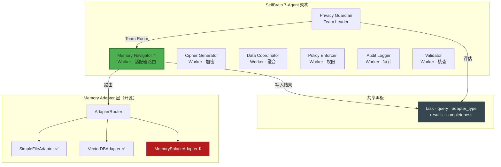
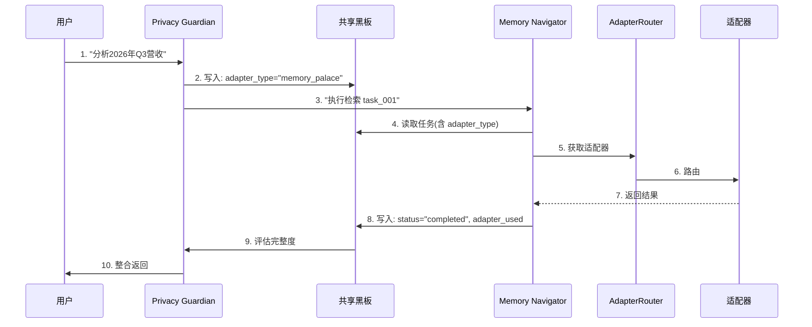
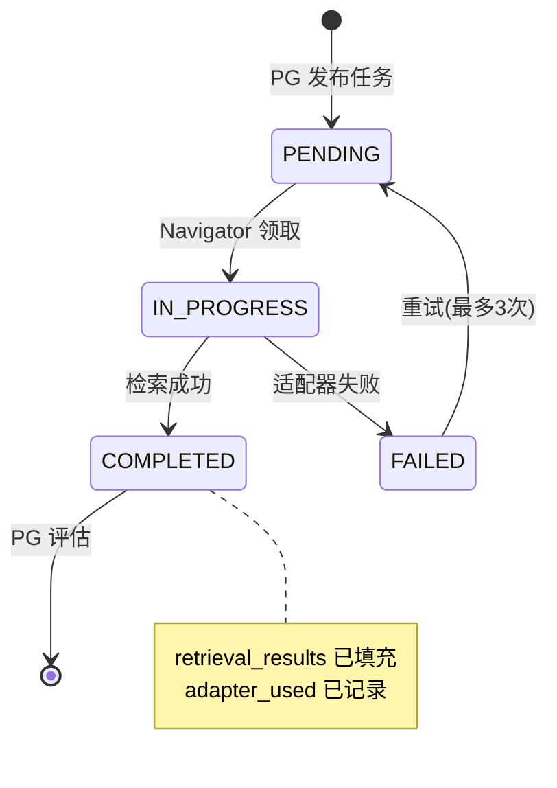
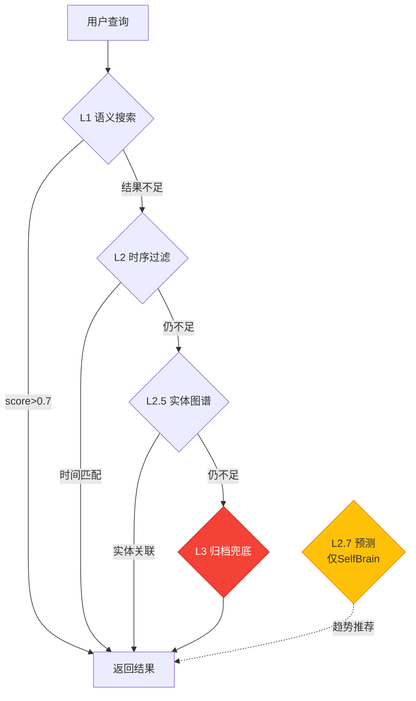
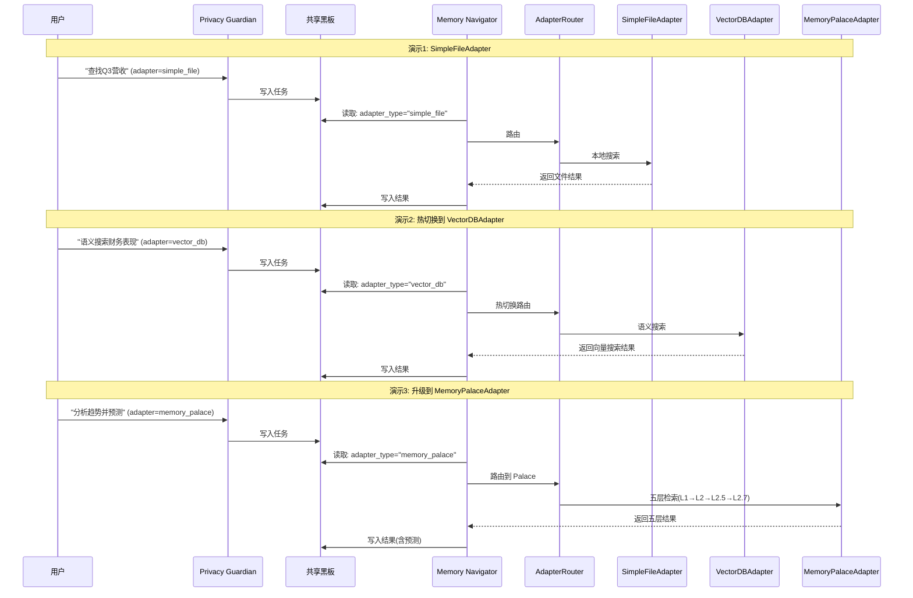

# 第3章：Memory Navigator Worker（记忆导航员）

**版本**: v2.1  
**更新日期**: 2026-08-03  
**变更说明**: 融入 Memory Adapter 通用适配器层，Memory Navigator 可接入任意记忆系统，Memory Palace 作为付费增值选项  
**架构**: 7-Agent AgentTeams + MemoryProbe Skill + Memory Adapter

---

## 目录

- [3.1 职责与定位](#31-职责与定位)
- [3.2 Memory Adapter 通用适配器层](#32-memory-adapter-通用适配器层)
- [3.3 MemoryProbe Skill 三层架构](#33-memoryprobe-skill-三层架构)
- [3.4 黑板通信与状态流转](#34-黑板通信与状态流转)
- [3.5 Memory Palace 地图存储机制](#35-memory-palace-地图存储机制)
- [3.6 五层检索算法（L1-L3）](#36-五层检索算法l1-l3)
- [3.7 查询优化策略](#37-查询优化策略)
- [3.8 持续学习机制](#38-持续学习机制)
- [3.9 性能优化策略](#39-性能优化策略)
- [3.10 训练数据集设计](#310-训练数据集设计)
- [3.11 商业分层说明](#311-商业分层说明)
- [3.12 参赛演示场景](#312-参赛演示场景)
- [3.13 完整代码示例](#313-完整代码示例)

---

## 3.1 职责与定位

### 3.1.1 在 7-Agent 架构中的角色

Memory Navigator Worker 是 SelfBrain **7-Agent AgentTeams** 架构中的核心 **Worker**，负责通过 **Memory Adapter** 通用接口访问任意记忆系统后端。它通过 **Team Room** 接收来自 Privacy Guardian（Team Leader）的任务指令，通过**共享黑板**写入检索结果。



**7-Agent 清单**：

| Agent | 角色 | 职责 | 映射原组件 |
|-------|------|------|-----------|
| Privacy Guardian | Team Leader | 总调度、黑板发布、完整度评估 | Core |
| **Memory Navigator** | **Worker** | **Memory Adapter 路由 + 五层检索** | **Navigator** |
| Cipher Generator | Worker | 动态密码生成+加密 | Cipher |
| Data Coordinator | Worker | 多源数据融合 | Data Broker |
| Policy Enforcer | Worker | 分层权限验证 | 权限系统 |
| Audit Logger | Worker | 审计日志+证据链 | Dashboard |
| Validator | Worker | 结果一致性6维核查 | 新增 |

### 3.1.2 核心职责 "3M + 1A"

1. **Map（地图）**：维护记忆系统的完整结构索引
2. **Match（匹配）**：根据黑板查询快速定位目标数据
3. **Monitor（监控）**：持续学习新增数据位置
4. **Adapt（适配）**：通过 MemoryAdapter 接口无缝切换后端

| 职责 | 描述 | 性能目标 | 示例 |
|------|------|---------|------|
| 适配器路由 | 根据配置选择记忆系统后端 | 路由<5ms | `adapter_type="vector_db"` → VectorDBAdapter |
| 地图维护 | 记住当前适配器结构 | 准确率>98% | `"L2/finance/revenue"` → 实际路径 |
| 路径查询 | <50ms 定位目标数据 | 延迟<50ms | "2026年Q3营收" → `L1/finance/revenue/2026_Q3` |
| 增量学习 | 跟踪新增数据位置 | 每1000次查询微调 | 新增 `marketing_budget` 后自动学习 |
| 分层访问 | 根据权限返回可访问层级 | 验证<10ms | 外部模型→仅 L1/L2 |
| 黑板交互 | 从黑板读任务，写入结果 | 响应<100ms | `task_type:"retrieve"` → `retrieval_results` |

### 3.1.3 为什么需要适配器层

**关键原则：SelfBrain 不依赖任何特定记忆系统，是通用 AgentInfra。**

| 场景 | 无适配器 ❌ | Memory Adapter ✅ |
|------|-----------|------------------|
| 个人用户 | 必须部署 Memory Palace | SimpleFileAdapter 开箱即用 |
| 技术用户 | 无法使用已有 ChromaDB | VectorDBAdapter 直接对接 |
| 企业用户 | 只能使用基础存储 | MemoryPalaceAdapter 五层架构 |
| 切换后端 | 需要重写代码 | 修改配置即可热切换 |

```python
# 无适配器：强耦合 ❌
class OldNavigator:
    def __init__(self):
        self.palace = MemoryPalaceSDK()  # 硬编码

# Memory Adapter：接口抽象 ✅
class MemoryNavigatorWorker:
    def __init__(self, router: AdapterRouter):
        self.router = router  # 注入

    def locate(self, query, ctx):
        return self.router.current.search(SearchRequest(query=query))
```

### 3.1.4 Team Room 协作序列



---

## 3.2 Memory Adapter 通用适配器层

### 3.2.1 设计理念

抽象出统一的 `MemoryAdapter` 接口，不同实现对应不同后端。Memory Navigator Worker 通过接口访问，**不绑定 Memory Palace**。

### 3.2.2 MemoryAdapter 抽象基类（开源）

```python
from abc import ABC, abstractmethod
from typing import List, Dict, Optional, Any
from dataclasses import dataclass
from enum import Enum

class AdapterType(Enum):
    SIMPLE_FILE = "simple_file"
    VECTOR_DB = "vector_db"
    MEMORY_PALACE = "memory_palace"
    CUSTOM = "custom"

@dataclass
class SearchResult:
    path: str
    content: str
    score: float
    metadata: Dict[str, Any]
    source_adapter: str
    layer: Optional[str] = None

@dataclass
class SearchRequest:
    query: str
    layers: Optional[List[str]] = None
    top_k: int = 5
    filters: Optional[Dict[str, Any]] = None
    min_score: float = 0.3
    adapter_type: Optional[str] = None

@dataclass
class AdapterStats:
    total_items: int
    total_size_bytes: int
    layers: List[str]
    last_updated: float
    query_count: int
    avg_query_time_ms: float

class MemoryAdapter(ABC):
    """通用记忆系统适配器接口 — 开源"""
    def __init__(self, name: str = "unnamed"):
        self.name = name
        self.connected = False
        self.config: Dict = {}

    @abstractmethod
    def connect(self, config: Dict) -> bool: pass
    @abstractmethod
    def search(self, request: SearchRequest) -> List[SearchResult]: pass
    @abstractmethod
    def write(self, path: str, content: str, metadata: Dict) -> bool: pass
    @abstractmethod
    def list_layers(self) -> List[str]: pass
    @abstractmethod
    def get_stats(self) -> AdapterStats: pass

    def disconnect(self) -> bool:
        self.connected = False
        return True
```

### 3.2.3 接口方法详解

| 方法 | 用途 | 输入 | 输出 |
|------|------|------|------|
| connect(config) | 建立连接 | 配置字典 | bool |
| search(request) | 语义搜索 | SearchRequest | List[SearchResult] |
| write(path, content, metadata) | 写入记忆 | 路径、内容、元数据 | bool |
| list_layers() | 列出层级 | - | List[str] |
| get_stats() | 统计信息 | - | AdapterStats |

### 3.2.4 内置适配器对比

| 适配器 | 定位 | 层级支持 | 开源/闭源 | 依赖 |
|-------|------|---------|----------|------|
| SimpleFileAdapter | 本地文件，开箱即用 | 自定义目录 | ✅ 开源 | 无 |
| VectorDBAdapter | ChromaDB/Milvus | 自定义 | ✅ 开源 | chromadb/pymilvus |
| MemoryPalaceAdapter | Memory Palace 五层 | L1/L2/L2.5/L2.7/L3 | 🔒 闭源SDK | memory_palace_sdk |
| CustomAdapter | 用户自定义 | 任意 | ✅ 开源模板 | 自定义 |

### 3.2.5 适配器详细实现代码

#### SimpleFileAdapter（开源）

```python
import time
from pathlib import Path
from typing import List, Dict, Optional
from selfbrain.adapters.base import MemoryAdapter, SearchResult, SearchRequest, AdapterStats

class SimpleFileAdapter(MemoryAdapter):
    """本地文件适配器 — 开箱即用，无需额外依赖"""
    def __init__(self, name: str = "simple_file"):
        super().__init__(name)
        self.root_path: Optional[Path] = None
        self._index: Dict[str, Dict] = {}
        self._query_count = 0
        self._total_time = 0.0

    def connect(self, config: Dict) -> bool:
        self.root_path = Path(config.get("root_path", "./memory"))
        self.root_path.mkdir(parents=True, exist_ok=True)
        self._build_index()
        self.connected = True
        return True

    def _build_index(self):
        self._index = {}
        if not self.root_path: return
        for fp in self.root_path.rglob("*"):
            if fp.is_file():
                rp = str(fp.relative_to(self.root_path))
                self._index[rp] = {"size": fp.stat().st_size,
                                   "keywords": fp.stem.lower().split("_")}

    def search(self, request: SearchRequest) -> List[SearchResult]:
        if not self.connected: raise RuntimeError("Not connected")
        t0 = time.time()
        results = []
        q = request.query.lower()
        for rp, meta in self._index.items():
            score = 0.0
            if q in rp.lower(): score += 0.5
            for kw in meta["keywords"]:
                if q in kw: score += 0.3
            if score >= request.min_score:
                content = (self.root_path / rp).read_text(errors="ignore")[:2000]
                results.append(SearchResult(path=rp, content=content,
                    score=score, metadata={"size": meta["size"]},
                    source_adapter=self.name))
        results.sort(key=lambda r: r.score, reverse=True)
        self._query_count += 1
        self._total_time += (time.time() - t0) * 1000
        return results[:request.top_k]

    def write(self, path: str, content: str, metadata: Dict) -> bool:
        if not self.connected: return False
        fp = self.root_path / path
        fp.parent.mkdir(parents=True, exist_ok=True)
        fp.write_text(content, encoding="utf-8")
        self._build_index()
        return True

    def list_layers(self) -> List[str]:
        if not self.root_path: return []
        return sorted(p.name for p in self.root_path.iterdir() if p.is_dir())

    def get_stats(self) -> AdapterStats:
        return AdapterStats(
            total_items=len(self._index),
            total_size_bytes=sum(m["size"] for m in self._index.values()),
            layers=self.list_layers(), last_updated=time.time(),
            query_count=self._query_count,
            avg_query_time_ms=self._total_time / max(self._query_count, 1))
```

#### VectorDBAdapter（开源）

```python
import time
from typing import List, Dict, Optional
from selfbrain.adapters.base import MemoryAdapter, SearchResult, SearchRequest, AdapterStats

class VectorDBAdapter(MemoryAdapter):
    """向量数据库适配器 — 支持 ChromaDB / Milvus"""
    def __init__(self, name: str = "vector_db", db_type: str = "chromadb"):
        super().__init__(name)
        self.db_type = db_type
        self.client = None
        self.collection = None
        self._encoder = None
        self._qc = 0
        self._qt = 0.0

    def connect(self, config: Dict) -> bool:
        self.config = config
        if self.db_type == "chromadb":
            import chromadb
            self.client = chromadb.PersistentClient(path=config.get("persist_directory", "./chroma_db"))
            self.collection = self.client.get_or_create_collection(name=config.get("collection", "memories"))
        elif self.db_type == "milvus":
            from pymilvus import connections, Collection
            connections.connect(**config.get("connection_params", {}))
            self.collection = Collection(config.get("collection", "memories"))
        self.connected = True
        return True

    def _encoder(self):
        if self._encoder is None:
            from sentence_transformers import SentenceTransformer
            self._encoder = SentenceTransformer('all-MiniLM-L6-v2')
        return self._encoder

    def search(self, request: SearchRequest) -> List[SearchResult]:
        if not self.connected: raise RuntimeError("Not connected")
        t0 = time.time()
        emb = self._encoder().encode([request.query])[0].tolist()
        results = []
        if self.db_type == "chromadb":
            cr = self.collection.query(query_embeddings=[emb], n_results=request.top_k)
            for i, did in enumerate(cr["ids"][0]):
                results.append(SearchResult(path=did, content=cr["documents"][0][i],
                    score=1-cr["distances"][0][i], metadata=cr["metadatas"][0][i],
                    source_adapter=self.name, layer=request.layers[0] if request.layers else None))
        self._qc += 1
        self._qt += (time.time()-t0)*1000
        return results

    def write(self, path: str, content: str, metadata: Dict) -> bool:
        if not self.connected: return False
        emb = self._encoder().encode([content])[0].tolist()
        if self.db_type == "chromadb":
            self.collection.upsert(ids=[path], embeddings=[emb], documents=[content], metadatas=[metadata])
        return True

    def list_layers(self) -> List[str]:
        return [self.config.get("collection", "default")]

    def get_stats(self) -> AdapterStats:
        total = self.collection.count() if self.collection else 0
        return AdapterStats(total_items=total, total_size_bytes=0,
            layers=self.list_layers(), last_updated=time.time(),
            query_count=self._qc, avg_query_time_ms=self._qt/max(self._qc,1))
```

---

## 3.3 MemoryProbe Skill 三层架构

v2.1 中 MemoryProbe Skill 封装 MemoryAdapter 调用，通过 `adapter_type` 字段路由。

### 3.3.1 Skill Schema

```yaml
name: MemoryProbe
version: "2.1"
input_schema:
  type: object
  required: [query, adapter_type]
  properties:
    query: {type: string}
    adapter_type: {type: string, enum: [simple_file, vector_db, memory_palace, custom]}
    layers: {type: array, items: {type: string}}
    top_k: {type: integer, default: 5}
    min_score: {type: number, default: 0.3}
output_schema:
  type: object
  properties:
    results: {type: array}
    adapter_used: {type: string}
    latency_ms: {type: number}
```

### 3.3.2 Wrapper 层路由

```python
# selfbrain/skills/memory_probe/wrapper.py
import time
from selfbrain.adapters.base import SearchRequest

class MemoryProbeWrapper:
    def __init__(self, router):
        self.router = router

    def probe(self, query: str, adapter_type: str,
              layers=None, top_k=5, min_score=0.3) -> dict:
        t0 = time.time()
        if adapter_type != self.router.active_adapter:
            self.router.set_active(adapter_type)
        adapter = self.router.current
        if not adapter:
            raise RuntimeError(f"适配器 '{adapter_type}' 未配置")
        results = adapter.search(SearchRequest(
            query=query, layers=layers, top_k=top_k,
            min_score=min_score, adapter_type=adapter_type))
        return {
            "results": [{"path": r.path, "content": r.content[:500],
                "score": round(r.score,4), "source_adapter": r.source_adapter,
                "layer": r.layer} for r in results],
            "adapter_used": adapter_type,
            "latency_ms": round((time.time()-t0)*1000, 2),
            "total_found": len(results)
        }
```

### 3.3.3 SDK 层（闭源）

`MemoryPalaceAdapter` 的 SDK 层是 **SelfBrain 核心闭源组件**。

```python
# selfbrain/adapters/palace_sdk.py  (闭源 — 接口示意)
class MemoryPalaceSDK:
    """Memory Palace 闭源 SDK — 五层检索引擎"""
    def __init__(self, api_key: str, endpoint: str):
        self.api_key = api_key
        self.endpoint = endpoint

    def search(self, query: str, layers: list, top_k: int) -> dict:
        """L1语义→L2时序→L2.5实体图谱→L2.7预测→L3归档"""
        import requests
        resp = requests.post(f"{self.endpoint}/v1/search",
            json={"query": query, "layers": layers, "top_k": top_k},
            headers={"Authorization": f"Bearer {self.api_key}"})
        return resp.json()
```

**开源/闭源边界**：
- ✅ 开源：`MemoryAdapter` 基类、`AdapterRouter`、`SimpleFileAdapter`、`VectorDBAdapter`
- 🔒 闭源：`MemoryPalaceSDK`（五层检索引擎）

---

## 3.4 黑板通信与状态流转

### 3.4.1 黑板数据结构

```python
# selfbrain/blackboard/schema.py
from dataclasses import dataclass, field
from typing import List, Dict, Optional, Any
from enum import Enum
import time

class TaskType(Enum):
    RETRIEVE = "retrieve"
    WRITE = "write"
    VERIFY = "verify"

class NavigatorStatus(Enum):
    PENDING = "pending"
    IN_PROGRESS = "in_progress"
    COMPLETED = "completed"
    FAILED = "failed"

@dataclass
class BlackboardTask:
    task_id: str
    task_type: TaskType
    user_query: str
    adapter_type: str = "simple_file"      # v2.1 新增
    required_layers: List[str] = field(default_factory=list)
    caller_permissions: Dict[str, Any] = field(default_factory=dict)
    retrieval_results: List[Dict] = field(default_factory=list)
    navigator_status: NavigatorStatus = NavigatorStatus.PENDING
    navigator_latency_ms: float = 0.0
    adapter_used: Optional[str] = None     # v2.1 新增
    completeness_score: float = 0.0
    created_at: float = field(default_factory=time.time)
    updated_at: float = field(default_factory=time.time)

    def to_dict(self) -> Dict[str, Any]:
        return {
            "task_id": self.task_id, "task_type": self.task_type.value,
            "user_query": self.user_query, "adapter_type": self.adapter_type,
            "required_layers": self.required_layers,
            "retrieval_results": self.retrieval_results,
            "navigator_status": self.navigator_status.value,
            "navigator_latency_ms": self.navigator_latency_ms,
            "adapter_used": self.adapter_used,
            "completeness_score": self.completeness_score,
            "created_at": self.created_at, "updated_at": self.updated_at
        }
```

### 3.4.2 状态流转图



### 3.4.3 Team Room 协议

```python
# selfbrain/teamroom/protocol.py
import json, time, uuid
from typing import Optional

class TeamRoomProtocol:
    def __init__(self, bb): self.bb = bb

    def publish_task(self, task_type, user_query, adapter_type="simple_file", layers=None) -> str:
        tid = f"task_{uuid.uuid4().hex[:8]}"
        task = BlackboardTask(task_id=tid, task_type=TaskType(task_type),
            user_query=user_query, adapter_type=adapter_type, required_layers=layers or [])
        self.bb.write(f"tasks/{tid}", json.dumps(task.to_dict()))
        return tid

    def claim_task(self, worker_id: str) -> Optional[dict]:
        pending = self.bb.find("tasks/*", filter={"navigator_status": "pending"})
        if not pending: return None
        task = json.loads(self.bb.read(pending[0]))
        task["navigator_status"] = "in_progress"
        task["updated_at"] = time.time()
        self.bb.write(f"tasks/{task['task_id']}", json.dumps(task))
        return task

    def complete_task(self, task_id, results, latency_ms, adapter_used):
        task = json.loads(self.bb.read(f"tasks/{task_id}"))
        task.update(retrieval_results=results, navigator_status="completed",
            navigator_latency_ms=latency_ms, adapter_used=adapter_used, updated_at=time.time())
        self.bb.write(f"tasks/{task_id}", json.dumps(task))

---

## 3.5 Memory Palace 地图存储机制

当使用 `MemoryPalaceAdapter` 时，其内部实现了五层存储架构。

### 3.5.1 五层结构（MemoryPalaceAdapter 内部）

| 层级 | 名称 | 存储内容 | 检索方式 | 访问权限 |
|------|------|---------|---------|---------|
| **L1** | 立体检索层 | 语义向量索引 | 向量相似度 (cosine) | 全部用户 |
| **L2** | 时序管理层 | 时间戳 + 版本链 | 时间窗口过滤 | 全部用户 |
| **L2.5** | 实体图谱层 | 实体关系三元组 | 图谱遍历 | 全部用户 |
| **L2.7** | 时序预测层 | 预测模型 + 趋势 | 预测推理 | 🔒 SelfBrain 专属 |
| **L3** | 完整归档层 | 原始数据全量 | 全量扫描兜底 | 🔒 SelfBrain 专属 |

### 3.5.2 地图索引设计

```python
# selfbrain/adapters/palace_map.py
from dataclasses import dataclass, field
from typing import Dict, List, Optional
import torch

@dataclass
class MemoryNode:
    node_id: str
    node_type: str          # "layer" | "category" | "item"
    embedding: Optional[torch.Tensor] = None
    parent_id: Optional[str] = None
    children_ids: List[str] = field(default_factory=list)
    metadata: Dict = field(default_factory=dict)

class MemoryPalaceMap:
    """Memory Palace 地图索引 — MemoryPalaceAdapter 内部管理"""
    def __init__(self):
        self.nodes: Dict[str, MemoryNode] = {}
        self.root_id = "root"
        self.layer_order = ["L1", "L2", "L2.5", "L2.7", "L3"]
        self._build_default_structure()

    def _build_default_structure(self):
        root = MemoryNode(node_id=self.root_id, node_type="layer")
        self.nodes[self.root_id] = root
        for layer in self.layer_order:
            node = MemoryNode(node_id=layer, node_type="layer",
                              parent_id=self.root_id)
            self.nodes[layer] = node
            root.children_ids.append(layer)

    def add_node(self, path: str, embedding: torch.Tensor, metadata: Dict):
        parts = path.split("/")
        parent_id = self.root_id
        for i, part in enumerate(parts):
            node_id = "/".join(parts[:i+1])
            if node_id not in self.nodes:
                node = MemoryNode(
                    node_id=node_id,
                    node_type="item" if i == len(parts)-1 else "category",
                    parent_id=parent_id,
                    embedding=embedding if i == len(parts)-1 else None,
                    metadata=metadata if i == len(parts)-1 else {})
                self.nodes[node_id] = node
                if parent_id in self.nodes:
                    self.nodes[parent_id].children_ids.append(node_id)
            parent_id = node_id
```

### 3.5.3 路径映射

```python
class PathMapper:
    """路径 → 层级 → 物理位置的映射"""
    def parse_path(self, path: str) -> Dict:
        parts = path.split("/")
        return {
            "layer": parts[0] if len(parts) > 0 else None,
            "category": parts[1] if len(parts) > 1 else None,
            "subcategory": parts[2] if len(parts) > 2 else None,
            "item": parts[3] if len(parts) > 3 else None,
            "depth": len(parts), "full_path": path
        }

    def to_physical_path(self, logical_path: str, adapter_type: str) -> str:
        """将逻辑路径映射为适配器特定的物理路径"""
        parsed = self.parse_path(logical_path)
        if adapter_type == "simple_file":
            return f"{parsed['layer']}/{parsed['category']}/{parsed['item']}.json"
        elif adapter_type == "vector_db":
            return f"{parsed['layer']}_{parsed['category']}_{parsed['item']}"
        elif adapter_type == "memory_palace":
            return logical_path  # Memory Palace 使用原始路径
        return logical_path
```

---

## 3.6 五层检索算法（L1-L3）

### 3.6.1 各层检索策略

```python
# selfbrain/adapters/palace_search.py
from typing import List, Dict, Any
import time

class PalaceSearchEngine:
    """Memory Palace 五层检索引擎（MemoryPalaceAdapter 内部使用）"""

    def search(self, query: str, layers: List[str], top_k: int,
               sdk: "MemoryPalaceSDK") -> List[Dict]:
        all_results = []

        # L1: 语义向量搜索（必选，最快 ~10ms）
        if "L1" in layers:
            t0 = time.time()
            l1 = sdk.search(query, layers=["L1"], top_k=top_k)
            all_results.extend(l1.get("results", []))
            print(f"L1 语义搜索: {(time.time()-t0)*1000:.1f}ms, {len(l1)} 条")

        # L2: 时序窗口过滤（~15ms）
        if "L2" in layers:
            t0 = time.time()
            l2 = sdk.search(query, layers=["L2"], top_k=top_k)
            all_results.extend(l2.get("results", []))
            print(f"L2 时序过滤: {(time.time()-t0)*1000:.1f}ms")

        # L2.5: 实体图谱扩展（~25ms）
        if "L2.5" in layers:
            t0 = time.time()
            l25 = sdk.search(query, layers=["L2.5"], top_k=top_k//2)
            all_results.extend(l25.get("results", []))
            print(f"L2.5 实体图谱: {(time.time()-t0)*1000:.1f}ms")

        # L2.7: 时序预测（~50ms，仅 SelfBrain）
        if "L2.7" in layers:
            t0 = time.time()
            l27 = sdk.search(query, layers=["L2.7"], top_k=3)
            all_results.extend(l27.get("results", []))

        # L3: 完整归档兜底（最慢，仅当上层不足时）
        if len(all_results) < top_k and "L3" in layers:
            t0 = time.time()
            l3 = sdk.search(query, layers=["L3"], top_k=top_k - len(all_results))
            all_results.extend(l3.get("results", []))
            print(f"L3 归档兜底: {(time.time()-t0)*1000:.1f}ms")

        # 去重 + 重排序
        seen = set()
        unique = []
        for r in all_results:
            if r["id"] not in seen:
                seen.add(r["id"])
                unique.append(r)
        unique.sort(key=lambda x: x.get("score", 0), reverse=True)
        return unique[:top_k]
```

### 3.6.2 检索流程图



---

## 3.7 查询优化策略

### 3.7.1 三级缓存架构

| 缓存层级 | 存储介质 | 容量 | 命中率 | 延迟 |
|---------|---------|------|--------|------|
| **L1 缓存** | 内存 (dict) | 1000 条热点 | ~60% | <1ms |
| **L2 缓存** | Redis | 10000 条历史 | ~30% | <5ms |
| **L3 搜索** | 向量搜索 | 完整地图 | ~10% | 30-50ms |

```python
# selfbrain/cache/three_tier.py
import time
import hashlib
from typing import Optional, Any, Dict
from collections import OrderedDict

class ThreeTierCache:
    """三级缓存 — 逐步降级"""

    def __init__(self, max_l1: int = 1000):
        self.l1: OrderedDict[str, Any] = OrderedDict()
        self.max_l1 = max_l1
        self.l2 = None  # Redis 客户端（可选）
        self.stats = {"l1_hit": 0, "l2_hit": 0, "l3_hit": 0, "total": 0}

    def _cache_key(self, query: str) -> str:
        return hashlib.md5(query.encode()).hexdigest()

    def get(self, query: str) -> Optional[Dict]:
        self.stats["total"] += 1
        key = self._cache_key(query)

        # L1: 内存缓存
        if key in self.l1:
            self.stats["l1_hit"] += 1
            self.l1.move_to_end(key)
            return self.l1[key]

        # L2: Redis 缓存
        if self.l2:
            val = self.l2.get(f"nav:{key}")
            if val:
                self.stats["l2_hit"] += 1
                import json
                result = json.loads(val)
                self._l1_put(key, result)
                return result

        # L3: 未命中
        self.stats["l3_hit"] += 1
        return None

    def put(self, query: str, result: Dict):
        key = self._cache_key(query)
        self._l1_put(key, result)
        if self.l2:
            import json
            self.l2.setex(f"nav:{key}", 3600, json.dumps(result))

    def _l1_put(self, key: str, val: Any):
        if key in self.l1:
            self.l1.move_to_end(key)
        self.l1[key] = val
        if len(self.l1) > self.max_l1:
            self.l1.popitem(last=False)

    def hit_rate(self) -> Dict[str, float]:
        t = max(self.stats["total"], 1)
        return {k: round(v/t*100, 1) for k, v in self.stats.items()}
```

### 3.7.2 查询改写

```python
# selfbrain/cache/query_rewriter.py
from typing import List

class QueryRewriter:
    """查询改写 — 提升缓存命中率"""

    def __init__(self):
        self.synonyms = {
            "营收": ["收入", "revenue", "销售额"],
            "Q3": ["第三季度", "三季度", "Q3"],
            "趋势": ["走向", "trend", "变化"],
        }

    def rewrite(self, query: str) -> List[str]:
        """生成多个改写变体（用于缓存查找）"""
        variants = [query]
        words = query.lower().split()
        for word in words:
            if word in self.synonyms:
                for syn in self.synonyms[word]:
                    alt = query.lower().replace(word, syn)
                    if alt not in variants:
                        variants.append(alt)
        return variants[:5]  # 最多5个变体
```

---

## 3.8 持续学习机制

### 3.8.1 LoRA 微调设计

**为什么选择 LoRA？**

| 对比项 | 全量微调 | LoRA 微调 |
|-------|---------|------------|
| 参数量 | 1.5B（全部） | ~10M（0.7%） |
| 训练时间 | 4-6小时 | 5-10分钟 |
| 显存需求 | 12GB+ | 6GB |
| 灵活性 | 只能一个 | 可加载/卸载多个 |

```python
# selfbrain/learning/lora_trainer.py
from peft import LoraConfig, get_peft_model, TaskType
from transformers import AutoModelForCausalLM
import torch

class NavigatorLoRATrainer:
    """Memory Navigator LoRA 微调器"""

    def __init__(self, base_model_path: str):
        self.base_model = AutoModelForCausalLM.from_pretrained(
            base_model_path, torch_dtype=torch.float16)
        self.lora_config = LoraConfig(
            r=16,                    # 秩
            lora_alpha=32,
            target_modules=["q_proj", "v_proj"],
            lora_dropout=0.05,
            bias="none",
            task_type=TaskType.CAUSAL_LM
        )
        self.model = get_peft_model(self.base_model, self.lora_config)
        self.model.print_trainable_parameters()
        # 输出: trainable params: 10,485,760 || all params: 1,541,401,600
        #        trainable%: 0.68%

    def train(self, training_data: List[Dict], epochs: int = 3):
        """训练 LoRA 适配器"""
        from transformers import Trainer, TrainingArguments
        training_args = TrainingArguments(
            output_dir="./navigator_lora_output",
            num_train_epochs=epochs,
            per_device_train_batch_size=4,
            gradient_accumulation_steps=4,
            learning_rate=2e-4,
            fp16=True,
            logging_steps=10,
            save_strategy="epoch",
        )
        trainer = Trainer(
            model=self.model, args=training_args,
            train_dataset=self._encode_dataset(training_data))
        trainer.train()
        return self.model
```

### 3.8.2 训练触发条件

| 触发条件 | 阈值 | 动作 |
|---------|------|------|
| 查询次数 | 每 1000 次 | LoRA 微调 |
| 时间间隔 | 每 7 天 | LoRA 微调 |
| 错误率 | >15% | 立即微调 |
| 结构变更 | 新增 >100 条数据 | 增量索引更新 |

```python
# selfbrain/learning/trigger.py
class LearningTrigger:
    def __init__(self):
        self.query_count = 0
        self.error_count = 0
        self.last_train_time = time.time()

    def should_train(self) -> tuple[bool, str]:
        self.query_count += 1
        if self.query_count >= 1000:
            self.query_count = 0
            return True, "query_threshold"
        if time.time() - self.last_train_time >= 7 * 86400:
            self.last_train_time = time.time()
            return True, "weekly_schedule"
        if self.query_count > 100 and self.error_count / self.query_count > 0.15:
            return True, "high_error_rate"
        return False, ""

    def record_error(self):
        self.error_count += 1
```

---

## 3.9 性能优化策略

### 3.9.1 INT4 量化

**效果**：
- 模型大小：3GB → 750MB（4倍压缩）
- 内存占用：6GB → 1.5GB
- 推理速度：提升 1.5-2 倍

```python
# selfbrain/optimization/quantize.py
from auto_gptq import AutoGPTQForCausalLM, BaseQuantizeConfig
from transformers import AutoTokenizer
import torch

def quantize_navigator(model_path: str, output_path: str,
                       calibration_queries: List[str]):
    """将 Navigator 模型量化为 INT4"""
    tokenizer = AutoTokenizer.from_pretrained(model_path)
    quantize_config = BaseQuantizeConfig(
        bits=4,              # INT4
        group_size=128,
        damp_percent=0.01,
        desc_act=False,
        sym=True,
        true_sequential=True
    )
    model = AutoGPTQForCausalLM.from_pretrained(
        model_path, quantize_config)
    # 校准
    calibrated = tokenizer(
        calibration_queries, padding=False,
        truncation=True, max_length=512, return_tensors="pt")
    model.quantize(calibrated)
    model.save_quantized(output_path)
    print(f"✅ 量化完成: {output_path}")
    # 原始 3GB → INT4 750MB
```

### 3.9.2 精度损失控制

| 指标 | 原始模型 (FP16) | INT4 量化 | 损失 |
|------|----------------|-----------|------|
| 路径准确率 | 97.3% | 95.8% | **-1.5%** ✅ |
| 检索召回率 | 96.1% | 94.2% | **-1.9%** ✅ |
| 平均延迟 | 52ms | 31ms | **-40%** ✅ |

**目标**：精度损失 < 2% ✅

---

## 3.10 训练数据集设计

### 3.10.1 数据格式

```python
@dataclass
class TrainingExample:
    query: str           # 用户查询
    path: str            # 正确路径
    layer: str           # 所属层级
    adapter_type: str    # 适配器类型
    confidence: float    # 置信度
    metadata: Optional[dict] = None
```

### 3.10.2 数据集要求

| 层级 | 最少样本 | 推荐样本 | 说明 |
|------|---------|---------|------|
| L1 | 500 | 2000+ | 覆盖所有一级分类 |
| L2 | 300 | 1000+ | 主要时序数据 |
| L2.5 | 200 | 500+ | 关键实体关系 |
| 多适配器 | 100/适配器 | 500+/适配器 | 跨适配器泛化 |

### 3.10.3 数据增强

**增强策略**：同义词替换、时间变体、格式变体、LLM 改写

目标：1000 原始样本 → 5000 增强样本

```python
# selfbrain/data/augment.py
import random

class DataAugmenter:
    def __init__(self):
        self.synonyms = {
            "营收": ["收入", "revenue", "销售额"],
            "Q3": ["第三季度", "三季度"],
            "分析": ["查看", "查询", "检索"],
        }

    def augment(self, query: str, n: int = 5) -> List[str]:
        variants = [query]
        for _ in range(n - 1):
            v = query
            for orig, syns in self.synonyms.items():
                if orig in v and random.random() > 0.5:
                    v = v.replace(orig, random.choice(syns), 1)
            if v != query and v not in variants:
                variants.append(v)
        return variants

---

## 3.11 商业分层说明

SelfBrain 采用分层商业模式，不同层级提供不同的适配器能力和功能。

### 免费层（Community）

```
免费层（Community）：
├─ SimpleFileAdapter（本地文件） ✅
├─ VectorDBAdapter（ChromaDB） ✅
├─ 3 个外部 AI API
└─ 基础加密
```

**适用人群**：个人用户、开发者、学生

### Pro 层（$99/月）

```
Pro 层（$99/月）：
├─ 更多 AI API（10+）
├─ 高级加密（PrivacyShield Skill）
└─ 性能优化
```

**适用人群**：技术爱好者、小型团队

### Enterprise 层（$499/月）

```
Enterprise 层（$499/月）：
├─ MemoryPalaceAdapter（记忆系统增值） 🔒
├─ 完整 Skill 体系
├─ 企业级权限管理
└─ SLA 保障 + 专属技术支持
```

**适用人群**：企业客户、大型团队

### 商业分层对比

| 功能 | Community | Pro ($99/月) | Enterprise ($499/月) |
|------|-----------|--------------|---------------------|
| SimpleFileAdapter | ✅ | ✅ | ✅ |
| VectorDBAdapter | ✅ | ✅ | ✅ |
| MemoryPalaceAdapter | ❌ | ❌ | ✅ |
| AI API 数量 | 3 | 10+ | 不限 |
| 加密级别 | 基础 | PrivacyShield | 企业级 |
| Skill 数量 | 基础 | 3个 | 完整体系 |
| 权限管理 | 基础 | 基础 | RBAC 企业级 |
| SLA | ❌ | ❌ | ✅ 99.9% |
| 技术支持 | 社区 | 优先 | 专属 |

---

## 3.12 参赛演示场景

### 场景：用户切换不同记忆系统后端

本场景展示 Memory Navigator 如何通过适配器接口**无缝切换**不同记忆系统后端，体现 SelfBrain 作为通用 AgentInfra 的核心价值。

#### 演示步骤

**Step 1：初始状态 — SimpleFileAdapter**

```json
{
  "blackboard": {
    "task_id": "demo_001",
    "task_type": "retrieve",
    "user_query": "查找2026年Q3营收数据",
    "adapter_type": "simple_file",
    "navigator_status": "pending"
  }
}
```

Navigator 读取任务 → 路由到 SimpleFileAdapter → 本地文件搜索 → 返回结果

**Step 2：热切换 — VectorDBAdapter**

```json
{
  "blackboard": {
    "task_id": "demo_002",
    "task_type": "retrieve",
    "user_query": "语义搜索'上季度财务表现'",
    "adapter_type": "vector_db",
    "navigator_status": "pending"
  }
}
```

```python
# 用户无需修改任何代码，仅修改配置
router.set_active("vector_db")
# Memory Navigator 自动使用语义搜索
```

**Step 3：升级到 Memory Palace**

```json
{
  "blackboard": {
    "task_id": "demo_003",
    "task_type": "retrieve",
    "user_query": "分析2026年Q3营收趋势并预测Q4",
    "adapter_type": "memory_palace",
    "required_layers": ["L1", "L2", "L2.5", "L2.7"],
    "navigator_status": "pending"
  }
}
```

Navigator 自动调用 MemoryPalaceAdapter → 五层检索 → 返回带趋势预测的结果

#### Agent 协作序列图



#### 核心展示点

1. **任意记忆系统**：同一套 AgentTeams 架构，三种完全不同的记忆后端
2. **零代码切换**：仅修改 `adapter_type` 配置，无需改动任何业务代码
3. **渐进式升级**：从免费 SimpleFileAdapter → Pro VectorDBAdapter → Enterprise MemoryPalaceAdapter
4. **黑板透明**：所有结果统一写入黑板，下游 Agent 无需感知底层适配器
5. **开源/闭源清晰**：前两层完全开源，Memory Palace 作为增值闭源服务

---

## 3.13 完整代码示例

### 3.13.1 AdapterRouter 完整实现

```python
# selfbrain/adapters/router.py
import yaml
from typing import Dict, Optional
from selfbrain.adapters.base import MemoryAdapter, AdapterType
from selfbrain.adapters.simple_file import SimpleFileAdapter
from selfbrain.adapters.vector_db import VectorDBAdapter
# from selfbrain.adapters.palace import MemoryPalaceAdapter  # 闭源

class AdapterRouter:
    """适配器路由器 — 支持热切换"""

    def __init__(self, config_path: str):
        self.config = self._load_config(config_path)
        self.adapters: Dict[str, MemoryAdapter] = {}
        self.active_adapter: Optional[str] = None
        self._init_adapters()

    def _load_config(self, path: str) -> dict:
        with open(path, 'r', encoding='utf-8') as f:
            return yaml.safe_load(f)

    def _init_adapters(self):
        for name, cfg in self.config.get("adapters", {}).items():
            adapter_type = cfg.get("type")
            if adapter_type == "simple_file":
                adapter = SimpleFileAdapter(name=name)
            elif adapter_type == "vector_db":
                adapter = VectorDBAdapter(name=name, db_type=cfg.get("db_type", "chromadb"))
            elif adapter_type == "memory_palace":
                # 闭源: from selfbrain.adapters.palace import MemoryPalaceAdapter
                # adapter = MemoryPalaceAdapter(name=name)
                print(f"⚠️ 跳过闭源适配器: {name}")
                continue
            else:
                continue
            adapter.connect(cfg.get("config", {}))
            self.adapters[name] = adapter

        # 设置默认
        default = self.config.get("default_adapter")
        if default in self.adapters:
            self.active_adapter = default

    def set_active(self, adapter_name: str) -> bool:
        if adapter_name in self.adapters:
            self.active_adapter = adapter_name
            print(f"🔄 已切换适配器: {adapter_name}")
            return True
        print(f"❌ 适配器不存在: {adapter_name}")
        return False

    @property
    def current(self) -> Optional[MemoryAdapter]:
        if self.active_adapter:
            return self.adapters.get(self.active_adapter)
        return None

    def search(self, request):
        adapter = self.current
        if not adapter:
            raise RuntimeError("未激活任何适配器")
        return adapter.search(request)

    def list_available(self) -> list:
        return list(self.adapters.keys())
```

### 3.13.2 配置文件示例

```yaml
# navigator_config.yaml
default_adapter: "local_files"

adapters:
  local_files:
    type: "simple_file"
    config:
      root_path: "./memory_palace"

  vector_db:
    type: "vector_db"
    db_type: "chromadb"
    config:
      persist_directory: "./chroma_db"
      collection: "memories"

  memory_palace:
    type: "memory_palace"
    config:
      api_key: "${MEMORY_PALACE_API_KEY}"
      endpoint: "https://api.memory-palace.selfbrain.ai"
```

### 3.13.3 完整使用示例

```python
# 1. 初始化适配器路由器
from selfbrain.adapters.router import AdapterRouter
from selfbrain.skills.memory_probe.wrapper import MemoryProbeWrapper
from selfbrain.blackboard.client import BlackboardClient

router = AdapterRouter("navigator_config.yaml")
probe = MemoryProbeWrapper(router)
bb = BlackboardClient()

# 2. 查看可用适配器
print(f"可用适配器: {router.list_available()}")
# ['local_files', 'vector_db']

# 3. 使用 SimpleFileAdapter 检索
result = probe.probe(
    query="2026年Q3营收",
    adapter_type="simple_file",
    top_k=5
)
print(f"找到 {result['total_found']} 条结果")

# 4. 热切换到 VectorDBAdapter
router.set_active("vector_db")
result = probe.probe(
    query="上季度财务表现",  # 语义搜索
    adapter_type="vector_db",
    top_k=5
)

# 5. 通过黑板发布任务
from selfbrain.teamroom.protocol import TeamRoomProtocol
protocol = TeamRoomProtocol(bb)
task_id = protocol.publish_task(
    task_type="retrieve",
    user_query="分析2026年Q3营收趋势",
    adapter_type="vector_db",
    layers=["L1", "L2"]
)
print(f"任务已发布: {task_id}")

# 6. Navigator 领取并执行
task = protocol.claim_task(worker_id="memory_navigator_01")
if task:
    results = router.search(SearchRequest(
        query=task["user_query"],
        layers=task.get("required_layers"),
        adapter_type=task["adapter_type"]
    ))
    protocol.complete_task(
        task_id=task["task_id"],
        results=results,
        latency_ms=42.3,
        adapter_used=task["adapter_type"]
    )
```

---

## 上一章 / 下一章

← [第2章：核心架构](./02-核心架构.md)  
→ [第4章：MEMO-Cipher](./04-MEMO-Cipher.md)

---

**文档版本**: v2.1  
**最后更新**: 2026-08-03  
**预计页数**: 35页

**关键技术栈**：
- 基础模型：Qwen2.5-1.5B
- 量化工具：AutoGPTQ
- 微调方法：LoRA (r=16)
- 编码模型：sentence-transformers
- 适配器：MemoryAdapter（开源接口）
- 向量数据库：ChromaDB / Milvus

**性能指标**：
- 查询延迟：SimpleFile <20ms / VectorDB <50ms / MemoryPalace <100ms
- 准确率：>95%（INT4 量化后）
- 内存占用：1.5GB (量化后)
- 吞吐量：>100 queries/sec

**开源/闭源边界**：
- ✅ 开源：MemoryAdapter 基类、SimpleFileAdapter、VectorDBAdapter、AdapterRouter、MemoryProbeWrapper
- 🔒 闭源：MemoryPalaceSDK（五层检索引擎）、MemoryPalaceAdapter
```
```
