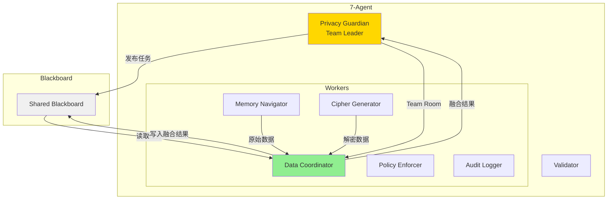
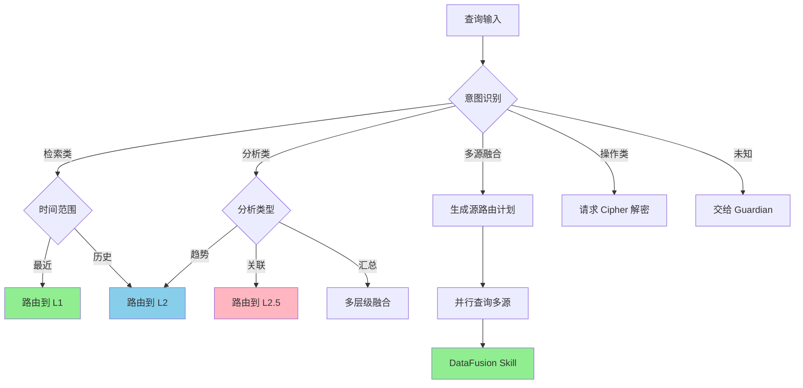
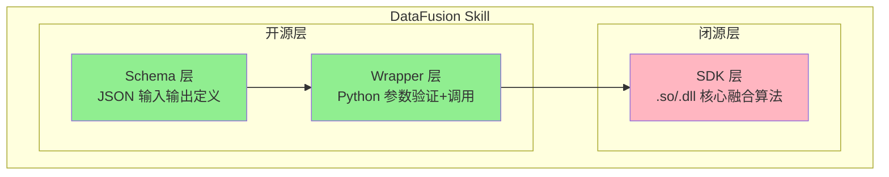
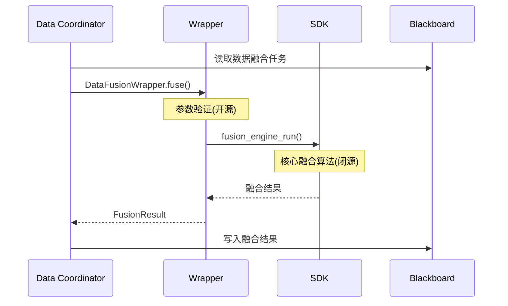
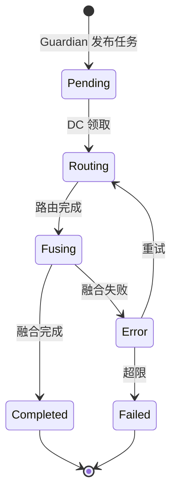
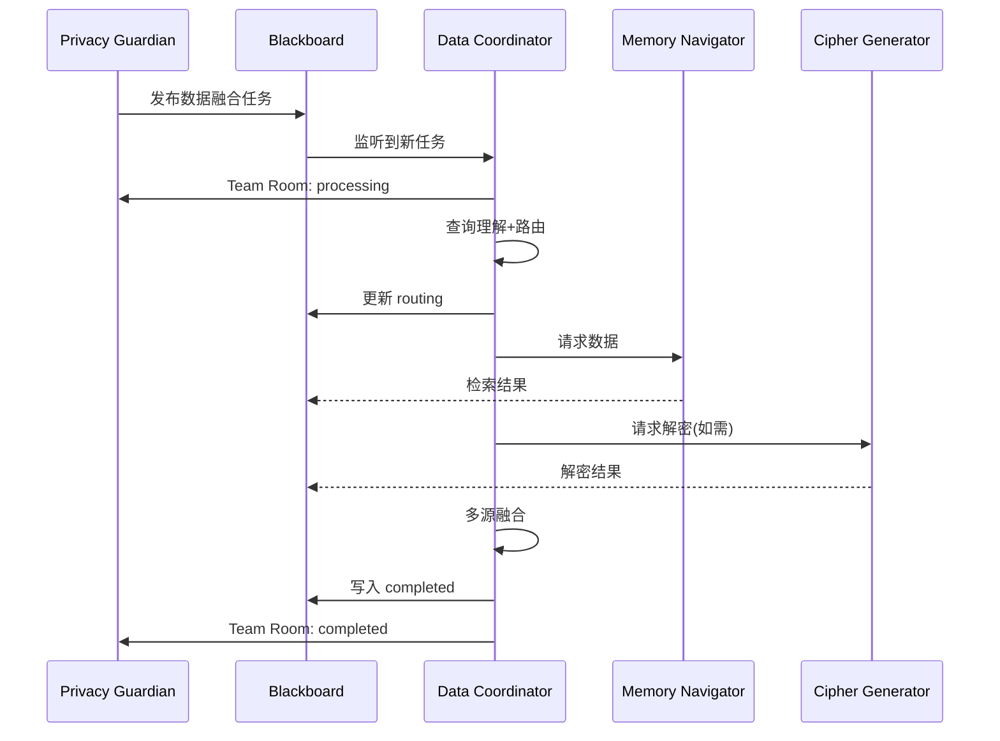

# 第5章：Data Coordinator（数据融合 Worker）

**版本**: v2.0  
**更新日期**: 2026-08-03  
**架构定位**: 7-Agent 架构中的 Worker 角色  
**关联 Skill**: DataFusion Skill（Schema + Wrapper + SDK 三层）

---

## 目录

- [5.1 职责与定位](#51-职责与定位)
- [5.2 查询理解能力](#52-查询理解能力)
- [5.3 智能路由算法](#53-智能路由算法)
- [5.4 数据融合策略](#54-数据融合策略)
- [5.5 DataFusion Skill 三层架构](#55-datafusion-skill-三层架构)
- [5.6 黑板状态与 Team Room 通信](#56-黑板状态与-team-room-通信)
- [5.7 与其他 Agent 的协作](#57-与其他-agent-的协作)
- [5.8 轻量化设计](#58-轻量化设计)
- [5.9 模型量化策略](#59-模型量化策略)
- [5.10 完整代码示例](#510-完整代码示例)

---

## 5.1 职责与定位

### Data Coordinator 在 7-Agent 架构中的角色

Data Coordinator（数据融合 Worker）是 SelfBrain 7-Agent 架构中的**数据融合专家**，负责多源数据的路由、融合与整合。它作为 **Worker** 受 Privacy Guardian（Team Leader）调度，通过 Team Room 和共享黑板与其他 Agent 协同工作。



### 从 Data Broker 到 Data Coordinator 的升级

| 维度 | 旧版 Data Broker | 新版 Data Coordinator |
|------|-----------------|---------------------|
| 架构定位 | 三 MEMO 架构的协调层 | 7-Agent 架构的 Worker |
| 通信方式 | 直接调用 Navigator/Cipher | Team Room + 共享黑板 |
| Skill 支持 | 无独立 Skill | DataFusion Skill（三层） |
| 开源策略 | 无区分 | Schema+Wrapper 开源，SDK 闭源 |
| 调度模式 | Core 直接委派 | Guardian 黑板发布 → Worker 响应 |
| 数据源范围 | 仅 Memory Palace 内部 | 多源融合（MP + API + DB + MCP） |

### 核心职责（升级版）

1. **查询理解（Query Understanding）** — 解析意图、识别数据源、提取实体
2. **智能路由（Smart Routing）** — 决定 MP 层级 + 外部数据源路由
3. **多源数据融合（Multi-Source Data Fusion）** ⭐ — 整合 MP 多层级 + 外部 API/DB/MCP 数据
4. **黑板状态管理（Blackboard State Management）** ⭐ — 监听任务、更新状态、写回结果

### 开源/闭源边界

```
┌─────────────────────────────────────────────────────────┐
│              DataFusion Skill 开源/闭源边界               │
├─────────────────────────────────────────────────────────┤
│  ✅ 开源（Schema + Wrapper）                             │
│  ├─ schemas/data-fusion-input.json    输入格式定义       │
│  ├─ schemas/data-fusion-output.json   输出格式定义       │
│  ├─ schemas/data-source-registry.json 数据源注册表       │
│  ├─ wrapper/data_fusion_wrapper.py    Python 薄层       │
│  └─ wrapper/source_adapters/          各源适配器         │
│                                                         │
│  ❌ 闭源（SDK）                                          │
│  ├─ sdk/libdatafusion.so / .dll       核心融合算法       │
│  ├─ sdk/multi_source_ranker           多源排序算法       │
│  ├─ sdk/semantic_dedup                语义去重算法       │
│  ├─ sdk/cross_source_linker           跨源关联算法       │
│  └─ sdk/schema_normalizer             智能 Schema 映射   │
└─────────────────────────────────────────────────────────┘
```

### 为什么用 INT4 量化版

```python
✅ 需要的能力：意图分类、实体抽取、路由决策、数据格式转换、Schema 映射
❌ 不需要的能力：深度语义理解、长文本生成、复杂逻辑推理、多轮对话管理
结论：VibeThinker-3B INT4 量化版足够！
```

| Agent | 角色 | 参数量 | 原因 |
|-------|------|--------|------|
| Privacy Guardian | Team Leader | 3B FP16 | 复杂推理、完整度评估 |
| Memory Navigator | Worker | 1.5B INT4 | 记忆 MP 地图 |
| Cipher Generator | Worker | 1.5B INT4 | 动态密码规则 |
| **Data Coordinator** | **Worker** | **VibeThinker-3B INT4** | **路由和融合** |
| Policy Enforcer | Worker | 0.5B INT4 | 权限查表 |
| Audit Logger | Worker | 0.5B INT4 | 日志格式化 |
| Validator | Worker | 1B INT4 | 6 维核查 |

### 轻量化设计理念

1. **专注核心**：只做数据融合，不做推理
2. **规则为主**：80% 靠规则，20% 靠学习
3. **快速响应**：延迟 < 50ms
4. **低资源消耗**：INT4 量化后仅需 ~300MB 显存
5. **无状态 Worker**：不维护对话状态，状态在黑板上

---

## 5.2 查询理解能力

### 意图分析（Intent Classification）

#### 意图分类体系

```python
class QueryIntent(Enum):
    # 检索类（80% 的查询）
    RETRIEVE_RECENT = "retrieve_recent"
    RETRIEVE_HISTORICAL = "retrieve_historical"
    RETRIEVE_RELATED = "retrieve_related"
    # 分析类（15%）
    ANALYZE_TREND = "analyze_trend"
    ANALYZE_COMPARISON = "analyze_comparison"
    ANALYZE_SUMMARY = "analyze_summary"
    # 多源融合类（新增 ⭐）
    FUSE_MULTI_SOURCE = "fuse_multi_source"
    CROSS_SOURCE_QUERY = "cross_source_query"
    # 操作类
    UPDATE_DATA = "update_data"
    DELETE_DATA = "delete_data"
    UNKNOWN = "unknown"
```

#### 意图识别示例

```python
# 示例1：检索最近数据
query = "显示我今天的会议安排"
intent = RETRIEVE_RECENT
reasoning = {"time_indicator": "今天", "sources": ["memory_palace"]}

# 示例2：多源融合（新增 ⭐）
query = "结合我的日历和项目数据，生成本周工作汇报"
intent = FUSE_MULTI_SOURCE
reasoning = {"sources": ["memory_palace", "calendar_api", "project_db"]}

# 示例3：跨源关联查询（新增 ⭐）
query = "和张三合作过的所有客户及其最近沟通记录"
intent = CROSS_SOURCE_QUERY
reasoning = {"entity": "张三", "sources": ["memory_palace", "crm_api"]}
```

### 实体抽取（Entity Extraction）

```python
class EntityType(Enum):
    PERSON = "person"
    ORGANIZATION = "organization"
    LOCATION = "location"
    TIME = "time"
    EVENT = "event"
    DOCUMENT = "document"
    CONCEPT = "concept"
    DATA_SOURCE = "data_source"    # 新增：数据源实体

class Entity:
    def __init__(self, text: str, type: EntityType, confidence: float):
        self.text = text
        self.type = type
        self.confidence = confidence

# 示例
entities = [
    Entity("张三", EntityType.PERSON, 0.95),
    Entity("CRM", EntityType.DATA_SOURCE, 0.98),
    Entity("日历", EntityType.DATA_SOURCE, 0.96),
]
```

### 查询分类决策树



### 分类逻辑实现

```python
class QueryClassifier:
    def classify(self, query: str) -> Dict[str, Any]:
        intent = self._classify_intent(query)
        entities = self._extract_entities(query)
        time_range = self._extract_time_range(query)
        sources = self._identify_sources(entities)  # 新增
        routing_plan = self._generate_routing_plan(intent, entities, time_range, sources)
        return {"intent": intent, "entities": entities, "time_range": time_range,
                "sources": sources, "routing_plan": routing_plan}

    def _identify_sources(self, entities: List[Entity]) -> List[str]:
        sources = [e.text for e in entities if e.type == EntityType.DATA_SOURCE]
        return sources if sources else ["memory_palace"]
```

---

## 5.3 智能路由算法

### 按需访问层级 + 多源路由

Data Coordinator 的核心能力是**智能路由**：决定访问哪些 MP 层级以及调用哪些外部数据源。

#### Memory Palace 五层架构回顾

```python
L1: 快速索引层（最近 1000 条）  # 80% 查询在此结束，延迟 < 10ms
L2: 时序管理层（按时间组织）    # 历史数据查询/趋势分析
L2.5: 实体图谱层（关系网络）    # 关联查询/路径查找
L2.7: 时序预测层（仅 SelfBrain）# 独占访问 ⭐
L3: 完整归档层（仅 SelfBrain）  # 最高安全级别 ⭐⭐⭐
```

#### 外部数据源注册表（新增）

```python
class DataSourceRegistry:
    def __init__(self):
        self.sources = {}

    def register(self, name, source_type, endpoint, schema, auth_required=False):
        self.sources[name] = {"type": source_type, "endpoint": endpoint,
                              "schema": schema, "auth_required": auth_required}

registry = DataSourceRegistry()
registry.register("memory_palace", "internal", "navigator.query", DataFusionSchema.MP)
registry.register("crm_api", "api", "https://api.company.com/crm/v1",
                   DataFusionSchema.CRM, auth_required=True)
registry.register("calendar_api", "mcp", "mcp://calendar-server", DataFusionSchema.CAL)
```

### 路由决策树（升级版）

```python
class RoutingDecision:
    def decide(self, query_info: Dict) -> RoutingPlan:
        plan = RoutingPlan()
        # MP 层级路由
        plan.add_source("memory_palace",
                        self._decide_memory_layers(query_info["intent"], query_info["time_range"]))
        # 外部源路由（新增）
        if query_info["intent"] in [QueryIntent.FUSE_MULTI_SOURCE, QueryIntent.CROSS_SOURCE_QUERY]:
            for src in query_info.get("sources", []):
                if src != "memory_palace":
                    plan.add_source(src, self._decide_source_query(src, query_info))
        return plan

    def _decide_memory_layers(self, intent, time_range) -> List[str]:
        if intent == QueryIntent.RETRIEVE_RECENT: return ["L1"]
        if intent in [QueryIntent.RETRIEVE_HISTORICAL, QueryIntent.ANALYZE_TREND]:
            return ["L1", "L2"] if self._is_recent_history(time_range) else ["L2"]
        if intent == QueryIntent.RETRIEVE_RELATED: return ["L2.5"]
        if intent == QueryIntent.ANALYZE_COMPARISON: return ["L1", "L2", "L2.5"]
        return ["L1"]

class RoutingPlan:
    def __init__(self):
        self.sources = {}
    def add_source(self, name, params):
        self.sources[name] = params
    def to_blackboard_task(self) -> Dict:
        return {"type": "data_routing", "sources": self.sources, "status": "pending"}
```

### 性能优化

```python
# 优化1：缓存热点路由
class RoutingCache:
    def __init__(self, max_size=1000):
        self.cache = LRUCache(max_size)
    def get(self, query_hash): return self.cache.get(query_hash)
    def set(self, query_hash, plan): self.cache.put(query_hash, plan)

# 优化2：提前终止
class EarlyTermination:
    def should_continue(self, results, threshold=0.9):
        if not results: return True
        return self._calculate_confidence(results) < threshold

# 优化3：并行查询多层/多源
class ParallelRouting:
    async def query_multiple_sources(self, plan: RoutingPlan, query: str) -> Dict:
        tasks = [self._query_async(n, p, query) for n, p in plan.sources.items()]
        results = await asyncio.gather(*tasks)
        return dict(zip(plan.sources.keys(), results))
```

---

## 5.4 数据融合策略

### 多源数据整合

```python
# 场景1：单源
result = navigator.query("L1", "今天的会议")

# 场景2：MP 多层级
results = {"L1": navigator.query("L1", q), "L2": navigator.query("L2", q)}

# 场景3：多源融合（新增）
results = {
    "memory_palace": navigator.query(["L1", "L2"], query),
    "calendar_api": calendar_client.get_week_events(),
    "project_db": project_client.get_active_tasks(),
}

# 场景4：跨源关联（新增）
results = {
    "memory_palace": navigator.query("L2.5", {"person": "张三"}),
    "crm_api": crm_client.get_interactions({"person": "张三"}),
    "project_db": project_client.get_by_owner({"person": "张三"}),
}
```

### 融合算法

```python
class DataFusion:
    """数据融合器（通过 DataFusion Skill SDK 调用）"""

    def fuse(self, multi_source_results: Dict[str, List]) -> FusionResult:
        # Step 1: Schema 映射 - Wrapper 层（开源）
        normalized = self._normalize_schemas(multi_source_results)
        # Step 2: 去重 - SDK 闭源
        unique_items = self._deduplicate(normalized)
        # Step 3: 排序
        sorted_items = self._sort_by_relevance(unique_items)
        # Step 4: 评分 - SDK 闭源核心算法
        scored_items = self._score_items(sorted_items, multi_source_results)
        # Step 5: 截断
        top_items = scored_items[:self.top_k]
        return FusionResult(
            items=top_items,
            sources=list(multi_source_results.keys()),
            metadata={"total_input": sum(len(v) for v in multi_source_results.values()),
                      "total_output": len(top_items)})

class FusionResult:
    def __init__(self, items, sources, metadata):
        self.items = items
        self.sources = sources
        self.fusion_metadata = metadata

    def to_blackboard_format(self) -> Dict:
        return {"type": "data_fusion_result", "items": self.items,
                "sources": self.sources, "metadata": self.fusion_metadata,
                "status": "completed"}
```

### Cipher 加密数据管理（通过 Team Room）

```python
class CipherCoordinator:
    """通过 Team Room + 黑板协调 Cipher Generator"""

    async def request_decryption(self, encrypted_data, password_id,
                                  session_id, blackboard) -> Any:
        blackboard.write({"type": "decrypt_request",
                          "encrypted_data": encrypted_data,
                          "password_id": password_id,
                          "requester": "data_coordinator", "status": "pending"})
        result = await blackboard.wait_for(
            task_type="decrypt_result", password_id=password_id, timeout=10.0)
        if result["status"] == "success":
            return result["decrypted_data"]
        raise CipherDecryptError(result.get("error", "Unknown"))
```

### 错误处理与重试

```python
class BrokerError(Exception): pass
class NavigatorTimeoutError(BrokerError): pass
class CipherDecryptError(BrokerError): pass
class DataSourceUnavailableError(BrokerError): pass

class RetryPolicy:
    def __init__(self, max_retries=3, backoff_factor=2.0):
        self.max_retries = max_retries
        self.backoff_factor = backoff_factor

    def execute_with_retry(self, func, *args, **kwargs):
        for attempt in range(self.max_retries):
            try:
                return func(*args, **kwargs)
            except NavigatorTimeoutError:
                if attempt == self.max_retries - 1: raise
                time.sleep(self.backoff_factor ** attempt)
            except DataSourceUnavailableError:
                return self._fallback_single_source(func, *args, **kwargs)
```

---

## 5.5 DataFusion Skill 三层架构

### Skill 概述

DataFusion Skill 采用 **Schema + Wrapper + SDK** 三层架构，实现开源接口与闭源算法的分离。



### 5.5.1 Schema 层（开源）

#### 输入 Schema

```json
{
  "$schema": "http://json-schema.org/draft-07/schema#",
  "title": "DataFusion Request",
  "type": "object",
  "required": ["query", "sources"],
  "properties": {
    "query": { "type": "string" },
    "intent": {
      "type": "string",
      "enum": ["retrieve_recent", "retrieve_historical", "retrieve_related",
               "analyze_trend", "analyze_comparison", "analyze_summary",
               "fuse_multi_source", "cross_source_query"]
    },
    "sources": {
      "type": "array",
      "items": {
        "type": "object",
        "required": ["name", "type"],
        "properties": {
          "name": { "type": "string" },
          "type": { "enum": ["memory_palace", "api", "database", "file", "mcp"] },
          "params": { "type": "object" },
          "priority": { "type": "integer", "minimum": 1, "maximum": 10 }
        }
      }
    },
    "fusion_strategy": {
      "type": "string",
      "enum": ["merge", "concat", "intersect", "weighted_merge"],
      "default": "merge"
    },
    "max_results": { "type": "integer", "default": 10 }
  }
}
```

#### 输出 Schema

```json
{
  "title": "DataFusion Response",
  "type": "object",
  "required": ["items", "metadata"],
  "properties": {
    "items": {
      "type": "array",
      "items": {
        "type": "object",
        "required": ["id", "content", "score", "_source"],
        "properties": {
          "id": { "type": "string" },
          "content": { "type": "object" },
          "score": { "type": "number", "minimum": 0, "maximum": 1 },
          "_source": { "type": "string" }
        }
      }
    },
    "metadata": {
      "type": "object",
      "properties": {
        "total_input": { "type": "integer" },
        "total_output": { "type": "integer" },
        "sources_used": { "type": "array", "items": { "type": "string" } },
        "processing_time_ms": { "type": "number" }
      }
    }
  }
}
```

### 5.5.2 Wrapper 层（开源）

Python 薄层：参数验证 + 调用 SDK。开源便于社区贡献新数据源适配器。

```python
class DataFusionWrapper:
    def __init__(self, sdk_path="sdk/libdatafusion.so"):
        self._sdk = ctypes.CDLL(sdk_path)
        self._registry = DataSourceRegistry()

    def validate_request(self, request: Dict) -> Tuple[bool, List[str]]:
        errors = []
        if "query" not in request: errors.append("Missing: query")
        if "sources" not in request: errors.append("Missing: sources")
        for src in request.get("sources", []):
            if src["name"] not in self._registry.sources:
                errors.append(f"Unknown source: {src['name']}")
        return (len(errors) == 0, errors)

    def fuse(self, request: Dict) -> Dict:
        is_valid, errors = self.validate_request(request)
        if not is_valid: raise ValueError(f"Validation failed: {errors}")
        raw = self._sdk.fusion_engine_run(json.dumps(request))
        result = json.loads(raw)
        result["metadata"]["wrapper_version"] = "2.0.0"
        return result
```

#### 数据源适配器（开源，社区可贡献）

```python
class BaseSourceAdapter:
    def __init__(self, config: Dict): self.config = config
    async def query(self, params: Dict) -> List[Dict]: raise NotImplementedError
    def normalize(self, raw_data: List[Dict]) -> List[Dict]: raise NotImplementedError

class MemoryPalaceAdapter(BaseSourceAdapter):
    async def query(self, params):
        return await self.navigator.query(params.get("layer", "L1"), params["query"])
    def normalize(self, raw_data):
        return [{"id": d["id"], "content": d, "score": d.get("score", 0.5),
                 "_source": "memory_palace"} for d in raw_data]

class CRMAdapter(BaseSourceAdapter):
    """社区可贡献的 CRM 适配器"""
    async def query(self, params):
        async with aiohttp.ClientSession() as s:
            r = await s.get(f"{self.config['endpoint']}/contacts", params=params)
            return await r.json()
    def normalize(self, raw_data):
        return [{"id": d["contact_id"], "content": d, "score": d.get("relevance", 0.5),
                 "_source": "crm_api"} for d in raw_data]
```

### 5.5.3 SDK 层（闭源）

核心融合算法，以 `.so`/`.dll` 二进制分发。

```python
class _DataFusionSDK:
    """DataFusion Core SDK（闭源黑盒）

    核心算法清单：
    1. multi_source_ranker    多源排序（LTR + 多信号融合）
    2. semantic_dedup          语义去重（Embedding + ANN）
    3. cross_source_linker     跨源关联（Entity Resolution）
    4. schema_normalizer       智能 Schema 映射
    5. adaptive_weight         自适应权重调整
    """
    def fusion_engine_run(self, request_json: str) -> str: ...
    def multi_source_rank(self, candidates, weights) -> List: ...
    def semantic_deduplicate(self, items, threshold) -> List: ...
    def cross_source_link(self, sources_data) -> List: ...
```

### 三层架构数据流



---

## 5.6 黑板状态与 Team Room 通信

### 黑板状态机



### 黑板数据结构

```python
class BlackboardEntry:
    PHASES = ["pending", "routing", "fusing", "completed", "error", "failed"]

    def __init__(self, task_id: str, user_query: str):
        self.task_id = task_id
        self.user_query = user_query
        self.phase = "pending"
        self.query_intent = None
        self.entities = []
        self.routing_plan = None
        self.source_results = {}
        self.fusion_result = None
        self.error_info = None
```

### Team Room 通信协议

```python
class DataCoordinatorWorker:
    def __init__(self, blackboard, team_room):
        self.blackboard = blackboard
        self.team_room = team_room
        self.classifier = QueryClassifier()
        self.router = RoutingDecision()
        self.fusion = DataFusion()

    async def run(self):
        while True:
            task = await self.blackboard.wait_for(task_type="data_fusion", phase="pending")
            self.team_room.notify("data_coordinator", "processing", task.task_id)
            task.phase = "routing"
            self.blackboard.update(task)

            query_info = self.classifier.classify(task.user_query)
            task.query_intent = query_info["intent"]

            routing_plan = self.router.decide(query_info)
            task.routing_plan = routing_plan.to_blackboard_task()
            task.phase = "fusing"
            self.blackboard.update(task)

            try:
                source_results = await self._execute_routing(routing_plan)
                fusion_result = self.fusion.fuse(source_results)
                task.fusion_result = fusion_result.to_blackboard_format()
                task.phase = "completed"
            except Exception as e:
                task.error_info = {"error": str(e), "type": type(e).__name__}
                task.phase = "error"

            self.blackboard.update(task)
            self.team_room.notify("data_coordinator", task.phase, task.task_id)
```

### 与 Privacy Guardian 的通信流程



---

## 5.7 与其他 Agent 的协作

### 协作关系矩阵

| 协作对象 | 通信方式 | 数据流向 | 触发条件 |
|---------|---------|---------|---------|
| Privacy Guardian | Team Room + 黑板 | 双向 | Guardian 发布任务/DC 汇报结果 |
| Memory Navigator | 黑板 | DC → MN → DC | 路由计划包含 memory_palace |
| Cipher Generator | 黑板 | DC → CG → DC | 需要解密/加密数据 |
| Policy Enforcer | 黑板 | PE → DC | 权限验证结果影响路由 |
| Audit Logger | 黑板 | DC → AL | 每次融合操作产生审计日志 |
| Validator | 黑板 | DC → VD | 融合结果需要 6 维核查 |

### 与 Memory Navigator 的协作

```python
async def _execute_routing(self, plan: RoutingPlan) -> Dict[str, List]:
    """执行路由计划，与多个 Agent 协作"""
    results = {}

    for source_name, params in plan.sources.items():
        if source_name == "memory_palace":
            # 通过黑板向 Navigator 发起请求
            self.blackboard.write({
                "type": "retrieval_request",
                "target": "memory_navigator",
                "params": params,
                "requester": "data_coordinator"
            })
            nav_result = await self.blackboard.wait_for(
                task_type="retrieval_result",
                requester="data_coordinator", timeout=10.0)
            results["memory_palace"] = nav_result["items"]

        elif source_name == "crm_api":
            adapter = CRMAdapter(self.registry.sources["crm_api"])
            raw = await adapter.query(params)
            results["crm_api"] = adapter.normalize(raw)

    return results
```

### 与 Policy Enforcer 的协作

```python
async def _check_permissions(self, query_info: Dict, blackboard: Blackboard) -> bool:
    """在路由前检查权限"""
    blackboard.write({
        "type": "permission_check",
        "target": "policy_enforcer",
        "requester": "data_coordinator",
        "query_intent": query_info["intent"],
        "entities": query_info["entities"],
        "status": "pending"
    })
    result = await blackboard.wait_for(
        task_type="permission_result",
        requester="data_coordinator", timeout=5.0)
    return result.get("allowed", False)
```

### 与 Audit Logger 的协作

```python
async def _log_fusion_operation(self, task_id: str, fusion_result: FusionResult,
                                 blackboard: Blackboard):
    """记录融合操作到审计日志"""
    blackboard.write({
        "type": "audit_event",
        "target": "audit_logger",
        "event": "data_fusion_completed",
        "task_id": task_id,
        "sources_used": fusion_result.sources,
        "items_count": len(fusion_result.items),
        "timestamp": datetime.utcnow().isoformat()
    })
```

---

## 5.8 轻量化设计

### 模型架构选择

```python
class DataCoordinatorModel(nn.Module):
    """Data Coordinator 模型（VibeThinker-3B INT4 量化版）"""

    def __init__(self, config):
        super().__init__()
        self.transformer = TransformerEncoder(
            vocab_size=32000, hidden_size=1024,
            num_layers=12, num_heads=16, intermediate_size=2688)
        self.intent_classifier = nn.Linear(1024, 12)  # 12 个意图类别
        self.ner_tagger = nn.Linear(1024, 8)           # 8 种实体类型
        self.routing_head = nn.Linear(1024, 5)          # 5 个层级

    def forward(self, input_ids, attention_mask):
        hidden = self.transformer(input_ids, attention_mask)
        cls = hidden[:, 0, :]
        return {
            "intent": self.intent_classifier(cls),
            "ner": self.ner_tagger(hidden),
            "routing": self.routing_head(cls)
        }
```

### 推理效率

```
性能目标：
├─ 延迟 < 50ms
│   ├─ 意图分类: 10ms
│   ├─ 实体抽取: 15ms
│   ├─ 路由决策: 5ms
│   └─ 数据格式化: 20ms
├─ 吞吐量 > 200 QPS（单 GPU RTX 4060 Ti）
└─ 资源: ~300MB 显存, CPU < 10%
```

---

## 5.9 模型量化策略

### INT4 量化

Data Coordinator 是 **VibeThinker-3B 的 INT4 量化版本**。量化过程将权重从 FP16 压缩到 INT4，减少约 75% 显存占用。

```python
class BrokerQuantizer:
    def quantize_to_int4(self, model, calibration_dataset):
        # Step 1: 准备校准数据
        loader = DataLoader(calibration_dataset, batch_size=8, shuffle=True)
        # Step 2: INT8 量化
        quantized = torch.quantization.quantize_dynamic(
            model, {nn.Linear: torch.quantization.default_dynamic_qconfig}, torch.qint8)
        # Step 3: 进一步压缩到 INT4
        quantized = self._convert_to_4bit(quantized)
        # Step 4: 验证精度
        loss = self._validate_accuracy(model, quantized, calibration_dataset)
        print(f"精度损失: {loss:.2%}")
        return quantized
```

### 精度要求

```
路由决策准确率 > 95%
├─ 意图分类准确率 > 98%
├─ 实体抽取 F1 > 90%
└─ 层级选择准确率 > 95%

量化后精度损失 < 2%
└─ INT4 量化后: 96.5%（原 97%），可接受
```

---

## 5.10 完整代码示例

### 端到端使用示例

```python
async def main():
    """Data Coordinator 完整使用示例"""

    # 1. 初始化组件
    blackboard = Blackboard()
    team_room = TeamRoom()
    config = DataBrokerConfig()
    model = DataCoordinatorModel(config)
    tokenizer = AutoTokenizer.from_pretrained("vibe-thinker-3b")

    # 2. 注册数据源
    registry = DataSourceRegistry()
    registry.register("memory_palace", "internal", "navigator.query", DataFusionSchema.MP)
    registry.register("crm_api", "api", "https://api.company.com/crm/v1", DataFusionSchema.CRM)

    # 3. 创建 Worker
    worker = DataCoordinatorWorker(blackboard, team_room)

    # 4. 模拟 Guardian 发布任务
    blackboard.write({
        "type": "data_fusion",
        "task_id": "task_001",
        "user_query": "结合日历和项目数据，生成本周工作汇报",
        "phase": "pending"
    })

    # 5. 启动 Worker
    await worker.run()

if __name__ == "__main__":
    asyncio.run(main())
```

---

## 总结

Data Coordinator（数据融合 Worker）是 SelfBrain 7-Agent 架构中的**核心数据融合引擎**，负责：

1. **查询理解**：意图分类（含多源融合/跨源关联）、实体抽取（含数据源识别）
2. **智能路由**：MP 层级路由 + 外部数据源路由（API/DB/MCP）
3. **多源数据融合**：Schema 映射 → 去重 → 排序 → 评分 → 截断
4. **黑板状态管理**：pending → routing → fusing → completed 状态机

**核心优势**：

- ✅ **轻量化**：VibeThinker-3B INT4，仅需 ~300MB 显存
- ✅ **快速响应**：延迟 < 50ms，吞吐量 > 200 QPS
- ✅ **高准确率**：路由决策准确率 > 95%
- ✅ **开源可控**：Schema+Wrapper 开源，SDK 闭源（6-24 月追赶时间）
- ✅ **多源融合**：支持 Memory Palace + 外部 API/DB/MCP 多源数据融合
- ✅ **Team Room 通信**：通过黑板与 Guardian/Navigator/Cipher 协同

**DataFusion Skill 三层架构**：

| 层级 | 内容 | 开源/闭源 |
|------|------|----------|
| Schema 层 | 输入输出 JSON 定义 | ✅ 开源 |
| Wrapper 层 | Python 参数验证 + 适配器 | ✅ 开源 |
| SDK 层 | 核心融合算法 (.so/.dll) | ❌ 闭源 |

**与其他 Agent 的关系**：

- 接收 Privacy Guardian 的任务委派（通过黑板）
- 查询 Memory Navigator 获取 MP 数据（通过黑板）
- 请求 Cipher Generator 加密/解密（通过黑板）
- 汇报结果给 Guardian 评估（通过 Team Room）
- 产生审计日志给 Audit Logger（通过黑板）
- 融合结果交给 Validator 核查（通过黑板）

---

## 上一章 / 下一章

← [第4章：Cipher Generator](./04-MEMO-Cipher.md)  
→ [第6章：Privacy Guardian](./06-SelfBrain-Core.md)
