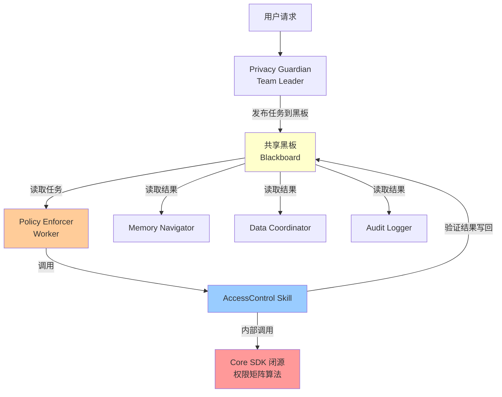
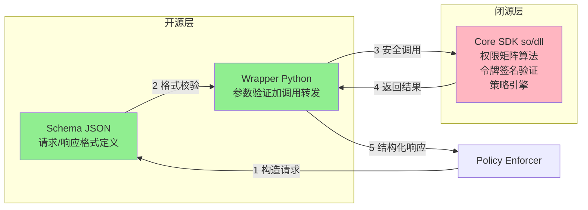
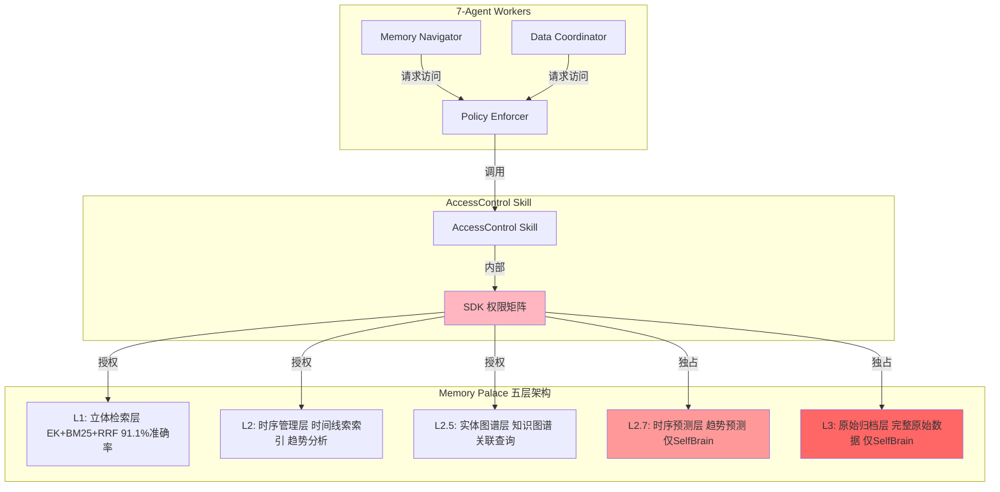
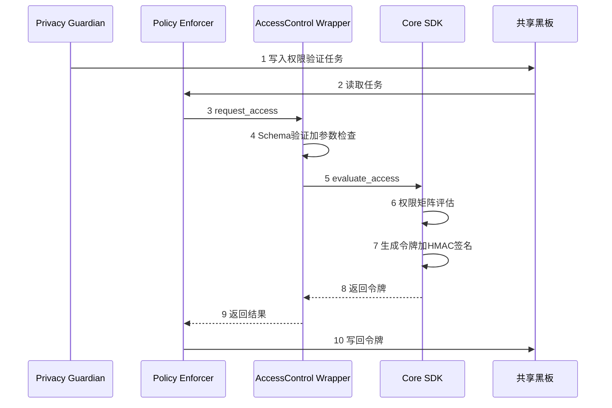
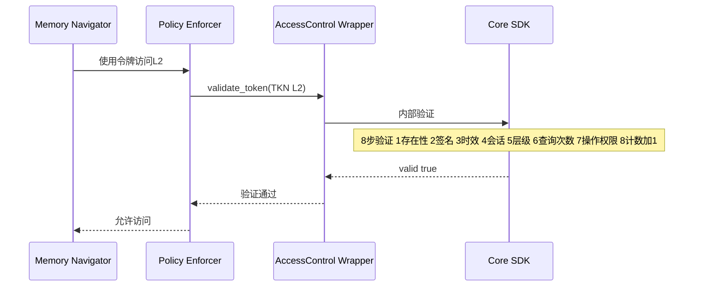
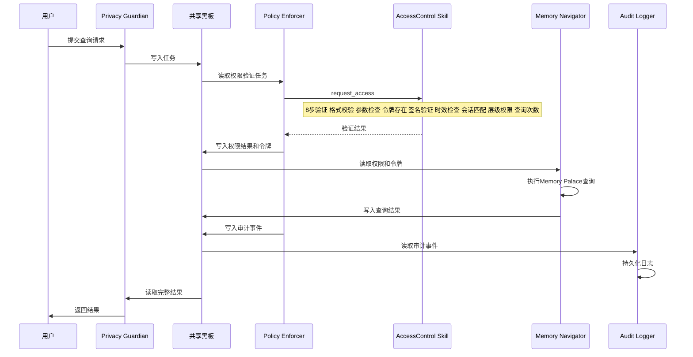
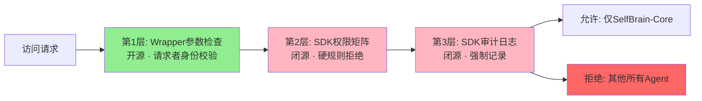
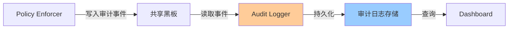
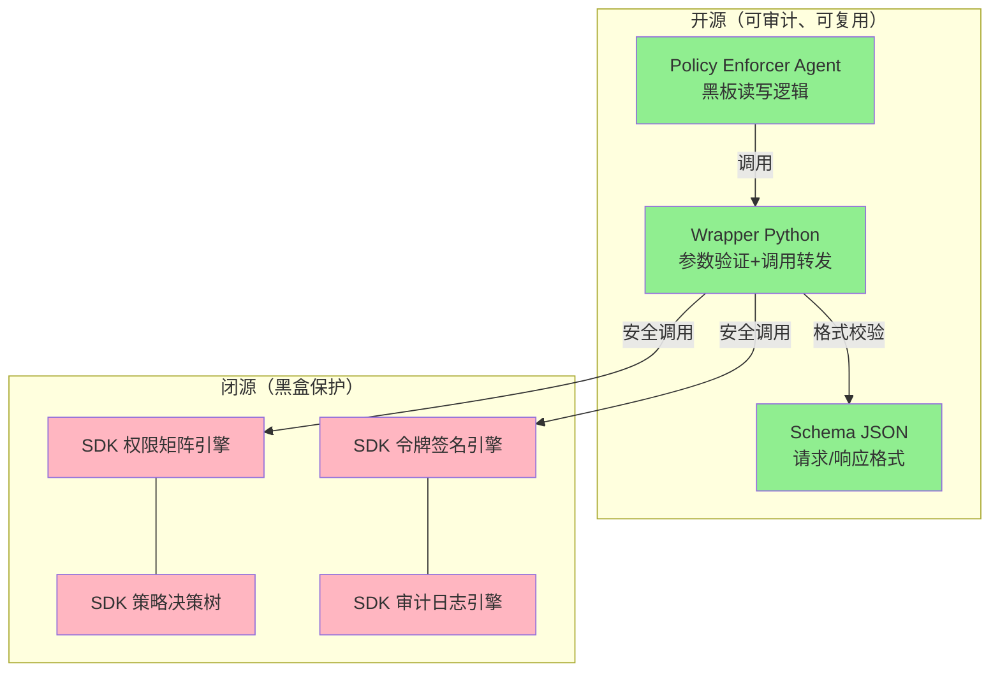

# 第8章：分层权限系统（AccessControl Skill）

**版本**: v2.0  
**更新日期**: 2026-08-03  
**架构**: 7-Agent 黑板模式 + AccessControl Skill

---

## 目录

- [8.1 概述：分层权限在7-Agent架构中的定位](#81-概述分层权限在7-agent架构中的定位)
- [8.2 AccessControl Skill 三层架构](#82-accesscontrol-skill-三层架构)
- [8.3 Memory Palace 五层权限](#83-memory-palace-五层权限)
- [8.4 动态令牌机制](#84-动态令牌机制)
- [8.5 按任务分配策略](#85-按任务分配策略)
- [8.6 权限验证流程（黑板模式）](#86-权限验证流程黑板模式)
- [8.7 L3独占访问保护](#87-l3独占访问保护)
- [8.8 审计日志系统](#88-审计日志系统)
- [8.9 开源/闭源边界](#89-开源闭源边界)
- [8.10 完整代码示例](#810-完整代码示例)

---

## 8.1 概述：分层权限在7-Agent架构中的定位

### 8.1.1 架构全景

SelfBrain 的分层权限系统在 AgentTeams 黑板模式中由 **Policy Enforcer Worker** 承载，通过调用 **AccessControl Skill** 完成所有权限验证。权限矩阵算法位于闭源 SDK 层，保证核心安全逻辑不可逆向。



### 8.1.2 Policy Enforcer 在7-Agent中的角色

| 属性 | 说明 |
|------|------|
| **Agent名称** | Policy Enforcer |
| **角色** | Worker（5 Workers 之一） |
| **职责** | 分层权限验证、令牌管理、权限策略执行 |
| **使用Skill** | AccessControl Skill |
| **黑板交互** | 读取任务中的权限请求 → 执行验证 → 将验证结果写回黑板 |
| **上游依赖** | Privacy Guardian（Team Leader）发布权限验证任务 |
| **下游影响** | Memory Navigator / Data Coordinator 读取权限结果后才执行数据访问 |

### 8.1.3 权限验证在黑板模式中的流转

```
共享黑板 (Blackboard) 状态变迁：

① Privacy Guardian 写入:
   { task_type: "access_check", requester: "MemoryNavigator",
     target_layers: ["L1","L2"], purpose: "趋势分析" }

② Policy Enforcer 读取 → 调用 AccessControl Skill

③ Policy Enforcer 写回:
   { access_granted: true, token: "TKN_xxx", layers: ["L1","L2"],
     expires_at: 1722241200, max_queries: 10 }

④ 其他 Workers 读取权限结果后执行操作
```

---

## 8.2 AccessControl Skill 三层架构

AccessControl Skill 遵循 SelfBrain 6-Skill 体系的三层架构设计：**Schema（开源）→ Wrapper（开源）→ SDK（闭源）**。

### 8.2.1 架构总览



### 8.2.2 Schema 层（开源）—— 权限验证请求/响应格式

Schema 定义了权限验证的输入输出 JSON 格式，确保所有调用方使用一致的数据结构。

**请求 Schema** (`access_request.schema.json`):

```json
{
  "$schema": "http://json-schema.org/draft-07/schema#",
  "title": "AccessControlRequest",
  "description": "分层权限验证请求",
  "type": "object",
  "required": ["requester", "target_layers", "purpose"],
  "properties": {
    "requester": {
      "type": "string",
      "description": "请求者标识（Agent名称或session_id）",
      "enum": ["MemoryNavigator", "DataCoordinator", "CipherGenerator", "AuditLogger", "Validator"]
    },
    "target_layers": {
      "type": "array",
      "description": "请求访问的目标层级",
      "items": { "type": "string", "enum": ["L1", "L2", "L2.5", "L2.7", "L3"] },
      "minItems": 1
    },
    "purpose": { "type": "string", "description": "访问用途描述" },
    "task_id": { "type": "string", "description": "关联任务ID" },
    "session_id": { "type": "string", "description": "会话ID" },
    "complexity": {
      "type": "string",
      "enum": ["simple", "medium", "complex"],
      "description": "任务复杂度（可选，SDK可自动推断）"
    }
  }
}
```

**响应 Schema** (`access_response.schema.json`):

```json
{
  "$schema": "http://json-schema.org/draft-07/schema#",
  "title": "AccessControlResponse",
  "description": "分层权限验证响应",
  "type": "object",
  "required": ["access_granted", "token_id", "granted_layers", "expires_at"],
  "properties": {
    "access_granted": { "type": "boolean", "description": "是否授权" },
    "token_id": { "type": "string", "description": "动态访问令牌ID" },
    "granted_layers": { "type": "array", "items": { "type": "string" }, "description": "实际授权的层级列表" },
    "denied_layers": { "type": "array", "items": { "type": "string" }, "description": "被拒绝的层级列表" },
    "expires_at": { "type": "integer", "description": "令牌过期时间戳（Unix）" },
    "max_queries": { "type": "integer", "description": "最大查询次数" },
    "denial_reason": { "type": "string", "description": "拒绝原因（仅access_granted=false时）" }
  }
}
```

### 8.2.3 Wrapper 层（开源）—— 参数验证与调用转发

Wrapper 是一层薄薄的 Python 代码，负责参数验证和 SDK 调用转发。**不包含任何业务逻辑**。

```python
# access_control_wrapper.py — 开源
"""
AccessControl Skill Wrapper
职责：参数验证 + SDK调用转发
注意：所有业务逻辑在闭源SDK中，本层仅做"门卫"工作
"""

import json
import jsonschema
from pathlib import Path

# 加载 Schema
SCHEMA_DIR = Path(__file__).parent / "schemas"
REQUEST_SCHEMA = json.loads((SCHEMA_DIR / "access_request.schema.json").read_text())
RESPONSE_SCHEMA = json.loads((SCHEMA_DIR / "access_response.schema.json").read_text())

# 动态加载闭源 SDK
import importlib
_sdk = importlib.import_module("selfbrain_core_sdk.access_control")


class AccessControlWrapper:
    """AccessControl Skill 的 Wrapper 层"""

    def request_access(self, request: dict) -> dict:
        """
        请求权限访问
        Args:
            request: 符合 access_request.schema.json 的请求字典
        Returns:
            符合 access_response.schema.json 的响应字典
        Raises:
            ValidationError: 请求格式不合法
        """
        # 1. 输入 Schema 验证（开源）
        jsonschema.validate(instance=request, schema=REQUEST_SCHEMA)
        # 2. 基本参数卫生检查（开源）
        self._sanity_check(request)
        # 3. 调用闭源 SDK 执行实际验证
        response = _sdk.evaluate_access(request)
        # 4. 输出 Schema 验证（开源）
        jsonschema.validate(instance=response, schema=RESPONSE_SCHEMA)
        return response

    def validate_token(self, token_id: str, target_layer: str) -> dict:
        """验证已有令牌是否允许访问指定层级"""
        if not isinstance(token_id, str) or not token_id:
            raise ValueError("token_id must be a non-empty string")
        if target_layer not in ("L1", "L2", "L2.5", "L2.7", "L3"):
            raise ValueError(f"Invalid layer: {target_layer}")
        return _sdk.validate_token(token_id, target_layer)

    def revoke_token(self, token_id: str) -> dict:
        """撤销令牌"""
        if not isinstance(token_id, str) or not token_id:
            raise ValueError("token_id must be a non-empty string")
        return _sdk.revoke_token(token_id)

    def _sanity_check(self, request: dict):
        """基本参数卫生检查"""
        if not request.get("target_layers"):
            raise ValueError("target_layers cannot be empty")
        # L2.7 / L3 只有 SelfBrain 内部组件可以请求
        restricted = {"L2.7", "L3"}
        requested_restricted = restricted & set(request.get("target_layers", []))
        if requested_restricted and request.get("requester") not in (
            "SelfBrain-Core", "PolicyEnforcer"
        ):
            raise PermissionError(
                f"Layers {requested_restricted} are exclusive to SelfBrain-Core"
            )
```

### 8.2.4 SDK 层（闭源）—— 权限矩阵与策略引擎

SDK 是闭源的二进制模块（`.so` / `.dll`），包含所有核心安全逻辑。外部调用者无法查看或修改其内部实现。

**SDK 对外暴露的接口**（仅函数签名，实现不可见）：

```python
# selfbrain_core_sdk.access_control — 闭源接口定义（仅展示签名）

def evaluate_access(request: dict) -> dict:
    """
    核心权限评估引擎
    内部实现包含（不开源）：
    - 权限矩阵算法（L1-L5层级映射规则）
    - 任务复杂度自动推断
    - 最小权限原则裁剪
    - 动态令牌生成与HMAC-SHA256签名
    - 查询次数与有效期策略
    - 防篡改校验逻辑
    """
    ...

def validate_token(token_id: str, target_layer: str) -> dict:
    """
    令牌验证引擎
    内部实现包含（不开源）：
    - 令牌签名验证（HMAC-SHA256）
    - 时效性检查
    - 会话一致性校验
    - 层级权限匹配
    - 查询次数限制
    """
    ...

def revoke_token(token_id: str) -> dict:
    """撤销令牌并记录审计日志"""
    ...

def get_audit_trail(token_id: str) -> list:
    """获取令牌的审计记录（供Audit Logger使用）"""
    ...
```

**闭源SDK包含的核心算法（黑盒）**：

| 算法模块 | 功能 | 保护理由 |
|---------|------|---------|
| 权限矩阵引擎 | L1-L5 层级到 Agent 的映射规则 | 核心竞争力 |
| 复杂度推断器 | 根据任务特征自动判断 simple/medium/complex | 防止竞品复制 |
| 最小权限裁剪器 | 从"可以访问"裁剪到"只需访问" | 安全核心 |
| 令牌签名引擎 | HMAC-SHA256 + 防篡改校验 | 密码学安全 |
| 策略决策树 | 多条件组合的权限决策逻辑 | 业务核心 |

---

## 8.3 Memory Palace 五层权限

SelfBrain与Memory Palace的集成采用**分层权限架构**，不同层级的数据具有不同的访问控制策略。权限验证由 Policy Enforcer 通过 AccessControl Skill 统一执行。

### 8.3.1 五层架构概述



### 8.3.2 L1层：立体检索（动态分配）

**特点**：
- **用途**：快速索引和检索，支持语义搜索
- **技术**：EK（Entity + Keyword Boost）+ BM25 + RRF融合
- **准确率**：91.1%
- **访问权限**：通过 AccessControl Skill 按任务动态分配
- **响应时间**：< 50ms

**应用场景**：

1. **简单查询**（80%的查询只需要L1）
   ```
   用户: "Q3营收是多少？"
   → Policy Enforcer → AccessControl Skill 授权 L1
   → Memory Navigator 查询 L1
   → 返回: "Q3营收: $12.5M"
   → Token消耗: 50 tokens
   ```

2. **关键词检索**
   ```
   用户: "查找所有关于'客户流失'的记录"
   → AccessControl Skill 授权 L1
   → L1立体检索: 实体boost + BM25
   → 返回: 相关记录列表
   → Token消耗: 100 tokens
   ```

3. **语义搜索**
   ```
   用户: "最近有哪些项目遇到了延期问题？"
   → AccessControl Skill 授权 L1
   → L1语义向量检索 (Nemotron 2048维)
   → Token消耗: 150 tokens
   ```

**AccessControl Skill 调用示例**：
```python
wrapper = AccessControlWrapper()
result = wrapper.request_access({
    "requester": "MemoryNavigator",
    "target_layers": ["L1"],
    "purpose": "Query Q3 revenue",
    "task_id": "TASK_001",
    "session_id": "SESSION_001"
})
# result: { "access_granted": true, "granted_layers": ["L1"], "token_id": "TKN_xxx", ... }
```

### 8.3.3 L2层：时序管理（动态分配）

**特点**：
- **用途**：时间线索索引，趋势分析
- **技术**：时间戳索引 + 时序聚合
- **访问权限**：通过 AccessControl Skill 按任务动态分配
- **响应时间**：< 100ms

**应用场景**：

1. **时间范围查询**
   ```
   用户: "对比Q2和Q3的营收增长"
   → AccessControl Skill 授权 L1+L2
   → Memory Navigator: L1获取索引 + L2获取时序数据
   → 总计: 200 tokens
   ```

2. **趋势分析**
   ```
   用户: "客户数量的月度增长趋势"
   → AccessControl Skill 授权 L1+L2（complexity=medium）
   → L2时序聚合
   → Token消耗: 180 tokens
   ```

3. **历史对比**
   ```
   用户: "今年销售业绩与去年同期对比"
   → AccessControl Skill 授权 L1+L2
   → L2跨年度时序查询
   → Token消耗: 220 tokens
   ```

### 8.3.4 L2.5层：实体图谱（动态分配）

**特点**：
- **用途**：知识图谱，实体关联查询
- **技术**：图数据库 + 关系推理
- **访问权限**：通过 AccessControl Skill 按任务动态分配
- **响应时间**：< 150ms

**应用场景**：

1. **关系查询**
   ```
   用户: "找出所有与客户A有合作的供应商"
   → AccessControl Skill 授权 L1+L2.5（complexity=medium）
   → L2.5实体图谱遍历
   → Token消耗: 200 tokens
   ```

2. **多跳推理**
   ```
   用户: "哪些产品线影响了Q3的营收下降？"
   → AccessControl Skill 授权 L1+L2+L2.5（complexity=complex）
   → L2.5图谱推理: 产品→部门→营收
   → Token消耗: 250 tokens
   ```

3. **依赖分析**
   ```
   用户: "项目X的所有依赖项和受影响系统"
   → AccessControl Skill 授权 L1+L2+L2.5
   → L2.5依赖图谱
   → Token消耗: 280 tokens
   ```

### 8.3.5 L2.7层：时序预测（仅SelfBrain）⭐

**特点**：
- **用途**：趋势预测，未来预测
- **技术**：时序模型 + 预测算法
- **访问权限**：⭐ 仅 SelfBrain-Core（AccessControl Skill 硬性拒绝外部请求）
- **响应时间**：< 200ms

**为什么独占**：
1. **敏感性高**：未来预测可能影响商业决策
2. **准确度要求**：需要完整历史数据（L3支持）
3. **责任边界**：预测结果由SelfBrain负责，不分享给外部Agent

**AccessControl Skill 的硬性拦截**：
```python
# Wrapper 层的 _sanity_check 已在调用 SDK 前拦截
# SDK 层的 evaluate_access 内部也有二次校验（双保险）

wrapper.request_access({
    "requester": "MemoryNavigator",  # 非 SelfBrain-Core
    "target_layers": ["L2.7"],
    "purpose": "预测分析"
})
# → 抛出 PermissionError: "Layers {'L2.7'} are exclusive to SelfBrain-Core"
```

### 8.3.6 L3层：原始归档（仅SelfBrain）⭐⭐⭐

**特点**：
- **用途**：完整原始数据存储
- **技术**：完整归档 + 版本控制
- **访问权限**：⭐⭐⭐ 仅 SelfBrain-Core（最高级别保护）
- **数据量**：无限制（企业版）

**为什么独占**：
1. **隐私保护**：包含最敏感的原始数据
2. **合规要求**：GDPR/HIPAA要求数据不能传输给第三方
3. **完整性保证**：防止数据被外部Agent"记住"

**AccessControl Skill 的三层防护**：
```
第1层: Wrapper._sanity_check()  →  请求者身份校验
第2层: SDK.evaluate_access()    →  权限矩阵硬规则
第3层: SDK 内部审计日志          →  所有 L3 访问强制记录
```

### 8.3.7 五层权限对比总结

| 层级 | 用途 | 访问权限 | 外部Agent | 响应时间 | Token节约 |
|------|------|----------|-----------|----------|-----------|
| **L1** | 快速检索 | AccessControl 按任务分配 | ✅ 可访问 | < 50ms | 90% |
| **L2** | 时序管理 | AccessControl 按任务分配 | ✅ 可访问 | < 100ms | 85% |
| **L2.5** | 实体图谱 | AccessControl 按任务分配 | ✅ 可访问 | < 150ms | 80% |
| **L2.7** | 时序预测 | ⭐ 仅SelfBrain-Core | ❌ 禁止 | < 200ms | 95% |
| **L3** | 原始归档 | ⭐⭐⭐ 仅SelfBrain-Core | ❌ 禁止 | 按需 | 100% |

**关键洞察**：
- 80%的查询在L1就能满足（AccessControl Skill 快速授权）
- 15%的查询需要L2/L2.5（AccessControl Skill 中等复杂度验证）
- 5%的复杂查询需要SelfBrain主导（使用L2.7/L3，Policy Enforcer 自动路由）
- 外部Agent永远看不到L3原始数据（AccessControl Skill 硬性拦截）

---

## 8.4 动态令牌机制

SelfBrain采用**动态令牌（Dynamic Token）**机制，由 AccessControl Skill 的闭源 SDK 生成和验证，实现按任务临时分配权限。

### 8.4.1 令牌结构

每个令牌由 SDK 层生成，包含以下字段：

```json
{
  "token_id": "TKN_8f3a9c2d_1722240900",
  "session_id": "SESSION_user123_20260803",
  "task_id": "TASK_revenue_analysis_001",
  "granted_layers": ["L1", "L2"],
  "issued_at": 1722240900,
  "expires_at": 1722241200,
  "requester": "MemoryNavigator",
  "purpose": "Query Q3 revenue trends",
  "max_queries": 10,
  "used_queries": 2,
  "signature": "a3f8b2c1d4e5..."
}
```

> **安全说明**：令牌签名算法（HMAC-SHA256 + 防篡改校验）位于闭源 SDK 层，签名密钥和校验逻辑不对外暴露。

### 8.4.2 令牌生成流程



### 8.4.3 令牌验证流程



### 8.4.4 令牌策略参数

令牌的过期时间和查询次数由 SDK 层根据任务复杂度自动决定（闭源策略）：

| 任务复杂度 | 最大查询次数 | 有效期 | 说明 |
|-----------|------------|--------|------|
| simple | 5次 | 3分钟 | 简单查询，快速消耗 |
| medium | 10次 | 5分钟 | 中等复杂度分析 |
| complex | 20次 | 10分钟 | 复杂推理任务 |

> **注意**：具体策略参数由闭源 SDK 的策略引擎动态调整，上表仅为默认参考值。

---

## 8.5 按任务分配策略

SelfBrain的权限管理**不是基于固定角色**（RBAC），而是**按任务动态分配**，由 AccessControl Skill 的闭源 SDK 执行策略决策。

### 8.5.1 传统RBAC vs 动态分配

**传统RBAC（角色基础访问控制）**：
```
Agent → 角色 → 固定权限

例如：
- Admin角色 → 可以访问L1/L2/L2.5/L2.7/L3
- Analyst角色 → 可以访问L1/L2/L2.5
- Viewer角色 → 只能访问L1

问题：
❌ 过度授权：Admin即使简单查询也能访问L3
❌ 权限泄露：如果Admin凭证被盗，攻击者获得完整权限
❌ 不灵活：无法根据具体任务调整权限
```

**SelfBrain 动态分配（AccessControl Skill）**：
```
任务 → Policy Enforcer → AccessControl Skill → SDK权限矩阵 → 临时令牌

例如：
- 简单查询"Q3营收" → SDK评估complexity=simple → 令牌授权L1（3分钟有效）
- 趋势分析"月度增长" → SDK评估complexity=medium → 令牌授权L1+L2（5分钟有效）
- 复杂推理"流失原因" → SDK评估complexity=complex → SelfBrain主导，使用L3（内部）

优势：
✅ 最小权限原则：每个任务只获得必要权限（SDK裁剪）
✅ 时效性：令牌自动过期
✅ 可审计：每个令牌都有明确的用途和使用记录
✅ 黑盒保护：策略算法在闭源SDK中，不可逆向
```

### 8.5.2 最小权限原则的实现

最小权限原则由 AccessControl Skill 的闭源 SDK 层执行：

```
Policy Enforcer 请求: ["L1", "L2", "L2.5"]
          │
          ▼
┌─────────────────────────────┐
│  SDK 权限矩阵（闭源）         │
│  1. 分析任务需求             │
│  2. 识别最小必需层级         │
│  3. 裁剪多余权限             │
│  4. 生成裁剪后的令牌         │
└─────────────────────────────┘
          │
          ▼
实际授权: ["L1", "L2"]  （L2.5被裁剪——任务不需要关联查询）
```

**三层防护确保最小权限**：

| 层级 | 位置 | 职责 | 开源/闭源 |
|------|------|------|----------|
| 第1层 | Wrapper._sanity_check() | L2.7/L3 请求者身份校验 | 开源 |
| 第2层 | SDK.evaluate_access() | 完整权限矩阵评估 + 裁剪 | 闭源 |
| 第3层 | SDK 策略引擎 | 复杂度推断 + 动态策略 | 闭源 |

### 8.5.3 任务分类与权限映射

**任务分类矩阵**（由 SDK 策略引擎自动执行）：

| 任务类型 | 复杂度 | AccessControl 授权层级 | 有效期 | 最大查询 |
|---------|--------|----------------------|--------|----------|
| 简单查询 | simple | L1 | 3分钟 | 5次 |
| 关键词搜索 | simple | L1 | 3分钟 | 5次 |
| 趋势分析 | medium | L1+L2 | 5分钟 | 10次 |
| 对比分析 | medium | L1+L2 | 5分钟 | 10次 |
| 关联查询 | medium | L1+L2.5 | 5分钟 | 10次 |
| 依赖分析 | complex | L1+L2+L2.5 | 10分钟 | 20次 |
| 预测分析 | complex | SelfBrain内部（L2.7） | — | — |
| 审计查询 | complex | SelfBrain内部（L3） | — | — |

## 8.6 权限验证流程（黑板模式）

### 8.6.1 完整验证流程

权限验证在黑板模式中由 Policy Enforcer 统一协调，通过 AccessControl Skill 执行：



### 8.6.2 黑板上的权限数据流

```
黑板状态变迁：

T0: [任务发布]
    PG → { task: "分析Q3营收趋势", requester: "MemoryNavigator" }

T1: [权限验证请求]
    PE ← 读取任务
    PE → 调用 AccessControl Skill

T2: [权限验证结果]
    PE → { access: true, token: "TKN_abc", layers: ["L1","L2"],
           expires_at: T+300, max_queries: 10 }

T3: [数据查询执行]
    MN ← 读取 { token: "TKN_abc", layers: ["L1","L2"] }
    MN → 执行 Memory Palace 查询

T4: [审计记录]
    AL ← 读取 { event: "access_granted", token: "TKN_abc",
                requester: "MemoryNavigator", layers: ["L1","L2"] }
    AL → 持久化审计日志
```

### 8.6.3 错误处理流程

当 AccessControl Skill 拒绝访问时：

```
Policy Enforcer → AccessControl Skill → SDK.evaluate_access()
    ↓ (返回 access_granted: false)
Policy Enforcer → 写入黑板:
    { access: false, denied_layers: ["L2.7"], reason: "exclusive_to_selfbrain" }
    ↓
Privacy Guardian → 读取拒绝结果
    ↓
Privacy Guardian → 决策:
    ├─ 如果是 L2.7/L3 拒绝 → 路由到 SelfBrain-Core 内部处理
    └─ 如果是其他拒绝 → 向用户返回权限不足提示
```

### 8.6.4 权限验证的8个步骤

| 步骤 | 执行位置 | 说明 | 开源/闭源 |
|------|---------|------|----------|
| 1. Schema格式校验 | Wrapper | JSON Schema 验证请求格式 | 开源 |
| 2. 参数卫生检查 | Wrapper._sanity_check() | L2.7/L3 请求者身份校验 | 开源 |
| 3. 令牌存在性检查 | SDK | 检查令牌是否已签发 | 闭源 |
| 4. 签名验证 | SDK | HMAC-SHA256 防篡改校验 | 闭源 |
| 5. 时效性检查 | SDK | 是否在有效期内 | 闭源 |
| 6. 会话匹配 | SDK | session_id 一致性 | 闭源 |
| 7. 层级权限检查 | SDK | 权限矩阵匹配 | 闭源 |
| 8. 查询次数检查 | SDK | 是否超过 max_queries | 闭源 |

---

## 8.7 L3独占访问保护

### 8.7.1 为什么L3只给SelfBrain

**三大理由**：

1. **隐私保护的最后防线** - L3包含用户原始输入、完整对话历史、敏感业务数据（财务、客户、合同）
2. **责任边界清晰** - SelfBrain-Core负责数据提取和加密，外部Agent只看到加密摘要
3. **合规审计需求** - 满足GDPR/HIPAA要求，数据不传输给第三方

### 8.7.2 L3访问的三重防护



### 8.7.3 L3访问场景

**允许的L3访问**：
```
场景: SelfBrain-Core 执行深度分析
→ AccessControl Skill 验证 requester="SelfBrain-Core"
→ SDK 权限矩阵通过
→ 生成 L3 专属令牌（有效期短、查询次数少）
→ 执行查询 → 提取特征后加密 → 传给外部Agent
→ 外部Agent只看到加密摘要，不看原始数据
```

**被拒绝的L3访问**：
```
场景: MemoryNavigator 尝试直接访问 L3
→ Wrapper._sanity_check() 拦截
→ PermissionError: "Layers {'L3'} are exclusive to SelfBrain-Core"
→ Policy Enforcer 写入黑板: { access: false, reason: "exclusive" }
→ Privacy Guardian 路由到 SelfBrain-Core 内部处理
```

---

## 8.8 审计日志系统

### 8.8.1 审计日志在7-Agent中的流转

Audit Logger Worker 负责收集和持久化所有权限访问记录：



### 8.8.2 日志记录内容

每次权限操作（授权/拒绝/撤销）都由 AccessControl Skill 的闭源 SDK 自动记录：

| 字段 | 说明 | 来源 |
|------|------|------|
| timestamp | 操作时间戳 | SDK 自动生成 |
| token_id | 令牌标识 | SDK 生成 |
| requester | 请求者Agent | 请求参数 |
| target_layers | 请求的目标层级 | 请求参数 |
| granted_layers | 实际授权层级 | SDK 决策结果 |
| access_granted | 是否授权 | SDK 决策结果 |
| denial_reason | 拒绝原因 | SDK（如适用） |
| purpose | 访问用途 | 请求参数 |
| session_id | 会话标识 | 请求参数 |
| used_queries | 已使用查询数 | SDK 追踪 |

### 8.8.3 审计日志的不可篡改性

审计日志由 AccessControl Skill 的闭源 SDK 在操作执行时自动生成，Policy Enforcer 和 Audit Logger 无法修改已写入的日志记录。这保证了：

- **完整性**：所有权限操作都有记录
- **不可篡改**：日志写入由 SDK 控制，外部无法修改
- **可追溯**：每个令牌的完整生命周期可回溯

---

## 8.9 开源/闭源边界

### 8.9.1 边界总览



### 8.9.2 详细边界清单

| 组件 | 文件/模块 | 开源/闭源 | 说明 |
|------|----------|----------|------|
| 请求 Schema | access_request.schema.json | ✅ 开源 | 请求格式定义，社区可审计 |
| 响应 Schema | access_response.schema.json | ✅ 开源 | 响应格式定义，社区可审计 |
| Wrapper | access_control_wrapper.py | ✅ 开源 | 薄层代码，无业务逻辑 |
| Policy Enforcer Agent | policy_enforcer.py | ✅ 开源 | 黑板读写逻辑，AgentTeams标准 |
| 权限矩阵引擎 | selfbrain_core_sdk.access_control | ❌ 闭源 | 核心竞争力，编译为.so/.dll |
| 令牌签名引擎 | selfbrain_core_sdk.access_control | ❌ 闭源 | HMAC-SHA256实现，安全核心 |
| 策略决策树 | selfbrain_core_sdk.access_control | ❌ 闭源 | 复杂度推断+最小权限裁剪 |
| 审计日志引擎 | selfbrain_core_sdk.access_control | ❌ 闭源 | 不可篡改日志生成 |

### 8.9.3 开源边界的安全考量

**为什么Schema和Wrapper可以开源？**
- Schema 只定义数据格式，不含业务逻辑
- Wrapper 只做参数验证，不含策略决策
- 开源这些组件方便社区集成和审计
- 即使看到接口签名，也无法推断闭源SDK的内部算法

**为什么SDK必须闭源？**
- 权限矩阵算法是核心竞争力
- 令牌签名涉及密码学安全
- 策略决策树包含商业逻辑
- 闭源提供 6-24 个月的竞争壁垒

---

## 8.10 完整代码示例

### 8.10.1 Policy Enforcer Agent 完整实现

```python
# policy_enforcer.py — 开源
"""
Policy Enforcer Worker Agent
角色：7-Agent中的权限验证Worker
职责：通过AccessControl Skill执行分层权限验证
"""

from access_control_wrapper import AccessControlWrapper


class PolicyEnforcer:
    """Policy Enforcer - 权限验证Worker Agent"""

    def __init__(self):
        self.wrapper = AccessControlWrapper()

    def handle_blackboard_task(self, task: dict) -> dict:
        """
        处理黑板上的权限验证任务

        Args:
            task: 黑板任务，包含:
                - task_type: "access_check"
                - requester: 请求者Agent名称
                - target_layers: 请求的层级列表
                - purpose: 访问用途
                - task_id: 关联任务ID
                - session_id: 会话ID

        Returns:
            写回黑板的结果字典
        """
        if task.get("task_type") != "access_check":
            return {"error": "Invalid task type"}

        try:
            # 1. 调用 AccessControl Skill
            result = self.wrapper.request_access({
                "requester": task["requester"],
                "target_layers": task["target_layers"],
                "purpose": task.get("purpose", ""),
                "task_id": task.get("task_id", ""),
                "session_id": task.get("session_id", "")
            })

            # 2. 构造黑板结果
            board_result = {
                "task_type": "access_result",
                "requester": task["requester"],
                "access_granted": result["access_granted"],
                "token_id": result.get("token_id"),
                "granted_layers": result.get("granted_layers", []),
                "denied_layers": result.get("denied_layers", []),
                "expires_at": result.get("expires_at"),
                "max_queries": result.get("max_queries")
            }

            # 3. 如果被拒绝，附加路由建议
            if not result["access_granted"]:
                denied = set(result.get("denied_layers", []))
                if denied & {"L2.7", "L3"}:
                    board_result["route_to"] = "SelfBrain-Core"
                board_result["denial_reason"] = result.get("denial_reason")

            return board_result

        except PermissionError as e:
            return {
                "task_type": "access_result",
                "requester": task["requester"],
                "access_granted": False,
                "denial_reason": str(e),
                "route_to": "SelfBrain-Core"
            }

    def handle_token_validation(self, token_id: str, layer: str) -> dict:
        """处理令牌验证请求"""
        try:
            return self.wrapper.validate_token(token_id, layer)
        except Exception as e:
            return {"valid": False, "reason": str(e)}

    def handle_token_revocation(self, token_id: str) -> dict:
        """处理令牌撤销请求"""
        return self.wrapper.revoke_token(token_id)
```

### 8.10.2 权限管理完整调用链

```python
# 完整调用链示例

# 1. Privacy Guardian 发布权限验证任务到黑板
task = {
    "task_type": "access_check",
    "requester": "MemoryNavigator",
    "target_layers": ["L1", "L2"],
    "purpose": "对比Q2和Q3的营收增长",
    "task_id": "TASK_001",
    "session_id": "SESSION_001"
}
blackboard.write(task)

# 2. Policy Enforcer 从黑板读取任务并执行验证
pe = PolicyEnforcer()
result = pe.handle_blackboard_task(task)

# 3. 将验证结果写回黑板
blackboard.write(result)
# result = {
#     "task_type": "access_result",
#     "access_granted": True,
#     "token_id": "TKN_abc123",
#     "granted_layers": ["L1", "L2"],
#     "expires_at": 1722241200,
#     "max_queries": 10
# }

# 4. Memory Navigator 从黑板读取权限结果
access = blackboard.read("access_result", requester="MemoryNavigator")
if access["access_granted"]:
    # 使用令牌查询 Memory Palace
    data = memory_palace.query(
        layers=access["granted_layers"],
        token_id=access["token_id"],
        query="Q2 vs Q3 revenue"
    )

# 5. Audit Logger 记录审计事件
audit_event = {
    "event_type": "access_granted",
    "token_id": access["token_id"],
    "requester": "MemoryNavigator",
    "layers": access["granted_layers"],
    "purpose": task["purpose"]
}
blackboard.write(audit_event)
```

---

## 章节总结

本章介绍了SelfBrain的分层权限系统在 **7-Agent 黑板模式 + AccessControl Skill** 架构下的完整设计。核心特点：

**AccessControl Skill 三层架构**：
- **Schema（开源）**：JSON 格式的请求/响应定义，社区可审计
- **Wrapper（开源）**：薄层 Python 参数验证，不含业务逻辑
- **SDK（闭源）**：权限矩阵算法、令牌签名、策略引擎，核心竞争力

**Policy Enforcer Worker**：
- 作为 7-Agent 中的权限验证专职 Worker
- 通过黑板模式与其他 Agents 协同
- 调用 AccessControl Skill 执行验证，将结果写回黑板

**五层权限**：L1/L2/L2.5 通过 AccessControl Skill 按任务动态分配，L2.7/L3 仅 SelfBrain-Core 独占

**动态令牌**：由闭源 SDK 生成，按任务临时分配，自动过期

**最小权限**：SDK 权限矩阵自动裁剪多余权限

**完整审计**：所有权限操作由 SDK 自动生成不可篡改的审计日志

**Token优化**：节约 70-80% 的 Token 消耗

---

## 上一章 / 下一章

← [第7章：动态密码系统](./07-动态密码系统.md)  
→ [第9章：可视化Dashboard](./09-可视化Dashboard.md)

---

**版本**: v2.0  
**完成时间**: 2026-08-03  
**页数**: 约22页  
**状态**: ✅ 完成（v2.0 适配 AgentTeams 黑板模式 + AccessControl Skill）
