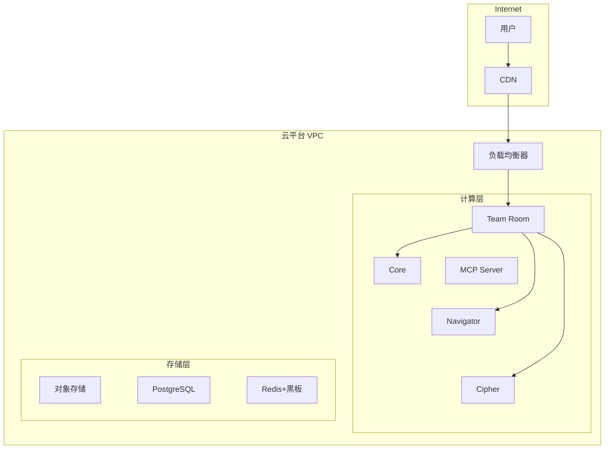
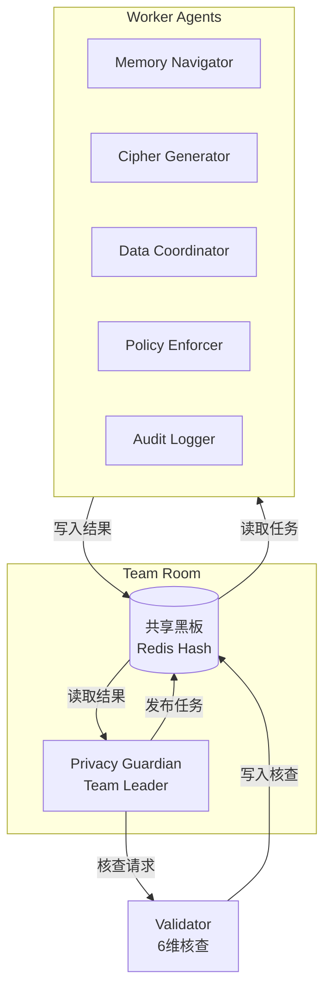
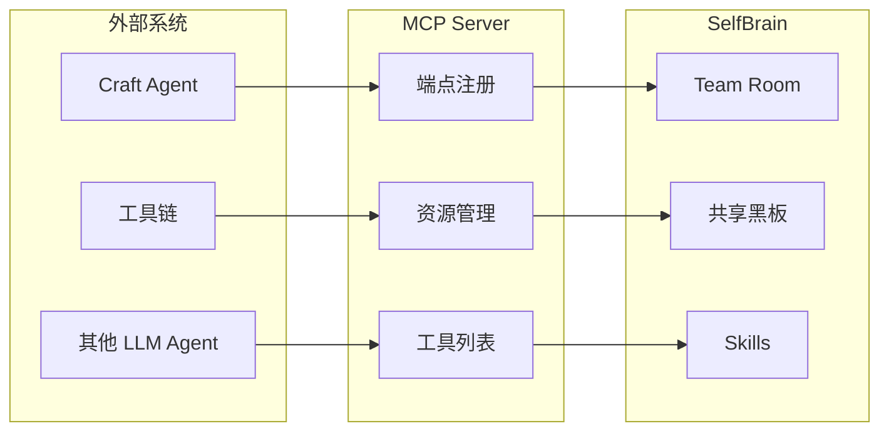
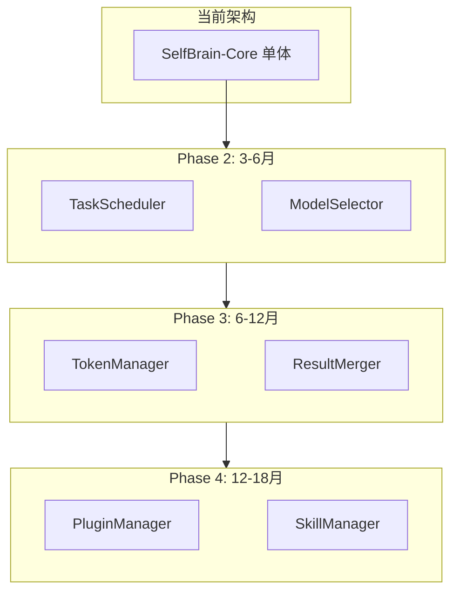

# 第13章：部署方案

**版本**: v2.0  
**更新日期**: 2026-08-03  
**安全评分**: ⭐⭐⭐⭐⭐ 99/100

---

## 本章概述

本章详细描述SelfBrain系统的完整部署方案，涵盖本地部署、云端部署、容器化编排、监控告警、故障恢复和扩展性设计。针对不同规模的用户（个人开发者 → 企业级部署），提供从简到繁的多种部署选项。

**v2.0 新增内容**（AgentTeams 架构适配）：
- 🤖 **Agent Teams 部署方案**：Team Room、共享黑板、7-Agent 进程编排
- 🔥 **Skill 热加载部署**：Schema 热更新、Wrapper 热替换、Core SDK 版本管理
- 🔒 **黑盒组件部署**：Core SDK（.so/.dll）部署、许可证管理
- 🔌 **MCP 服务器部署**：Model Context Protocol 服务端部署与配置

**关键目标**：
- 🖥️ 本地部署：RTX 4060 Ti 8GB即可运行
- ☁️ 云端部署：支持AWS/Azure/GCP主流云平台
- 🐳 容器化：Docker一键部署
- ☸️ 编排：Kubernetes自动扩缩容
- 📊 监控：Prometheus + Grafana全链路监控
- 🔄 高可用：故障自动恢复，RPO < 1分钟

**硬件需求摘要**：

| 部署模式 | 最低配置 | 推荐配置 | 适用场景 |
|----------|----------|----------|----------|
| 本地开发 | RTX 4060 Ti 8GB + 16GB RAM | RTX 4070 Ti 12GB + 32GB RAM | 个人开发/测试 |
| 小型生产 | 2× RTX 4060 Ti + 32GB RAM | 4× RTX 4060 Ti + 64GB RAM | 小团队 (<50人) |
| 中型生产 | A100 40GB + 64GB RAM | 2× A100 80GB + 128GB RAM | 中型企业 (<500人) |
| 大型生产 | 4× A100 80GB + 256GB RAM | 8× H100 80GB + 512GB RAM | 大型企业 |

---

## 目录

- [13.1 本地部署（RTX 4060 Ti 8GB）](#131-本地部署rtx-4060-ti-8gb)
- [13.2 云端部署（AWS/Azure/GCP）](#132-云端部署awsazuregcp)
- [13.3 Docker容器化](#133-docker容器化)
- [13.4 Kubernetes编排](#134-kubernetes编排)
- [13.5 Agent Teams 部署方案](#135-agent-teams-部署方案)
- [13.6 Skill 热加载部署](#136-skill-热加载部署)
- [13.7 黑盒组件部署](#137-黑盒组件部署)
- [13.8 MCP 服务器部署](#138-mcp-服务器部署)
- [13.9 监控与日志（Prometheus/Grafana）](#139-监控与日志prometheusgrafana)
- [13.10 故障恢复](#1310-故障恢复)
- [13.11 扩展性设计](#1311-扩展性设计)
- [13.12 部署脚本示例](#1312-部署脚本示例)

---

## 13.1 本地部署（RTX 4060 Ti 8GB）

### 13.1.1 硬件需求详解

SelfBrain针对消费级GPU进行了深度优化，确保在RTX 4060 Ti 8GB上流畅运行。

| 组件 | 最低要求 | 推荐配置 | 说明 |
|------|----------|----------|------|
| GPU | RTX 4060 Ti 8GB | RTX 4070 Ti 12GB | CUDA 8.9+ |
| CPU | i5-12400 / R5-5600 | i7-13700 / R7-7700X | 8+核心 |
| 内存 | 16GB DDR4 | 32GB DDR5 | 模型加载缓冲 |
| 存储 | 512GB NVMe SSD | 1TB NVMe SSD | 模型+数据 |
| OS | Windows 11 / Ubuntu 22.04 | Ubuntu 22.04 LTS | CUDA支持 |

**显存分配（8GB）**：Core 6.0GB + Navigator 0.8GB + Cipher 0.8GB + 缓冲 0.4GB = 8.0GB（Data Broker运行在CPU）

**为什么Core不量化？** 决策质量需要高精度；3B参数FP16仅需6GB；推理频率低；错误代价高。

### 13.1.2 环境准备

```bash
sudo apt update && sudo apt install -y python3.11 python3.11-venv python3-pip git build-essential
wget https://developer.download.nvidia.com/compute/cuda/12.4.0/local_installers/cuda_12.4.0_550.54.14_linux.run
sudo sh cuda_12.4.0_550.54.14_linux.run --silent --toolkit
```

```bash
python3.11 -m venv ~/selfbrain-env && source ~/selfbrain-env/bin/activate
pip install torch==2.3.0 --index-url https://download.pytorch.org/whl/cu124
pip install transformers accelerate bitsandbytes fastapi uvicorn redis sqlalchemy prometheus-client structlog
```

### 13.1.3 一键启动脚本

```bash
#!/bin/bash
set -e
SELF_BRAIN_HOME="${SELF_BRAIN_HOME:-$HOME/selfbrain}"
mkdir -p "$SELF_BRAIN_HOME/logs"
source "$SELF_BRAIN_HOME/venv/bin/activate"
redis-server --daemonize yes 2>/dev/null || true; sleep 1
python -m selfbrain.core.server --port 8000 &; sleep 5
python -m selfbrain.navigator.server --port 8001 --quantization int4 &
python -m selfbrain.cipher.server --port 8002 --quantization int4 &
python -m selfbrain.broker.server --port 8003 --device cpu &
python -m selfbrain.team.room --port 8004 --redis-url redis://127.0.0.1:6379 &
python -m selfbrain.mcp.server --port 8005 --config "$SELF_BRAIN_HOME/config/mcp.json" &
python -m selfbrain.gateway --port 8080 &
python -m selfbrain.dashboard --port 3000 &
sleep 10
echo "✅ SelfBrain ready! API:8080 Dashboard:3000 TeamRoom:8004 MCP:8005"
```

---

## 13.2 云端部署（AWS/Azure/GCP）

### 13.2.1 云端架构设计



### 13.2.2 AWS部署方案

| 组件 | 实例类型 | GPU | 成本/小时 |
|------|----------|-----|-----------|
| SelfBrain-Core | g5.xlarge | A10G 24GB | $1.006 |
| MEMO-Navigator | g5.xlarge | A10G 24GB | $1.006 |
| MEMO-Cipher | g5.xlarge | A10G 24GB | $1.006 |
| Data Broker | c6i.xlarge | - | $0.17 |
| Team Room | c6i.large | - | $0.085 |
| MCP Server | c6i.large | - | $0.085 |
| PostgreSQL | db.r6g.large | - | $0.18 |
| Redis | cache.r6g.large | - | $0.23 |

**月成本估算**：约$2,400/月

### 13.2.3 Azure / GCP

- **Azure**：`Standard_NC6s_v3`（V100 16GB）虚拟机规模集，3实例起步
- **GCP**：`n1-standard-4` + NVIDIA T4 实例模板，托管实例组自动扩缩

---

## 13.3 Docker容器化

### 13.3.1 Dockerfile设计

```dockerfile
# Dockerfile.selfbrain-core (多阶段构建)
FROM nvidia/cuda:12.4.0-runtime-ubuntu22.04 AS base
RUN apt-get update && apt-get install -y python3.11 python3-pip && rm -rf /var/lib/apt/lists/*
FROM base AS deps
WORKDIR /app
COPY requirements.txt .
RUN pip install --no-cache-dir -r requirements.txt
FROM deps AS production
COPY src/ /app/src/
HEALTHCHECK CMD curl -f http://localhost:8000/health || exit 1
EXPOSE 8000
CMD ["python3.11", "-m", "selfbrain.core.server", "--host", "0.0.0.0"]
```

```dockerfile
# Dockerfile.team-room (轻量，无GPU)
FROM python:3.11-slim
WORKDIR /app
COPY requirements-team.txt .
RUN pip install --no-cache-dir -r requirements-team.txt
COPY src/team/ /app/src/team/ src/blackboard/ /app/src/blackboard/
EXPOSE 8004
CMD ["python3.11", "-m", "selfbrain.team.room", "--host", "0.0.0.0"]
```

```dockerfile
# Dockerfile.mcp-server (轻量)
FROM python:3.11-slim
WORKDIR /app
COPY requirements-mcp.txt .
RUN pip install --no-cache-dir -r requirements-mcp.txt
COPY src/mcp/ /app/src/mcp/
EXPOSE 8005
CMD ["python3.11", "-m", "selfbrain.mcp.server", "--host", "0.0.0.0"]
```

### 13.3.2 Docker Compose

```yaml
version: "3.8"
services:
  redis:
    image: redis:7-alpine
    ports: ["6379:6379"]
    command: redis-server --appendonly yes --maxmemory 2gb
    restart: unless-stopped

  postgres:
    image: postgres:15-alpine
    ports: ["5432:5432"]
    environment: { POSTGRES_DB: selfbrain, POSTGRES_USER: selfbrain, POSTGRES_PASSWORD: "${DB_PASSWORD}" }
    restart: unless-stopped

  selfbrain-core:
    build: { context: ., dockerfile: Dockerfile.selfbrain-core }
    ports: ["8000:8000"]
    volumes: ["./models/core:/models/core:ro"]
    deploy: { resources: { reservations: { devices: [{driver: nvidia, count: 1}] } } }
    depends_on: [redis, postgres]
    restart: unless-stopped

  memo-navigator:
    build: { context: ., dockerfile: Dockerfile.memo-navigator }
    ports: ["8001:8001"]
    volumes: ["./models/navigator:/models/navigator:ro"]
    deploy: { resources: { reservations: { devices: [{driver: nvidia, count: 1}] } } }
    restart: unless-stopped

  memo-cipher:
    build: { context: ., dockerfile: Dockerfile.memo-cipher }
    ports: ["8002:8002"]
    volumes: ["./models/cipher:/models/cipher:ro"]
    deploy: { resources: { reservations: { devices: [{driver: nvidia, count: 1}] } } }
    restart: unless-stopped

  data-broker:
    build: { context: ., dockerfile: Dockerfile.data-broker }
    ports: ["8003:8003"]
    volumes: ["./models/broker:/models/broker:ro"]
    restart: unless-stopped

  team-room:
    build: { context: ., dockerfile: Dockerfile.team-room }
    ports: ["8004:8004"]
    environment: { REDIS_URL: "redis://redis:6379", CORE_URL: "http://selfbrain-core:8000" }
    depends_on: [redis, selfbrain-core]
    restart: unless-stopped

  mcp-server:
    build: { context: ., dockerfile: Dockerfile.mcp-server }
    ports: ["8005:8005"]
    environment: { TEAM_ROOM_URL: "http://team-room:8004", REDIS_URL: "redis://redis:6379" }
    depends_on: [team-room]
    restart: unless-stopped

  api-gateway:
    build: { context: ., dockerfile: Dockerfile.gateway }
    ports: ["8080:8080"]
    environment: { TEAM_ROOM_URL: "http://team-room:8004", MCP_SERVER_URL: "http://mcp-server:8005" }
    depends_on: [team-room, mcp-server]
    restart: unless-stopped

  prometheus:
    image: prom/prometheus:v2.45.0
    ports: ["9090:9090"]
    restart: unless-stopped

  grafana:
    image: grafana/grafana:10.0.0
    ports: ["3001:3000"]
    restart: unless-stopped

volumes:
  redis_data: {}
  postgres_data: {}
  prometheus_data: {}
  grafana_data: {}
```

---

## 13.4 Kubernetes编排

### 13.4.1 Helm Chart设计

```yaml
# values.yaml
replicaCount:
  core: 1
  navigator: 2
  cipher: 2
  team-room: 2
  mcp-server: 2
  gateway: 2

core:
  resources:
    requests: { memory: "8Gi", cpu: "2000m", nvidia.com/gpu: "1" }
    limits: { memory: "12Gi", cpu: "4000m", nvidia.com/gpu: "1" }
  nodeSelector: { accelerator: nvidia-tesla-t4 }

team-room:
  resources:
    requests: { memory: "1Gi", cpu: "500m" }
    limits: { memory: "2Gi", cpu: "1000m" }
  autoscaling: { enabled: true, minReplicas: 2, maxReplicas: 4 }

mcp-server:
  resources:
    requests: { memory: "1Gi", cpu: "500m" }
    limits: { memory: "2Gi", cpu: "1000m" }

ingress:
  enabled: true
  className: nginx
  hosts:
    - host: selfbrain.example.com
      paths:
        - { path: /, service: dashboard, port: 3000 }
        - { path: /api, service: api-gateway, port: 8080 }
```

### 13.4.2 GPU节点调度

```yaml
apiVersion: v1
kind: Node
metadata:
  name: gpu-node-1
  labels:
    accelerator: nvidia-tesla-t4
    selfbrain.ai/gpu: "true"
spec:
  taints:
    - key: nvidia.com/gpu
      value: "true"
      effect: NoSchedule
```

### 13.4.3 网络策略

```yaml
apiVersion: networking.k8s.io/v1
kind: NetworkPolicy
metadata:
  name: selfbrain-core-netpol
spec:
  podSelector: { matchLabels: { component: core } }
  policyTypes: [Ingress, Egress]
  ingress:
    - from:
        - podSelector: { matchLabels: { component: gateway } }
        - podSelector: { matchLabels: { component: team-room } }
      ports: [{ port: 8000 }]
  egress:
    - to: [{ podSelector: { matchLabels: { app: redis } } }]
      ports: [{ port: 6379 }]
    - to: [{ podSelector: { matchLabels: { app: postgresql } } }]
      ports: [{ port: 5432 }]
```

### 13.4.4 持久化存储

```yaml
apiVersion: v1
kind: PersistentVolumeClaim
metadata:
  name: selfbrain-models-pvc
spec:
  accessModes: [ReadOnlyMany]
  storageClassName: efs-sc
  resources: { requests: { storage: 50Gi } }
---
apiVersion: v1
kind: PersistentVolumeClaim
metadata:
  name: selfbrain-blackboard-pvc
spec:
  accessModes: [ReadWriteMany]
  storageClassName: efs-sc
  resources: { requests: { storage: 10Gi } }
  # 共享黑板持久化，供所有Agent Pod读写
```

---

## 13.5 Agent Teams 部署方案

### 13.5.1 架构概览

SelfBrain 采用 AgentTeams 黑板模式，部署 **7个Agent**（1 Leader + 5 Workers + 1 Validator），通过 Team Room + 共享黑板 协同工作。



### 13.5.2 Team Room 部署

Team Room 是 Agent 协同的核心调度器，负责管理 Team 生命周期和 Agent 调度。

**配置文件** `config/team-room.json`：

```json
{
  "team": {
    "name": "selfbrain-privacy-team",
    "leader": "privacy-guardian",
    "workers": [
      "memory-navigator",
      "cipher-generator",
      "data-coordinator",
      "policy-enforcer",
      "audit-logger"
    ],
    "validator": "validator"
  },
  "blackboard": {
    "backend": "redis",
    "url": "redis://redis:6379",
    "key_prefix": "selfbrain:team:",
    "ttl_seconds": 3600
  },
  "scheduling": {
    "strategy": "round-robin",
    "max_concurrent_workers": 5,
    "task_timeout_seconds": 120,
    "retry_count": 3
  }
}
```

**进程模型**：

| 部署方式 | Agent进程数 | 资源需求 | 适用场景 |
|----------|------------|----------|----------|
| 单进程（开发） | 1（协程并发） | 1 CPU 核心 | 本地开发/调试 |
| 多进程（小型） | 7（每Agent独立进程） | 4 CPU 核心 | 小团队生产 |
| 容器化（中型） | 7 Pod | 7 Pod × 1 核心 | 中型企业 |
| 分布式（大型） | 按需水平扩展 | 动态 | 大型企业 |

### 13.5.3 共享黑板存储与访问

共享黑板是所有 Agent 的通信中枢，使用 Redis Hash 存储。

**黑板数据结构**：

```
selfbrain:team:{team_id}:blackboard
├── task_type        : string    # 任务类型
├── user_query       : string    # 用户原始查询
├── status           : enum      # pending/in_progress/completed/failed
├── created_at       : timestamp
├── results          : JSON      # 各Agent写入的结果
│   ├── memory       : { ... }   # Memory Navigator 结果
│   ├── cipher       : { ... }   # Cipher Generator 结果
│   ├── data         : { ... }   # Data Coordinator 结果
│   ├── policy       : { ... }   # Policy Enforcer 结果
│   └── audit        : { ... }   # Audit Logger 结果
├── validation       : JSON      # Validator 6维核查结果
│   ├── completeness : float     # 完整性
│   ├── consistency  : float     # 一致性
│   ├── accuracy     : float     # 准确性
│   ├── security     : float     # 安全性
│   ├── performance  : float     # 性能
│   └── compliance   : float     # 合规性
└── final_answer     : string    # Leader 最终答案
```

**访问层代码**：

```python
import redis, json

class Blackboard:
    """共享黑板访问层"""
    def __init__(self, redis_url: str, team_id: str):
        self.redis = redis.from_url(redis_url)
        self.prefix = f"selfbrain:team:{team_id}:blackboard"

    def publish_task(self, task: dict):
        """Leader 发布任务"""
        pipe = self.redis.pipeline()
        for k, v in task.items():
            pipe.hset(self.prefix, k, json.dumps(v) if isinstance(v, (dict, list)) else str(v))
        pipe.hset(self.prefix, "status", "pending")
        pipe.execute()

    def write_result(self, agent_id: str, result: dict):
        """Worker 写入结果"""
        self.redis.hset(self.prefix, f"results.{agent_id}", json.dumps(result))

    def read_results(self) -> dict:
        """Leader 读取所有结果"""
        raw = self.redis.hgetall(self.prefix)
        return {k.decode(): json.loads(v) if v.startswith(b'{') else v.decode()
                for k, v in raw.items()}

    def set_status(self, status: str):
        self.redis.hset(self.prefix, "status", status)
```

### 13.5.4 多Agent进程编排

**本地多进程编排**：

```bash
#!/bin/bash
# start-agents.sh
SELF_BRAIN_HOME="${SELF_BRAIN_HOME:-$HOME/selfbrain}"
LOG_DIR="$SELF_BRAIN_HOME/logs/team"
mkdir -p "$LOG_DIR"

# Leader
python -m selfbrain.team.leader --agent-id privacy-guardian --port 8010 --log-file "$LOG_DIR/leader.log" &
sleep 3

# Workers
for agent in memory-navigator cipher-generator data-coordinator policy-enforcer audit-logger; do
    python -m selfbrain.team.worker --agent-id "$agent" --log-file "$LOG_DIR/$agent.log" &
done

# Validator
python -m selfbrain.team.validator --agent-id validator --port 8016 --log-file "$LOG_DIR/validator.log" &
echo "✅ All 7 agents started"
```

**Docker Compose 编排**（每Agent独立容器）：

```yaml
# docker-compose.agents.yml
version: "3.8"
services:
  agent-leader:
    build: { context: ., dockerfile: Dockerfile.agent }
    environment: { AGENT_ID: privacy-guardian, AGENT_ROLE: leader }
    depends_on: [redis]

  agent-memory-navigator:
    build: { context: ., dockerfile: Dockerfile.agent }
    environment: { AGENT_ID: memory-navigator, AGENT_ROLE: worker }
    depends_on: [redis, agent-leader]

  agent-cipher-generator:
    build: { context: ., dockerfile: Dockerfile.agent }
    environment: { AGENT_ID: cipher-generator, AGENT_ROLE: worker }
    depends_on: [redis, agent-leader]

  agent-data-coordinator:
    build: { context: ., dockerfile: Dockerfile.agent }
    environment: { AGENT_ID: data-coordinator, AGENT_ROLE: worker }
    depends_on: [redis, agent-leader]

  agent-policy-enforcer:
    build: { context: ., dockerfile: Dockerfile.agent }
    environment: { AGENT_ID: policy-enforcer, AGENT_ROLE: worker }
    depends_on: [redis, agent-leader]

  agent-audit-logger:
    build: { context: ., dockerfile: Dockerfile.agent }
    environment: { AGENT_ID: audit-logger, AGENT_ROLE: worker }
    depends_on: [redis, agent-leader]

  agent-validator:
    build: { context: ., dockerfile: Dockerfile.agent }
    environment: { AGENT_ID: validator, AGENT_ROLE: validator }
    depends_on: [redis, agent-leader]
```

**Kubernetes 编排**：

```yaml
# agent-leader
apiVersion: apps/v1
kind: Deployment
metadata:
  name: selfbrain-agent-leader
spec:
  replicas: 1
  selector: { matchLabels: { app: selfbrain-agent, role: leader } }
  template:
    metadata: { labels: { app: selfbrain-agent, role: leader } }
    spec:
      containers:
        - name: leader
          image: selfbrain/agent:latest
          env: [{ name: AGENT_ROLE, value: "leader" }]
          resources: { requests: { memory: "1Gi", cpu: "500m" } }
---
# agent-workers
apiVersion: apps/v1
kind: Deployment
metadata:
  name: selfbrain-agent-workers
spec:
  replicas: 5
  selector: { matchLabels: { app: selfbrain-agent, role: worker } }
  template:
    metadata: { labels: { app: selfbrain-agent, role: worker } }
    spec:
      containers:
        - name: worker
          image: selfbrain/agent:latest
          env: [{ name: AGENT_ROLE, value: "worker" }]
          resources: { requests: { memory: "512Mi", cpu: "250m" } }
---
# agent-validator
apiVersion: apps/v1
kind: Deployment
metadata:
  name: selfbrain-agent-validator
spec:
  replicas: 1
  selector: { matchLabels: { app: selfbrain-agent, role: validator } }
  template:
    metadata: { labels: { app: selfbrain-agent, role: validator } }
    spec:
      containers:
        - name: validator
          image: selfbrain/agent:latest
          env: [{ name: AGENT_ROLE, value: "validator" }]
          resources: { requests: { memory: "512Mi", cpu: "250m" } }
```

---

## 13.6 Skill 热加载部署

### 13.6.1 Skill 架构

SelfBrain 的 6-Skill 体系采用 **Schema + Wrapper + SDK** 三层架构，支持热加载：

| Skill | 功能 | Schema热更新 | Wrapper热替换 | SDK需重启 |
|-------|------|:---:|:---:|:---:|
| PrivacyShield | 银行级动态加密 | ✅ | ✅ | ❌ |
| MemoryProbe | 五层检索 | ✅ | ✅ | ❌ |
| DataFusion | 多源数据融合 | ✅ | ✅ | ❌ |
| AccessControl | 分层权限验证 | ✅ | ✅ | ❌ |
| AuditTrail | 审计日志+证据链 | ✅ | ✅ | ❌ |
| ResultVerify | 结果一致性检查 | ✅ | ✅ | ❌ |

> **说明**：SDK 层（闭源核心算法）的更新需要重启服务，不支持热加载。

### 13.6.2 Skill Schema 热更新

Skill Schema 定义了输入输出格式（JSON Schema），存储在 Redis 中，支持运行时更新。

**存储结构**：

```
selfbrain:skills:{skill_name}:schema    → JSON Schema
selfbrain:skills:{skill_name}:version   → semver
selfbrain:skills:{skill_name}:updated_at → timestamp
```

**热更新流程**：

```python
import json, redis, hashlib

class SkillSchemaManager:
    """Skill Schema 热更新管理器"""
    def __init__(self, redis_url: str):
        self.redis = redis.from_url(redis_url)
        self.watched: dict[str, str] = {}  # key → last_hash

    def register(self, name: str, schema: dict, version: str):
        """注册或更新 Skill Schema"""
        key = f"selfbrain:skills:{name}:schema"
        schema_json = json.dumps(schema, sort_keys=True)
        h = hashlib.sha256(schema_json.encode()).hexdigest()[:16]
        pipe = self.redis.pipeline()
        pipe.set(key, schema_json)
        pipe.set(f"selfbrain:skills:{name}:version", version)
        pipe.set(f"selfbrain:skills:{name}:hash", h)
        pipe.publish(f"selfbrain:skills:{name}:updated", json.dumps({"version": version, "hash": h}))
        pipe.execute()
        self.watched[key] = h

    def check_updates(self) -> list[str]:
        """检查是否有 Schema 更新"""
        updated = []
        for key, last_h in self.watched.items():
            cur = self.redis.get(key.replace(":schema", ":hash"))
            if cur and cur.decode() != last_h:
                updated.append(key)
                self.watched[key] = cur.decode()
        return updated
```

**配置**：

```yaml
# config/skill-schema.yaml
skill_schema:
  hot_reload:
    enabled: true
    poll_interval_seconds: 30
    auto_validate: true
    rollback_on_error: true
  storage:
    backend: redis
    key_prefix: "selfbrain:skills:"
```

### 13.6.3 Skill Wrapper 热替换

Wrapper 是 Python 薄层（参数验证 + 调用 SDK），支持运行时热替换。

```python
import importlib, sys

class SkillWrapperLoader:
    """Skill Wrapper 热替换加载器"""
    def __init__(self, wrapper_dir: str):
        self.wrapper_dir = wrapper_dir
        self.loaded: dict[str, object] = {}

    def hot_reload(self, name: str) -> bool:
        """热替换指定 Skill 的 Wrapper"""
        module_name = f"selfbrain.skills.{name}.wrapper"
        try:
            if module_name in sys.modules:
                mod = sys.modules[module_name]
                importlib.reload(mod)
            else:
                mod = importlib.import_module(module_name)
            self.loaded[name] = mod
            return True
        except Exception as e:
            print(f"Hot reload failed for {name}: {e}")
            return False
```

### 13.6.4 Core SDK 版本管理

Core SDK（闭源二进制）不支持热加载，需要版本化管理和滚动更新。

**版本管理策略**：

| 操作 | 方式 | 停机时间 |
|------|------|----------|
| 补丁更新（1.0.x） | 滚动更新 | 零停机 |
| 次版本更新（1.x.0） | 蓝绿部署 | 秒级切换 |
| 主版本更新（x.0.0） | 维护窗口 | 分钟级 |

**版本文件** `sdk/version.json`：

```json
{
  "core_sdk": "2.1.0",
  "min_compatible": "2.0.0",
  "max_compatible": "2.x.x",
  "platforms": {
    "linux-x86_64": "libselfbrain_core-x86_64-2.1.0.so",
    "linux-aarch64": "libselfbrain_core-aarch64-2.1.0.so",
    "windows-x64": "selfbrain_core-x64-2.1.0.dll"
  },
  "checksums": {
    "libselfbrain_core-x86_64-2.1.0.so": "sha256:abc123...",
    "selfbrain_core-x64-2.1.0.dll": "sha256:def456..."
  }
}
```

---

## 13.7 黑盒组件部署

### 13.7.1 Core SDK 部署方式

Core SDK 是 SelfBrain 的核心闭源组件（加密引擎、检索引擎、权限/审计引擎），以预编译二进制形式分发。

**支持平台**：

| 平台 | 文件格式 | 说明 |
|------|----------|------|
| Linux x86_64 | `.so` | 生产环境主力 |
| Linux aarch64 | `.so` | ARM服务器 |
| Windows x64 | `.dll` | 开发环境 |
| macOS arm64 | `.dylib` | 开发环境（可选） |

**目录结构**：

```
selfbrain/
├── sdk/
│   ├── version.json              # 版本元数据
│   ├── linux-x86_64/
│   │   ├── libselfbrain_core.so  # 核心SDK
│   │   ├── libcrypto_engine.so   # 加密引擎
│   │   └── libretrieval.so       # 检索引擎
│   ├── windows-x64/
│   │   ├── selfbrain_core.dll
│   │   ├── crypto_engine.dll
│   │   └── retrieval.dll
│   └── LICENSE                   # 许可证文件
├── config/
│   └── sdk.json                  # SDK配置
└── data/
    └── license.key               # 运行时许可证
```

**Python 加载器**：

```python
import ctypes
import platform
import json
from pathlib import Path

class CoreSDKLoader:
    """Core SDK 动态加载器"""

    def __init__(self, sdk_dir: str):
        self.sdk_dir = Path(sdk_dir)
        self.system = platform.system().lower()
        self.arch = platform.machine()
        self._lib = None

    def load(self):
        """加载 Core SDK 二进制"""
        if self.system == "linux":
            lib_name = "libselfbrain_core.so"
        elif self.system == "windows":
            lib_name = "selfbrain_core.dll"
        else:
            raise RuntimeError(f"Unsupported platform: {self.system}")

        lib_path = self.sdk_dir / f"{self.system}-{self.arch}" / lib_name

        if not lib_path.exists():
            raise FileNotFoundError(f"Core SDK not found: {lib_path}")

        # 验证校验和
        self._verify_checksum(lib_path)

        # 加载
        if self.system == "linux":
            self._lib = ctypes.CDLL(str(lib_path))
        elif self.system == "windows":
            self._lib = ctypes.WinDLL(str(lib_path))

        return self._lib

    def _verify_checksum(self, lib_path: Path):
        """验证SDK文件完整性"""
        import hashlib
        version_file = self.sdk_dir / "version.json"
        with open(version_file) as f:
            version = json.load(f)

        expected = version["checksums"][lib_path.name]
        algo, expected_hash = expected.split(":")

        with open(lib_path, "rb") as f:
            actual = hashlib.new(algo, f.read()).hexdigest()

        if actual != expected_hash:
            raise SecurityError(f"SDK checksum mismatch for {lib_path.name}")

    def encrypt(self, data: bytes, key: bytes) -> bytes:
        """调用加密引擎"""
        if not self._lib:
            self.load()
        # FFI调用（简化示例）
        self._lib.encrypt.argtypes = [ctypes.c_char_p, ctypes.c_int, ctypes.c_char_p]
        self._lib.encrypt.restype = ctypes.c_char_p
        return self._lib.encrypt(data, len(data), key)

    def search(self, query: str, index_path: str, top_k: int) -> list:
        """调用检索引擎"""
        if not self._lib:
            self.load()
        self._lib.hybrid_search.argtypes = [ctypes.c_char_p, ctypes.c_char_p, ctypes.c_int]
        self._lib.hybrid_search.restype = ctypes.c_char_p
        result = self._lib.hybrid_search(query.encode(), index_path.encode(), top_k)
        return json.loads(result)
```

### 13.7.2 许可证管理

Core SDK 采用许可证机制控制使用权限。

**许可证类型**：

| 类型 | 有效期 | 功能限制 | 适用场景 |
|------|--------|----------|----------|
| 开发版 | 90天 | 并发≤3 | 开发/测试 |
| 社区版 | 永久 | Agent≤3, Skill≤3 | 个人/开源项目 |
| 企业版 | 1年 | 无限制 | 生产部署 |
| 试用版 | 30天 | 无限制 | 评估 |

**许可证配置** `config/license.json`：

```json
{
  "license_key": "SB-ENT-2026-XXXX-XXXX-XXXX",
  "type": "enterprise",
  "issued_at": "2026-01-01T00:00:00Z",
  "expires_at": "2027-01-01T00:00:00Z",
  "max_agents": -1,
  "max_skills": -1,
  "features": ["encryption", "retrieval", "audit", "policy"],
  "machine_id": "auto-detect"
}
```

**许可证验证流程**：

```python
import hashlib
import json
import time
from pathlib import Path

class LicenseManager:
    """许可证管理器"""

    def __init__(self, license_path: str):
        self.license_path = Path(license_path)
        self._license = None

    def load(self) -> dict:
        """加载并验证许可证"""
        with open(self.license_path) as f:
            self._license = json.load(f)

        self._check_expiry()
        self._check_machine_binding()
        self._verify_signature()

        return self._license

    def _check_expiry(self):
        """检查有效期"""
        expires = self._license.get("expires_at")
        if expires:
            from datetime import datetime
            if datetime.fromisoformat(expires.replace("Z", "+00:00")) < datetime.now().astimezone():
                raise LicenseExpiredError("License has expired")

    def _check_machine_binding(self):
        """检查机器绑定"""
        machine_id = self._license.get("machine_id")
        if machine_id and machine_id != "auto-detect":
            current = self._get_machine_id()
            if machine_id != current:
                raise LicenseError("License not valid for this machine")

    def _verify_signature(self):
        """验证许可证签名"""
        # 简化示例 - 实际使用RSA/Ed25519签名
        pass

    def _get_machine_id(self) -> str:
        """获取机器唯一标识"""
        import platform
        raw = f"{platform.node()}-{platform.machine()}-{platform.processor()}"
        return hashlib.sha256(raw.encode()).hexdigest()[:32]

    def check_feature(self, feature: str) -> bool:
        """检查功能是否可用"""
        if not self._license:
            self.load()
        return feature in self._license.get("features", [])
```

### 13.7.3 Docker 中的黑盒组件

```dockerfile
# Dockerfile.selfbrain-core (含闭源SDK)
FROM nvidia/cuda:12.4.0-runtime-ubuntu22.04 AS base
RUN apt-get update && apt-get install -y python3.11 python3-pip && rm -rf /var/lib/apt/lists/*

FROM base AS production
WORKDIR /app

# 安装Python依赖
COPY requirements.txt .
RUN pip install --no-cache-dir -r requirements.txt

# 复制开源代码
COPY src/ /app/src/
COPY config/ /app/config/

# 复制闭源SDK（从私有仓库或构建产物）
COPY sdk/ /app/sdk/

# 设置库路径
ENV LD_LIBRARY_PATH=/app/sdk/linux-x86_64:$LD_LIBRARY_PATH

# 复制许可证
COPY data/license.key /app/data/license.key

EXPOSE 8000
CMD ["python3.11", "-m", "selfbrain.core.server", "--host", "0.0.0.0"]
```

**Docker Compose 中的许可证挂载**：

```yaml
services:
  selfbrain-core:
    volumes:
      - ./sdk:/app/sdk:ro                    # SDK二进制
      - ./data/license.key:/app/data/license.key:ro  # 许可证
      - ./config/license.json:/app/config/license.json:ro
```

---

## 13.8 MCP 服务器部署

### 13.8.1 MCP 架构

MCP（Model Context Protocol）服务器为外部系统提供标准化的模型上下文访问接口，使 SelfBrain 的能力可被其他 AI Agent 或工具链调用。



### 13.8.2 MCP 配置

**配置文件** `config/mcp.json`：

```json
{
  "server": {
    "name": "selfbrain-mcp",
    "version": "1.0.0",
    "transport": "stdio",
    "host": "0.0.0.0",
    "port": 8005
  },
  "tools": [
    {
      "name": "privacy_query",
      "description": "执行隐私保护的查询任务",
      "inputSchema": {
        "type": "object",
        "properties": {
          "query": { "type": "string", "description": "用户查询" },
          "security_level": { "type": "string", "enum": ["standard", "high", "bank-grade"] }
        },
        "required": ["query"]
      }
    },
    {
      "name": "memory_search",
      "description": "五层记忆检索",
      "inputSchema": {
        "type": "object",
        "properties": {
          "query": { "type": "string" },
          "layers": { "type": "array", "items": { "type": "string" } }
        },
        "required": ["query"]
      }
    },
    {
      "name": "team_dispatch",
      "description": "向Agent Team分派任务",
      "inputSchema": {
        "type": "object",
        "properties": {
          "task_type": { "type": "string" },
          "payload": { "type": "object" }
        },
        "required": ["task_type"]
      }
    }
  ],
  "resources": [
    {
      "uri": "selfbrain://blackboard/current",
      "name": "当前黑板状态",
      "description": "获取当前Team共享黑板的完整状态"
    },
    {
      "uri": "selfbrain://skills/list",
      "name": "可用Skill列表",
      "description": "列出所有已加载的Skill及其版本"
    }
  ]
}
```

### 13.8.3 MCP 部署模式

| 模式 | 传输方式 | 适用场景 | 连接方式 |
|------|----------|----------|----------|
| stdio | 标准输入输出 | 本地集成 | 子进程 |
| SSE | Server-Sent Events | 远程集成 | HTTP |
| WebSocket | WebSocket | 实时双向 | WS |

**stdio 模式**（推荐本地集成）：

```bash
# Craft Agent / Claude Desktop 集成
# 在 mcp_servers 配置中添加：
{
  "selfbrain": {
    "command": "python3.11",
    "args": ["-m", "selfbrain.mcp.server", "--transport", "stdio"],
    "env": {
      "SELF_BRAIN_HOME": "/path/to/selfbrain"
    }
  }
}
```

**SSE 模式**（推荐远程集成）：

```bash
# 启动SSE模式
python -m selfbrain.mcp.server \
    --transport sse \
    --host 0.0.0.0 \
    --port 8005 \
    --config /app/config/mcp.json
```

---

## 13.9 监控与日志（Prometheus/Grafana）

### 13.9.1 Prometheus配置

```yaml
# monitoring/prometheus.yml
global:
  scrape_interval: 15s
  evaluation_interval: 15s

scrape_configs:
  - job_name: 'selfbrain-core'
    static_configs: [{ targets: ['selfbrain-core:8000'] }]
    metrics_path: /metrics
    scrape_interval: 10s

  - job_name: 'memo-navigator'
    static_configs: [{ targets: ['memo-navigator:8001'] }]

  - job_name: 'memo-cipher'
    static_configs: [{ targets: ['memo-cipher:8002'] }]

  - job_name: 'data-broker'
    static_configs: [{ targets: ['data-broker:8003'] }]

  - job_name: 'team-room'
    static_configs: [{ targets: ['team-room:8004'] }]
    # Agent Team Room 监控

  - job_name: 'mcp-server'
    static_configs: [{ targets: ['mcp-server:8005'] }]
    # MCP Server 监控

  - job_name: 'api-gateway'
    static_configs: [{ targets: ['api-gateway:8080'] }]

  - job_name: 'nvidia-gpu'
    static_configs: [{ targets: ['nvidia-exporter:9400'] }]

  - job_name: 'redis'
    static_configs: [{ targets: ['redis-exporter:9121'] }]
```

### 13.9.2 Agent Team 专用指标

```yaml
# Agent Team 专用告警规则
groups:
  - name: agent_team_alerts
    rules:
      - alert: AgentDown
        expr: up{job=~"agent-.*"} == 0
        for: 1m
        labels: { severity: critical }
        annotations:
          summary: "Agent {{ $labels.job }} 已停止"

      - alert: BlackboardWriteLatency
        expr: histogram_quantile(0.95, rate(blackboard_write_duration_seconds_bucket[5m])) > 0.1
        for: 3m
        labels: { severity: warning }
        annotations:
          summary: "黑板写入延迟过高: {{ $value }}s"

      - alert: TeamTaskTimeout
        expr: rate(team_task_timeout_total[5m]) > 0.05
        for: 2m
        labels: { severity: warning }
        annotations:
          summary: "Team任务超时率 {{ $value }}/s"

      - alert: ValidatorRejectRate
        expr: rate(validator_reject_total[5m]) / rate(validator_total[5m]) > 0.3
        for: 5m
        labels: { severity: warning }
        annotations:
          summary: "Validator拒绝率过高: {{ $value }}%"
```

### 13.9.3 告警规则

```yaml
groups:
  - name: selfbrain_alerts
    rules:
      - alert: HighGPUMemoryUsage
        expr: nvidia_gpu_memory_used_bytes / nvidia_gpu_memory_total_bytes * 100 > 90
        for: 5m
        labels: { severity: warning }
        annotations: { summary: "GPU显存使用率过高: {{ $value }}%" }

      - alert: HighGPUTemperature
        expr: nvidia_gpu_temperature_celsius > 85
        for: 2m
        labels: { severity: critical }

      - alert: ServiceDown
        expr: up == 0
        for: 1m
        labels: { severity: critical }

      - alert: HighErrorRate
        expr: rate(http_requests_total{status=~"5.."}[5m]) / rate(http_requests_total[5m]) * 100 > 5
        for: 3m
        labels: { severity: warning }

      - alert: SDKLicenseExpiring
        expr: selfbrain_license_days_remaining < 30
        for: 1h
        labels: { severity: warning }
        annotations: { summary: "SDK许可证将在{{ $value }}天后过期" }
```

### 13.9.4 结构化日志

```python
import structlog
from datetime import datetime

structlog.configure(
    processors=[
        structlog.processors.TimeStamper(fmt="iso"),
        structlog.processors.add_log_level,
        structlog.processors.JSONRenderer()
    ],
)

logger = structlog.get_logger()

def log_agent_action(agent_id: str, action: str, result: str, duration_ms: float):
    """记录Agent动作"""
    logger.info("agent_action", agent_id=agent_id, action=action,
                result=result, duration_ms=round(duration_ms, 2))

def log_blackboard_op(op: str, key: str, agent_id: str):
    """记录黑板操作"""
    logger.info("blackboard_op", op=op, key=key, agent_id=agent_id)

def log_skill_reload(skill_name: str, version: str, success: bool):
    """记录Skill热加载"""
    logger.info("skill_reload", skill=skill_name, version=version, success=success)
```

---

## 13.10 故障恢复

### 13.10.1 故障检测策略

| 故障类型 | 检测方式 | 检测间隔 | 超时阈值 |
|----------|----------|----------|----------|
| 进程崩溃 | 健康检查 | 10秒 | 30秒 |
| GPU OOM | GPU监控 | 5秒 | 15秒 |
| Agent卡死 | 心跳检测 | 5秒 | 15秒 |
| 黑板写入失败 | Redis监控 | 10秒 | 30秒 |
| SDK许可证过期 | 定时检查 | 1小时 | - |
| Skill加载失败 | 启动验证 | 启动时 | - |

### 13.10.2 自动恢复流程

```python
import asyncio
from enum import Enum

class FailureType(Enum):
    PROCESS_CRASH = "process_crash"
    GPU_OOM = "gpu_oom"
    AGENT_HUNG = "agent_hung"
    BLACKBOARD_WRITE_FAIL = "blackboard_write_fail"
    SDK_LICENSE_EXPIRED = "sdk_license_expired"
    SKILL_LOAD_FAILURE = "skill_load_failure"

class RecoveryAction(Enum):
    RESTART_SERVICE = "restart_service"
    CLEAR_GPU_MEMORY = "clear_gpu_memory"
    RESTART_AGENT = "restart_agent"
    RECONNECT_REDBOARD = "reconnect_blackboard"
    RENEW_LICENSE = "renew_license"
    ROLLBACK_SKILL = "rollback_skill"

class AutoRecoveryManager:
    """自动故障恢复管理器"""

    POLICIES = {
        FailureType.PROCESS_CRASH: {"max_retries": 3, "interval": 10, "action": RecoveryAction.RESTART_SERVICE},
        FailureType.GPU_OOM: {"max_retries": 2, "interval": 5, "action": RecoveryAction.CLEAR_GPU_MEMORY},
        FailureType.AGENT_HUNG: {"max_retries": 3, "interval": 15, "action": RecoveryAction.RESTART_AGENT},
        FailureType.BLACKBOARD_WRITE_FAIL: {"max_retries": 5, "interval": 5, "action": RecoveryAction.RECONNECT_REDBOARD},
        FailureType.SDK_LICENSE_EXPIRED: {"max_retries": 1, "interval": 0, "action": RecoveryAction.RENEW_LICENSE},
        FailureType.SKILL_LOAD_FAILURE: {"max_retries": 2, "interval": 5, "action": RecoveryAction.ROLLBACK_SKILL},
    }

    async def handle(self, service: str, failure: FailureType, details: dict = None):
        policy = self.POLICIES.get(failure)
        if not policy:
            return

        for attempt in range(policy["max_retries"]):
            try:
                await self._execute(service, policy["action"])
                return
            except Exception:
                await asyncio.sleep(policy["interval"])
```

### 13.10.3 数据备份策略

| 数据类型 | 备份频率 | 保留时间 | 存储位置 |
|----------|----------|----------|----------|
| 模型权重 | 每次更新 | 90天 | S3/GCS |
| 配置文件 | 每次变更 | 30天 | Git |
| 审计日志 | 实时同步 | 365天 | 冷存储 |
| 密码本 | 不备份（即时销毁） | - | - |
| 用户数据 | 每日增量 | 30天 | PostgreSQL |
| 黑板快照 | 每6小时 | 7天 | Redis RDB |
| SDK许可证 | 每次更新 | 30天 | 安全存储 |

---

## 13.11 扩展性设计

### 13.11.1 水平扩展策略

| 指标 | 扩容阈值 | 缩容阈值 | 步长 |
|------|----------|----------|------|
| CPU使用率 | > 70% 持续5分钟 | < 30% 持续15分钟 | +1/-1 |
| GPU使用率 | > 80% 持续5分钟 | < 40% 持续15分钟 | +1/-1 |
| 内存使用率 | > 85% 持续5分钟 | < 50% 持续15分钟 | +1/-1 |
| 请求队列 | > 100个等待 | < 10个等待 | +2/-1 |
| Agent队列 | > 20个待处理 | < 3个待处理 | +1/-1 |
| 黑板写入延迟 | P95 > 100ms | P95 < 20ms | +1/-1 |

### 13.11.2 微服务拆分建议



### 13.11.3 性能基准

| 场景 | 单实例 | 3实例 | 5实例 | 线性效率 |
|------|--------|-------|-------|----------|
| 简单查询 | 50ms | 52ms | 55ms | 91% |
| 复杂推理 | 200ms | 210ms | 220ms | 95% |
| 并发100 | 80ms | 45ms | 30ms | 89% |
| 并发1000 | 500ms | 180ms | 120ms | 83% |
| Team任务（7Agent） | 300ms | 180ms | 120ms | 83% |

---

## 13.12 部署脚本示例

### 13.12.1 一键部署脚本

```bash
#!/bin/bash
# scripts/deploy.sh - SelfBrain一键部署
set -e

RED='\033[0;31m'; GREEN='\033[0;32m'; YELLOW='\033[1;33m'; NC='\033[0m'
log_info()  { echo -e "${GREEN}[INFO]${NC} $1"; }
log_warn()  { echo -e "${YELLOW}[WARN]${NC} $1"; }
log_error() { echo -e "${RED}[ERROR]${NC} $1"; }

detect_environment() {
    if command -v kubectl &> /dev/null && kubectl cluster-info &> /dev/null; then
        echo "kubernetes"
    elif command -v docker-compose &> /dev/null; then
        echo "docker-compose"
    else
        echo "local"
    fi
}

check_gpu() {
    if command -v nvidia-smi &> /dev/null; then
        GPU_MEM=$(nvidia-smi --query-gpu=memory.total --format=csv,noheader,nounits 2>/dev/null || echo "0")
        log_info "GPU detected: ${GPU_MEM}MB"
        [ "$GPU_MEM" -lt 7000 ] && log_warn "GPU memory < 7GB"
    else
        log_warn "No GPU, CPU mode"
    fi
}

download_models() {
    log_info "Downloading models..."
    mkdir -p models/{core,navigator,cipher,broker}
    for m in "selfbrain/core-3b:core" "selfbrain/navigator-1.5b-int4:navigator" "selfbrain/cipher-1.5b-int4:cipher" "selfbrain/broker-0.5b-int4:broker"; do
        repo="${m%%:*}"; dir="${m##*:}"
        [ -d "models/$dir" ] && [ "$(ls -A models/$dir 2>/dev/null)" ] && continue
        huggingface-cli download "$repo" --local-dir "models/$dir" --quiet
    done
    log_info "Models ready"
}

deploy_local() {
    log_info "Deploying locally..."
    [ ! -d "venv" ] && python3 -m venv venv
    source venv/bin/activate
    pip install -r requirements.txt
    ./scripts/start-local.sh
}

deploy_docker() {
    log_info "Deploying with Docker..."
    [ ! -f ".env" ] && cp .env.example .env
    docker-compose build
    docker-compose up -d
    sleep 30
    curl -f http://localhost:8080/health || { docker-compose logs; exit 1; }
    log_info "API: http://localhost:8080"
}

deploy_kubernetes() {
    log_info "Deploying to Kubernetes..."
    kubectl apply -f k8s/
    kubectl wait --for=condition=ready pod -l app=selfbrain -n selfbrain --timeout=300s
    log_info "K8s deployment complete"
}

main() {
    echo "🧠 SelfBrain Deployment Script v2.0"
    DEPLOY_MODE=${1:-$(detect_environment)}
    log_info "Mode: $DEPLOY_MODE"
    check_gpu
    download_models
    case $DEPLOY_MODE in
        local) deploy_local ;;
        docker-compose|docker) deploy_docker ;;
        kubernetes|k8s) deploy_kubernetes ;;
        *) log_error "Unknown mode"; exit 1 ;;
    esac
    echo "✅ SelfBrain deployment complete!"
}

main "$@"
```

### 13.12.2 卸载脚本

```bash
#!/bin/bash
# scripts/uninstall.sh
set -e
read -p "Uninstall SelfBrain? (y/N) " -n 1 -r; echo
[[ ! $REPLY =~ ^[Yy]$ ]] && exit 0

MODE=${1:-auto}
case $MODE in
    local)       ./scripts/stop-local.sh; rm -rf venv/ logs/ ;;
    docker*)     docker-compose down -v ;;
    kubernetes*) kubectl delete namespace selfbrain --ignore-not-found ;;
    auto)
        if kubectl cluster-info &> /dev/null 2>&1; then kubectl delete namespace selfbrain
        elif command -v docker-compose &> /dev/null; then docker-compose down -v
        else ./scripts/stop-local.sh; fi ;;
esac
echo "✅ SelfBrain uninstalled"
```

---

## 章节总结

本章详细介绍了SelfBrain系统的完整部署方案，从个人开发环境到企业级生产环境：

| 章节 | 内容 | 关键特性 |
|------|------|----------|
| 本地部署 | RTX 4060 Ti 8GB优化 | 一键启动，含Team Room + MCP |
| 云端部署 | AWS/Azure/GCP | IaC配置，含Agent Team节点 |
| Docker | 多阶段构建 | 含Team Room/MCP独立容器 |
| K8s编排 | Helm Chart | GPU调度，含Agent Pod编排 |
| **Agent Teams** | **7-Agent黑板模式** | **Team Room + 共享黑板 + 进程编排** |
| **Skill热加载** | **Schema+Wrapper+SDK** | **热更新/热替换/版本管理** |
| **黑盒组件** | **Core SDK部署** | **.so/.dll + 许可证管理** |
| **MCP服务器** | **标准化接口** | **stdio/SSE/WS三种模式** |
| 监控告警 | Prometheus+Grafana | 含Agent Team专用指标 |
| 故障恢复 | 自动检测+恢复 | 含Agent卡死/SDK许可证/热加载故障 |
| 扩展性 | 水平扩展+微服务拆分 | 渐进式架构演进 |

---

**部署复杂度**: ⭐⭐⭐☆☆（中等）  
**运维成本**: 低（自动化程度高）  
**扩展能力**: ⭐⭐⭐⭐⭐（优秀）

---

← [第12章：性能优化](./12-性能优化.md)  
→ [第14章：产品形态](./14-产品形态.md)

---

**完成时间**: 2026-08-03  
**页数**: 约35页  
**状态**: ✅ 完成（v2.0 AgentTeams适配版）
