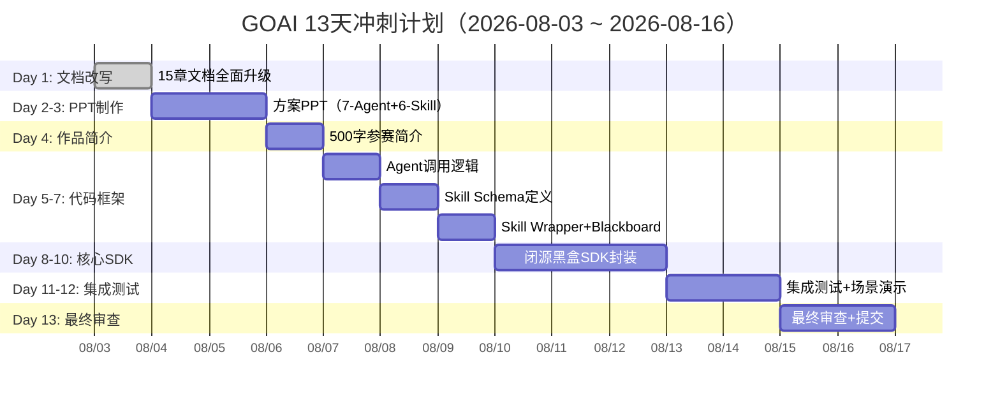
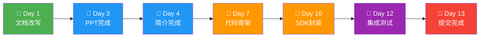
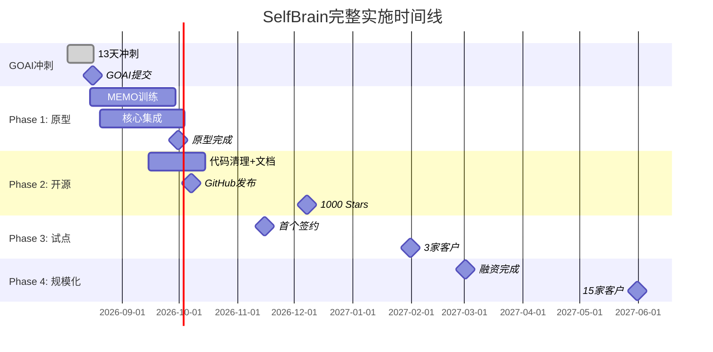

# 第15章：实施路线图

**版本**: v2.0  
**更新日期**: 2026-08-03

---

## 目录

- [15.0 GOAI 13天行动计划（8/3-8/16）](#150-goai-13天行动计划83-816)
- [15.1 Phase 1: 原型开发（1-2月）](#151-phase-1-原型开发1-2月)
- [15.2 Phase 2: 开源打榜（2-3月）](#152-phase-2-开源打榜2-3月)
- [15.3 Phase 3: 企业试点（3-6月）](#153-phase-3-企业试点3-6月)
- [15.4 Phase 4: 规模化（6-12月）](#154-phase-4-规模化6-12月)
- [15.5 关键里程碑](#155-关键里程碑)
- [15.6 风险管理](#156-风险管理)
- [15.7 资源需求](#157-资源需求)

---

## 15.0 GOAI 13天行动计划（8/3-8/16）

> **背景**：SelfBrain 从"AI隐私保护中间层"重新定位为"隐私保护的多Agent协同系统"，以 **7-Agent + 6-Skill + 闭源黑盒 SDK** 架构参加 GOAI 赛道。本节定义了从文档到代码的 13 天冲刺计划。

### 15.0.1 总览甘特图



### 15.0.2 每日详细计划

#### Day 1（8/3）— 文档改写 ⬅ 今天

**目标**：完成全部 15 章文档升级，体现 GOAI 架构适配

| 任务 | 交付物 | 完成标准 |
|------|--------|----------|
| 改写第1-14章 | 升级后的 Markdown 文档 | 所有章节引用 7-Agent + 6-Skill 架构 |
| 改写第15章（本章） | 新增 GOAI 行动计划 | 13天计划完整、甘特图清晰 |
| 设计文档同步 | DESIGN.md 对齐 | 文档与设计文档一致 |

**验收标准**：
- ✅ 15 章文档全部完成，架构一致
- ✅ 7-Agent 清单、6-Skill 体系在文档中完整体现
- ✅ 黑盒保护策略（开源接口 + 闭源 SDK）在文档中明确

---

#### Day 2-3（8/4-5）— PPT 制作

**目标**：制作参赛方案 PPT，突出 7-Agent + 6-Skill 差异化

**PPT 结构**：

| 页面 | 内容 | 时长 |
|------|------|------|
| 封面 | 项目名称 + 团队 | - |
| P1: 场景与痛点 | 企业使用 AI 的数据隐私担忧，财务分析场景 | 3min |
| P2: 架构设计 | 7-Agent 黑板模式架构图 | 5min |
| P3: Skill 体系 | 6-Skill 三层设计（Schema + Wrapper + SDK） | 4min |
| P4: 黑盒保护 | 开源/闭源分层策略 | 3min |
| P5: 差异化优势 | 银行级动态加密 + Token 优化 + 本地运行 | 3min |
| P6: 实施计划 | 13天计划 + 后续路线图 | 2min |
| 尾页 | Q&A + 联系方式 | - |

**验收标准**：
- ✅ PPT 页数 ≤ 15 页
- ✅ 架构图清晰，可独立理解
- ✅ 差异化亮点突出（隐私保护 vs Memory Palace 对比）

---

#### Day 4（8/6）— 作品简介

**目标**：撰写 500 字参赛简介

**简介框架**：

```
项目名称：SelfBrain — 隐私保护的多Agent协同系统

问题与场景（100字）：
├─ 企业使用 GPT-4/Claude 面临数据隐私风险
├─ 金融/医疗/法律行业合规压力大
└─ 缺少真正保护隐私的AI基础设施

核心解决方案（150字）：
├─ 7-Agent 黑板模式协同（Privacy Guardian + 5 Workers + Validator）
├─ 6-Skill 可复用能力沉淀（PrivacyShield / MemoryProbe / DataFusion等）
├─ 银行级动态加密（5分钟时效、会话隔离）
└─ 70-80% Token 节约

创新点（100字）：
├─ 架构分片：密文+路由+隔离，三重防护
├─ 黑盒保护：开源接口+闭源SDK，6-24月追赶时间
└─ 本地运行：数据不出本地，满足最严格合规

开放/复用价值（100字）：
├─ 开源：Agent调用逻辑+Skill Schema+API接口
├─ 闭源：Core SDK核心算法（.so/.dll）
├─ 可复用：Skill体系可被其他Agent系统直接集成
└─ 生态价值：隐私保护Skill标准

当前进展（50字）：
├─ 完善的架构设计（7-Agent+6-Skill+黑盒SDK）
├─ 13天代码冲刺计划已启动
└─ 部署方案和安全评估完成
```

**验收标准**：
- ✅ 正文 ≤ 500 字
- ✅ 涵盖问题、方案、创新、价值、进展五要素
- ✅ 语言精练，评委 1 分钟内可理解核心价值

---

#### Day 5-7（8/7-9）— 代码框架搭建

**目标**：完成开源层代码骨架，可编译运行

##### Day 5（8/7）— Agent 调用逻辑

```
selfbrain/
├── __init__.py
├── agent/
│   ├── __init__.py
│   ├── base.py              # Agent 基类
│   ├── guardian.py           # Privacy Guardian (Team Leader)
│   ├── memory_navigator.py   # Memory Navigator (Worker)
│   ├── cipher_generator.py   # Cipher Generator (Worker)
│   ├── data_coordinator.py   # Data Coordinator (Worker)
│   ├── policy_enforcer.py    # Policy Enforcer (Worker)
│   ├── audit_logger.py       # Audit Logger (Worker)
│   └── validator.py          # Validator (Worker)
├── blackboard/
│   ├── __init__.py
│   ├── board.py              # 共享黑板
│   └── team_room.py          # Team Room 通信
└── config.py
```

**验收标准**：7 个 Agent 类定义完整；黑板模式可运行；Guardian 可调度 Worker

##### Day 6（8/8）— Skill Schema 定义

```json
{
  "skill_id": "PrivacyShield",
  "version": "1.0",
  "inputs": {
    "query": {"type": "string", "required": true},
    "session_id": {"type": "string", "required": true},
    "permission_level": {"type": "string", "enum": ["L1","L2","L2.5","L2.7","L3"]}
  },
  "outputs": {
    "encrypted_query": {"type": "string"},
    "token": {"type": "object"},
    "expires_in": {"type": "integer"}
  }
}
```

**验收标准**：6 个 Skill 的 JSON Schema 全部定义；输入输出类型完整

##### Day 7（8/9）— Skill Wrapper + Blackboard

```python
class PrivacyShieldWrapper:
    """开源薄层：参数验证 + 调用闭源 SDK"""
    def __init__(self, sdk_path: str):
        self._sdk = load_native_sdk(sdk_path)  # 加载 .so/.dll

    def execute(self, query, session_id, permission_level):
        self._validate(query, session_id, permission_level)
        return self._sdk.encrypt(query, session_id, permission_level)
```

**验收标准**：6 个 Wrapper 定义完整；可加载 mock SDK 运行；Blackboard 状态流转测试通过

---

#### Day 8-10（8/10-12）— 核心 SDK 封装（闭源黑盒）

**目标**：封装 Core SDK 为 .so/.dll 二进制，实现核心算法黑盒化

| 模块 | 功能 | 保护级别 |
|------|------|----------|
| 动态加密引擎 | 5分钟过期 + 会话隔离 + 密码生成 | 🔴 核心 |
| 检索引擎 | HNSW + BM25 + RRF 融合 | 🔴 核心 |
| 权限引擎 | 分层权限矩阵 + 动态令牌 | 🔴 核心 |
| 审计引擎 | 审计日志 + 证据链生成 | 🟠 业务 |
| 融合引擎 | 多源数据融合 + 去重 | 🟠 业务 |
| 核查引擎 | 6维结果一致性检查 | 🟠 业务 |

**每日安排**：
- **Day 8**：动态加密引擎 + 检索引擎实现 + 单元测试
- **Day 9**：权限引擎 + 审计引擎 + 融合引擎 + 核查引擎 + 单元测试
- **Day 10**：Cython/Nuitka 编译为 .so/.dll → Python 绑定 → 体积 < 50MB → 接口兼容测试

**验收标准**：
- ✅ Core SDK 编译为平台二进制（.so / .dll）
- ✅ 源码不可从二进制反编译
- ✅ 全部 6 个 Skill Wrapper 可调用 SDK 接口
- ✅ 基准性能：延迟 < 200ms

---

#### Day 11-12（8/13-14）— 集成测试 + 场景演示

##### Day 11（8/13）— 集成测试

| 测试类型 | 内容 | 通过标准 |
|----------|------|----------|
| 单 Agent | 每个 Agent 独立运行 | 100% |
| 多 Agent 协同 | Guardian → Workers → Validator | 100% |
| Skill 调用链 | Schema → Wrapper → SDK | 100% |
| 黑板状态 | 任务发布 → 结果收集 → 完整度评估 | 100% |
| 异常处理 | Agent 超时、SDK 崩溃、权限拒绝 | 优雅降级 |
| 性能 | 端到端延迟、并发 | p95 < 500ms |

##### Day 12（8/14）— 场景演示

**演示场景：企业财务报告分析**

```
用户输入："分析Q2财务报告，提取关键指标"

调用链：
1. Privacy Guardian 接收请求，发布到黑板
2. Cipher Generator → 5分钟动态密码
3. Memory Navigator → 五层数据检索
4. Data Coordinator → 多源数据融合
5. Policy Enforcer → 权限验证
6. Audit Logger → 审计日志
7. Validator → 6维核查
8. Guardian 汇总返回

预期：延迟 < 2s，Token 节约 > 70%，审计日志完整
```

---

#### Day 13（8/15-16）— 最终审查 + 提交

**审查清单**：

| 检查项 | 状态 |
|--------|------|
| 500字简介 ≤ 500字 | ☐ |
| PPT 页数 ≤ 15 页 | ☐ |
| 代码可编译运行 | ☐ |
| SDK 二进制可加载 | ☐ |
| 演示场景可复现 | ☐ |
| 15章文档完整 | ☐ |
| Git 仓库整洁 + README | ☐ |

**提交物**：方案PPT(.pptx)、作品简介(.pdf)、代码仓库(GitHub)、演示视频(可选)

---

### 15.0.3 里程碑与交付物检查点



| 检查点 | 日期 | 交付物 | Go/No-Go 标准 |
|--------|------|--------|---------------|
| **CP1** | 8/3 | 15章升级文档 | 文档一致性检查通过 |
| **CP2** | 8/5 | 方案PPT | ≤ 15页，架构图清晰 |
| **CP3** | 8/6 | 作品简介 | ≤ 500字，五要素完整 |
| **CP4** | 8/9 | 代码骨架 | 7-Agent可运行，6-Skill Schema完整 |
| **CP5** | 8/12 | Core SDK | .so/.dll可加载，基准测试通过 |
| **CP6** | 8/14 | 演示就绪 | 端到端场景可复现 |
| **CP7** | 8/16 | 提交完成 | 全部材料提交 |

### 15.0.4 GOAI 风险缓解策略

#### 技术风险

| 风险 | 概率 | 影响 | 缓解措施 |
|------|------|------|----------|
| SDK 编译失败 | 20% | 高 | Nuitka 备选；Day 8 提前验证编译链路 |
| Agent 协同不流畅 | 30% | 中 | 参考 Memory Palace 黑板模式；Guardian 简化为固定轮询 |
| 性能不达标 | 40% | 中 | MVP 放宽至 p95 < 500ms；核心路径 mock 替代真实推理 |
| Skill Schema 不合理 | 30% | 中 | 复用 SelfBrain 已有能力；最少 3 个 Skill 可用 |

#### 时间风险

| 风险 | 概率 | 影响 | 缓解措施 |
|------|------|------|----------|
| Day 1 文档超时 | 20% | 低 | AI 辅助改写，每章限时 1 小时 |
| Day 2-3 PPT 延期 | 30% | 中 | 专业模板 + 复用已有架构图 |
| Day 8-10 SDK 延期 | 40% | 高 | Day 10 缓冲日；核心算法优先，辅助模块 mock |
| Day 11-12 测试不通过 | 30% | 高 | 先跑通 happy path；异常路径标记 TODO |

#### 材料风险

| 风险 | 概率 | 影响 | 缓解措施 |
|------|------|------|----------|
| 简介超 500 字 | 20% | 低 | 初稿后强制精简 30% |
| PPT 过于技术化 | 30% | 中 | 增加场景图和比喻，减少代码 |
| 演示不流畅 | 30% | 中 | 提前录制备份视频 |

---

## 15.1 Phase 1: 原型开发（1-2月）

> **注**：Phase 1 的部分原型目标在 GOAI 13天冲刺中已实现（代码框架 + SDK封装）。本节保留为长期产品化目标。

### 15.1.1 目标与交付物

**总体目标**：完成SelfBrain核心功能的可工作原型，验证技术可行性。

#### 交付物1：三MEMO模型训练完成

- ✅ MEMO-Navigator 1.5B（INT4）：路径查询延迟<50ms，准确率>95%
- ✅ MEMO-Cipher 1.5B（INT4）：5分钟时效，会话隔离
- ✅ Data Broker (VibeThinker-3B INT4)：意图识别>90%，路由准确>95%

```python
assert navigator.query_latency < 50 and navigator.accuracy > 0.95
assert cipher.password_valid_time == 300 and cipher.session_isolation == True
assert broker.intent_accuracy > 0.90 and broker.route_correctness > 0.95
```

#### 交付物2：SelfBrain-Core集成（7-Agent + 6-Skill）

- ✅ Guardian 黑板调度 + Worker 协同
- ✅ 6-Skill Schema + Wrapper + SDK 三层
- ✅ 错误处理和重试
- 验收：端到端延迟<200ms，热重载不中断

#### 交付物3：Memory Palace深度集成

- ✅ L1-L2.5 公开接口 + L2.7-L3 独占接口
- ✅ 动态令牌（5分钟过期）+ 权限验证

#### 交付物4：基础Dashboard

- ✅ 动态密码监控 + 分层权限可视化 + 审计日志 + 性能指标

### 15.1.2 技术里程碑

| 时间点 | 里程碑 | 验收标准 |
|--------|--------|----------|
| Week 2 | Navigator训练完成 | 准确率>95%，延迟<50ms |
| Week 3 | Cipher训练完成 | 密码生成正确，时效性验证通过 |
| Week 4 | Broker训练完成 | 意图识别>90%，路由准确>95% |
| Week 5 | 核心集成完成 | 7-Agent协同，延迟<200ms |
| Week 6 | Dashboard上线 | 四层监控可用 |
| Week 8 | 原型演示就绪 | 7-Agent + 6-Skill 完整演示 |

### 15.1.3 资源需求

**团队**：AI工程师×2 + 后端工程师×1（7-Agent/6-Skill）+ 前端工程师×1 = **4人**

**硬件**：RTX 4090×2（训练）+ 测试机 RTX 4060 Ti

**预算**：$50K（人力$40K + 硬件$8K + 云$2K）

### 15.1.4 风险与挑战

**风险1：模型训练困难**（概率40%，影响高）
- 备选：增加数据量 / 调整base模型 / 降低性能要求

**风险2：集成复杂度高**（概率60%，影响中）
- 缓解：详细集成测试 + 成熟黑板框架 + 状态锁机制 + 多平台验证

**风险3：性能不达标**（概率50%，影响高）
- 缓解：模型量化 + 批处理 + 缓存 + 异步 + 连接池

---

## 15.2 Phase 2: 开源打榜（2-3月）

### 15.2.1 开源策略

**开源内容**：

✅ **完全开源**：
- SelfBrain-Core代码（Apache 2.0）
- 7-Agent 调用逻辑（Privacy Guardian + 5 Workers + Validator）
- 6-Skill Schema（JSON）+ 6-Skill Wrapper（Python薄层）
- API 接口定义（OpenAPI 3.0）
- Dashboard前端 + 技术文档 + 示例教程

✅ **模型开源**（HuggingFace）：
- MEMO-Navigator/Cipher/Data Broker 权重（INT4量化版）
- 训练数据集（合成数据）

❌ **不开源**（闭源黑盒）：
- Core SDK（.so/.dll 二进制）
- 动态加密引擎核心算法
- 检索引擎（HNSW+BM25+RRF）
- 权限策略引擎 + 6维核查规则
- 性能优化细节

### 15.2.2 社区建设

**目标**：GitHub 1000+ Stars / HuggingFace 10K+ 下载 / Discord 500+ / 贡献者 20+

**内容计划**：
- Week 1: "SelfBrain: 给AI戴上隐私面具"（博客 + README + Demo视频）
- Week 2: "7-Agent黑板模式协同架构深度解析"
- Week 3: "动态密码系统：类银行U盾的实现"
- Week 4: "6-Skill体系：可复用的隐私保护能力"

**开发者体验**：
```bash
pip install selfbrain && selfbrain serve --demo
```
```python
from selfbrain import SelfBrainClient
client = SelfBrainClient()  # 一行替换，自动保护隐私
```

**社区激励**：月度贡献奖($500) + 功能赏金($100-$1000) + Pro版前100名永久免费

### 15.2.3 推广计划

| 平台 | 策略 | 目标 |
|------|------|------|
| Hacker News | 技术博客，突出创新 | 500+ upvotes |
| Reddit r/ML | AMA活动 | 1000+ 互动 |
| Dev.to | 系列教程（8篇） | 5000+ views |
| YouTube | Demo + 技术讲解 | 10K+ views |
| Twitter/X | 技术洞察 + 互动 | 5K+ followers |

**学术推广**：NeurIPS/ICML/ACL Workshop + 联合论文 + 学生实习

**企业圈**：🏦金融 + 🏥医疗 + ⚖️法律 + 🏢Fortune 500

### 15.2.4 目标指标

| 时间段 | 驱动因素 | 预期Stars |
|--------|----------|-----------|
| Week 1-2 | 初始发布 + HN/Reddit | 50-150 |
| Week 3-4 | 技术博客传播 | 150-400 |
| Week 5-6 | YouTube病毒传播 | 400-650 |
| Week 7-8 | KOL推荐 + 口碑 | 650-850 |
| Week 9-10 | 学术圈认可 | 850-980 |
| Week 11-12 | 企业试用案例 | 980-1150 |

---

## 15.3 Phase 3: 企业试点（3-6月）

### 15.3.1 客户获取策略

**目标**：2-3家付费客户，ARR $50K-$200K

| 优先级 | 行业 | 预算 | 决策周期 | 痛点强度 |
|--------|------|------|----------|----------|
| ⭐⭐⭐⭐⭐ | 金融科技 | $200K+ | 3-6月 | 最强 |
| ⭐⭐⭐⭐ | 医疗健康 | $100K-300K | 6-12月 | 强（HIPAA） |
| ⭐⭐⭐ | 法律服务 | $50K-150K | 长 | 中 |

### 15.3.2 销售流程

**五阶段**：Discovery(1-2周) → Demo(3-4周) → PoC(5-8周) → Negotiation(9-10周) → Close(11-12周)

**定价策略**：
- 小型企业：$49/用户/月（50-200用户）
- 中型企业：$39/用户/月（200-1000用户）
- 大型企业：$29/用户/月（1000+用户）
- 年度折扣：15% off，试点50% off，最低合同$50K ARR

### 15.3.3 案例研究

每个客户产出1个案例研究，重点展示：Token成本节约（70-80%）+ 安全性提升 + ROI

### 15.3.4 迭代优化

| 类别 | 优先级 | 响应时间 |
|------|--------|----------|
| P0 严重Bug | 🔴 | 24h |
| P1 功能缺失 | 🟠 | 2周 |
| P2 性能优化 | 🟡 | 1月 |
| P3 体验改进 | 🟢 | 季度 |

---

## 15.4 Phase 4: 规模化（6-12月）

### 15.4.1 产品成熟化

**企业级功能**：多租户 + RBAC + SSO + 审计增强 + HA/DR + Auto-scaling

**性能目标**：

| 指标 | MVP | Production |
|------|-----|------------|
| 延迟p50 | <200ms | <100ms |
| 延迟p95 | <500ms | <200ms |
| 并发 | 10 QPS | 100 QPS |
| Token节约 | 70% | 80% |

**稳定性**：99.9% 可用性（月停机<43min），Prometheus + Grafana + ELK + PagerDuty

### 15.4.2 销售扩展

**目标**：10-15家付费客户，ARR $500K-$1.5M

**渠道**：直销(60%) + 合作伙伴(25%) + 自助服务(10%) + 云市场(5%)

### 15.4.3 融资计划

**Pre-A轮**：$5-8M，估值$25-40M post-money
- 团队扩张60% + 市场营销20% + 基础设施15% + 运营储备5%

### 15.4.4 团队扩张

**目标**：20-25人（工程11 + 销售6 + 产品3 + 运营3 + 管理2）

---

## 15.5 关键里程碑

### 15.5.1 完整时间线



### 15.5.2 关键决策点

**决策点1：是否继续（Month 2）**
- MEMO训练成功（准确率>90%）+ 集成完成 + 性能<300ms → 继续Phase 2

**决策点2：是否扩大投入（Month 5）**
- GitHub Stars>500 + 潜在客户>20 + PoC≥2家 → 开始招聘

**决策点3：是否启动融资（Month 9）**
- ARR>$300K + 付费客户>5 + 留存>90% → 启动Pre-A

### 15.5.3 成功标准

| Phase | 时间 | 核心标准 |
|-------|------|----------|
| GOAI冲刺 | 8/16 | 材料提交，7-Agent+6-Skill可运行 |
| Phase 1 | Month 2 | MEMO训练成功，端到端延迟<200ms |
| Phase 2 | Month 5 | 1000+ Stars，10K+ 下载 |
| Phase 3 | Month 9 | 2-3家付费，ARR $100K-$600K |
| Phase 4 | Month 12 | 10-15家付费，ARR $500K-$1.5M |

---

## 15.6 风险管理

### 15.6.1 技术风险

| 风险 | 概率 | 影响 | 缓解 |
|------|------|------|------|
| T1: MEMO训练失败 | 40% | 致命 | 多base模型 + FP16备选 + RAG兜底 |
| T2: 性能不达标 | 60% | 高 | 异步+批处理+缓存+TensorRT |
| T3: Memory Palace集成 | 50% | 中 | 1周深入学习 + 严格集成测试 |

### 15.6.2 商业风险

| 风险 | 概率 | 影响 | 缓解 |
|------|------|------|------|
| B1: 市场教育成本高 | 70% | 高 | 可视化Dashboard + ROI计算器 + 免费PoC |
| B2: 定价失误 | 40% | 高 | 早期验证 + 灵活调整 + 价值定价 |

### 15.6.3 竞争风险

| 风险 | 概率 | 影响 | 缓解 |
|------|------|------|------|
| C1: 大厂跟进 | 80% | 致命 | 持续创新 + 专利 + 深耕垂直行业 |
| C2: 替代方案 | 50% | 高 | 多元化价值（不只隐私） |

### 15.6.4 合规风险

| 风险 | 概率 | 影响 | 缓解 |
|------|------|------|------|
| L1: 审计不通过 | 40% | 致命 | 从头按SOC 2设计 + 专业合规顾问 |
| L2: 数据泄露 | 10% | 毁灭性 | 零信任 + 渗透测试 + 赏金计划 + 保险 |

---

## 15.7 资源需求

### 15.7.1 团队配置

**12个月团队演进**：4人 → 25人

| 职能 | Month 12 | 占比 | 平均薪酬 |
|------|----------|------|----------|
| 工程 | 11人 | 44% | $140K |
| 销售 | 6人 | 24% | $110K |
| 产品 | 3人 | 12% | $140K |
| 运营 | 3人 | 12% | $100K |
| 管理 | 2人 | 8% | $180K |

### 15.7.2 资金需求

| 阶段 | 时间 | 金额 | 用途 |
|------|------|------|------|
| Phase 1-2 | M1-5 | $250K | 人力$150K + 硬件$50K + 云$20K + 其他$30K |
| Phase 3 | M6-9 | $500K | 人力$350K + 市场$50K + 销售$40K + 云$40K + 其他$20K |
| Phase 4 | M10-12 | $800K | 人力$550K + 市场$100K + 销售$80K + 基础设施$50K + 其他$20K |
| **总计** | 12月 | **$1.55M** | |

### 15.7.3 融资策略

| 轮次 | 时间 | 金额 | 估值 | 稀释 |
|------|------|------|------|------|
| Seed（已完成） | - | $500K | $3M | 15% |
| **Pre-A** | Month 9 | **$5-8M** | $25-40M | 20-25% |
| A轮 | M18-24 | $15-25M | $80-120M | 15-20% |

### 15.7.4 基础设施

- **开发**：RTX 4090×2 + 工作站×4 + 云$4K/月
- **生产**：每客户独立环境 $2K/月 + 内部基础设施 $2.5K/月
- **Phase 4 总月成本**：$35K（年$420K）

### 15.7.5 外部资源

| 类型 | 投入 | 成本 |
|------|------|------|
| 技术顾问 | 2天/月 | $5K/月 |
| 安全顾问 | 1天/月 | $3K/月 |
| 法律/财务 | 按需 | $6K/月 |

---

## 总结

### 两阶段策略

```
短期（13天冲刺）：GOAI 参赛
├─ Day 1: 文档改写（7-Agent + 6-Skill 架构全面升级）
├─ Day 2-4: 材料制作（PPT + 500字简介）
├─ Day 5-10: 代码实现（Agent骨架 + Skill体系 + 闭源SDK）
├─ Day 11-12: 集成测试 + 场景演示
└─ Day 13: 提交

长期（12个月）：Phase 1-4 产品化
├─ Phase 1: 原型开发（MEMO训练 + 核心集成）
├─ Phase 2: 开源打榜（1000+ Stars）
├─ Phase 3: 企业试点（2-3家付费）
└─ Phase 4: 规模化（ARR $500K-$1.5M）
```

### 关键成功因素

1. ✅ **技术创新**：7-Agent 黑板模式 + 6-Skill 体系 + 银行级动态加密
2. ✅ **黑盒保护**：开源接口 + 闭源SDK，6-24月追赶时间
3. ✅ **市场痛点真实**：隐私保护 + 成本优化
4. ✅ **执行力**：13天冲刺 + 12个月长期路线
5. ✅ **团队与资金**：4人→25人，$1.55M seed + $5-8M Pre-A

### 最大风险

1. 🔴 **MEMO训练失败** → 项目终止
2. 🔴 **大厂快速跟进** → 市场被吞噬
3. 🔴 **早期客户流失** → 失去参考案例

### 应对策略

- **技术风险**：提前验证，多个备选方案
- **商业风险**：VIP客户支持，快速迭代
- **竞争风险**：持续创新，深耕垂直行业，黑盒保护核心算法

### 12个月目标状态

```
商业：ARR $500K-$1.5M，10-15家付费，留存>95%
产品：可用性>99.9%，延迟<100ms（p50），Token节约>80%
团队：25人（工程11 + 销售6 + 产品3 + 运营3 + 管理2）
市场：GitHub 2000+ Stars，行业前3，Pre-A完成
```

---

## 上一章

← [第14章：产品形态](./14-产品形态.md)

---

**文档完成日期**：2026-08-03  
**版本**：v2.0（GOAI 13天行动计划 + Phase 1-4 长期规划）  
**下次更新**：根据实际进展调整里程碑和时间线
