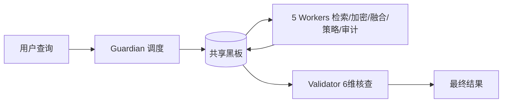
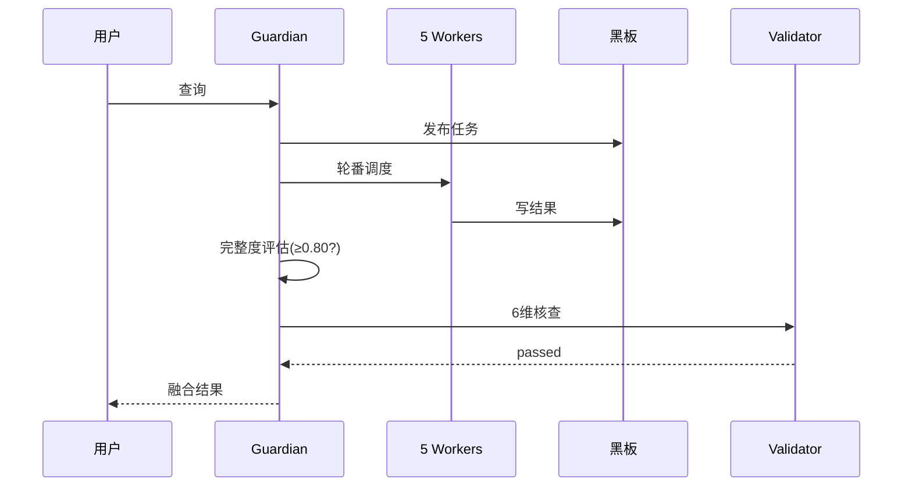

<!-- @agent: session-260809-ruby-hill | module: ppt | ts: 2026-08-09T15:05+08:00 -->

# SelfBrain-GOAI 参赛 PPT 大纲素材（12-15 页）

> **赛道**：GOAI 2026 · 赛道一「新智基座 | AgentInfra」
> **叙事主线**：个人数据分散存储的隐私痛点 → 7-Agent 黑板协同 + 6-Skill 规则驱动 → 引擎黑盒桥接 → 工程可信（195 测试 / 88% 覆盖）
> **风格参考**：参赛PPT/full-content-v3-final.md（深蓝 + 金色，数据驱动，每页"要点 + 量化"）

---

## 第 1 页 · 封面

**标题**：SelfBrain-GOAI — 多 Agent 隐私防护协作的本地隐私模型

**副标题**：接入你想用的任何外部先进大模型，但把隐私留在你的手上

**要点**：
- GOAI 2026 参赛作品 · 赛道一「新智基座 | AgentInfra」
- 7 Agents 黑板协同 · 6 Skills 规则驱动 · 引擎黑盒桥接
- 195 tests / 88% 覆盖率 · demo 完整度 0.95

**备注（演讲者）**：30 秒定位——这是"参赛可复现"的 AgentInfra 工程：隐私保护的多 Agent 协同框架，附完整测试与一键复现。

---

## 第 2 页 · 问题背景：个人数据分散存储的隐私痛点

**标题**：个人数据越分散，隐私越失控

**要点**：
- 数据散落：本地文件 / 云盘 / 备忘录 / 聊天记录 / 浏览器 —— 各自为政，无统一权限边界
- 隐私风险：明文存储 + 明文上送外部模型 → 敏感信息（PII）暴露面持续扩大
- 两难困境：用最强外部模型（GPT-4/Claude）→ 明文出境；本地部署 → 成本百万级、能力滞后
- 合规压力：GDPR / 个保法 / 行业监管对数据处理提出可审计、可追溯要求

**备注**：痛点不用讲技术，讲"用户真实处境"——数据在哪、泄露风险在哪、为什么现有 Agent 框架解决不了。

---

## 第 3 页 · 方案总览：多 Agent 协同 + 黑板模式

**标题**：一条第三条路：7 Agent 黑板协同，隐私留在手上

**要点**：
- 思路：**外部模型的能力 × 本地部署的隐私 × 规则驱动的可信**，三者兼得
- 黑板模式（Blackboard）：所有 Agent 通过共享黑板松耦合交互，Guardian 统一调度
- 架构：业务层（7 Agent + 6 Skill）→ 桥接层（sb_api）→ 引擎黑盒（4 模型）→ 框架（agent-teams-sdk）



**备注**：一张图讲清"多 Agent 怎么协同"——不是链式调用，是黑板读写 + 完整度驱动的自主闭环。

---

## 第 4 页 · 分层架构：业务层 / 桥接层 / 引擎黑盒 / 框架

**标题**：四层架构：独立代码 + 桥接引用

**要点**：
- **业务层**（F:\SelfBrain-GOAI）：7 Agents + 6 Skills + demo —— 全部参赛创新逻辑，独立仓库独立评审
- **桥接层**（src/sb_api）：只读加载主项目 4 模型，统一 envelope（ok/pending/error），惰性导入
- **引擎黑盒**（F:\SelfBrain）：core/navigator/cipher/broker 4 模型 —— **零修改**（git diff 为空）
- **框架层**（agent-teams-sdk）：TeamRoom 黑板 / Agent-Skill 基类 —— **只装不改**

| 层 | 位置 | 修改状态 |
|----|------|---------|
| 业务层 | F:\SelfBrain-GOAI\src | 参赛主体（新增） |
| 桥接层 | src/sb_api/ | 新增（唯一 import model_loader 的入口） |
| 引擎黑盒 | F:\SelfBrain\src | **零修改** |
| 框架 | F:\agent-teams-sdk | **零修改** |

**备注**：强调"黑盒桥接"是工程亮点——不依赖主项目内部实现，环境变量可切换源码路径，评审可独立验证边界。

---

## 第 5 页 · 7-Agent 协同流程：查询 → Guardian → Workers → 完整度 → Validator

**标题**：一次查询的完整旅程

**要点**（流程）：
1. **查询进入**：用户提交 → Guardian 分析任务、写入黑板
2. **Worker 执行**：Navigator（检索）→ Cipher（加密分析）→ Coordinator（融合）→ Policy（权限校验）→ Audit（审计）
3. **完整度评估**：Guardian 每调度一个 Worker 后重算完整度，达标（≥0.80）即停
4. **结果核查**：Validator 对最终结果执行 6 维核查
5. **融合输出**：Guardian 融合重建最终答案



**备注**：这是全篇最重要的技术页——强调"完整度驱动调度"的自主闭环，而非一次性流水线。

---

## 第 6 页 · 完整度评估机制

**标题**：0.95 封顶的完整度引擎：驱动调度的"活信号"

**要点**：
- **加权模型**：navigator 0.35 + cipher 0.30 + coordinator 0.20 + policy 0.15
- **额外加权**：user_query 存在 +0.05（总分补足）
- **封顶 0.95**：杜绝"满分幻觉"，为不确定性留白
- **驱动闭环**：Guardian 每调度一个 Worker 重算 → 缺什么补什么 → 达标（≥0.80）停止调度
- demo 端到端实测完整度 **0.95**

```mermaid
graph TD
    A[score=0] --> B[navigator? +0.35]
    B --> C[cipher? +0.30]
    C --> D[coordinator? +0.20]
    D --> E[policy? +0.15]
    E --> F[user_query? +0.05]
    F --> G[min(score, 0.95)]
    G --> H{score ≥ 0.80?}
    H -->|否| I[补派 Worker]
    H -->|是| J[停止调度 → Validator]
```

**备注**：点明设计哲学——完整度不是"事后打分"，是驱动协同的实时信号；0.95 封顶是工程诚实的体现。

---

## 第 7 页 · 6-Skill 体系

**标题**：6 个规则化 Skill：能力标准化 + JSON Schema 校验

**要点**：

| Skill | 职责 | 校验 |
|-------|------|------|
| privacy_shield | PII 检测脱敏（手机/身份证/银行卡等） | BaseSkill + jsonschema 双轨 |
| memory_probe | 查询扩展/分解（同义词 12+关键词 20） | jsonschema 严格 |
| data_fusion | 多源合并去重（归一化+Jaccard） | jsonschema |
| access_control | RBAC 权限（fail-closed 默认拒绝） | jsonschema 严格 |
| audit_trail | 审计条目 + 汇总报告 | jsonschema 严格 |
| result_verify | 完整性/格式/一致性 + 加权评分 | BaseSkill + jsonschema |

- 全部继承 SDK `BaseSkill`，实现 name/version/schema/execute 抽象契约
- 输入输出 JSON Schema（Draft 2020-12）校验，错误统一抛 `ValueError`（可预期、可测试）

**备注**：强调"规则驱动"——不是 prompt 工程，是 schema 契约；可审计、可测试、可复用。

---

## 第 8 页 · 引擎桥接黑盒

**标题**：sb_api 桥接层：主项目零修改的黑盒引用

**要点**：
- **惰性加载**：`import sb_api` 不加载模型，首次调用才导入 `model_loader`（torch/transformers 不进运行时依赖）
- **4 模型**：core / navigator / cipher / broker，统一 envelope（`{status, data, component, action}`）
- **防重复加载**：`_LOADED` 注册表缓存 (model, tokenizer)，unload 幂等
- **可替换路径**：`SB_SELFBRAIN_SRC` 环境变量覆盖源码路径
- **红线验证**：主项目 git diff 为空；loader 是唯一 import model_loader 的入口

```python
from sb_api import create_engine
engine = create_engine()          # stub 模式：零模型加载，全流程可跑
result = engine.search("查询")     # 统一 envelope：{status, data, ...}
```

**备注**：这是"工程可信度"的关键证据——黑盒边界经 grep 审计，评审者可独立验证零修改。

---

## 第 9 页 · 可观测与审计

**标题**：全链路可观测 + 不可抵赖的审计追踪

**要点**：
- **统一 envelope**：每个组件返回 `status/data/component/action`，错误显式降级（error envelope），不静默失败
- **黑板可观测**：TeamRoom 状态实时可读，Guardian 调度过程全程可见
- **审计日志**：AuditLogger 每次执行生成条目（时间戳/Agent/动作/结果），本地 JSONL 留档 + 写回黑板
- **AuditTrail Skill**：格式化 entries / summary（total+by_agent）/ report 三级输出
- **验证闭环**：Validator 6 维核查（完整性/正确性/隐私/一致性/时效性/安全性）+ ResultVerify 加权评分

**备注**：回应评审点"可观测 + 可审计"——隐私系统必须证明自己"看得见、查得到、赖不掉"。

---

## 第 10 页 · 技术指标

**标题**：工程可信：195 测试 / 88% 覆盖 / 0 失败

**要点**：

| 指标 | 数值 |
|------|------|
| 测试通过 | **195 passed / 0 failed / 0 errors** |
| 覆盖率 | **88%**（1623 stmts，目标 >80%） |
| 测试耗时 | ~1.8s |
| 测试模块 | 6 文件（conftest/sb_api/guardian/agents/skills/demo） |
| Demo 完整度 | **0.95（封顶值）** |
| Review | 双 Review 完成（架构 3.7/5 + Bug 3 P0 全修） |

- 单元覆盖最薄弱模块仍有 81%+（result_verify），核心调度 guardian 达 98%
- 测试即文档：195 个用例刻画全部行为契约

**备注**：数据说话——88% 覆盖在同类参赛工程里是硬实力；强调"测试不是附属品，是交付物"。

---

## 第 11 页 · 创新点总结（与 Memory Palace 对比）

**标题**：不是"又一套 Agent 框架"，而是隐私保护的 AgentInfra

**要点**：
- **vs 传统 Agent 框架**（LangChain/CrewAI/AutoGen）：它们是编排工具，SelfBrain 是隐私基础设施——数据保护、完整度闭环、审计追踪
- **vs 上一代 SelfBrain（Memory Palace）**：
  - 上一代：五层记忆架构 + 动态密码 + 闭源 SDK（商业原型）
  - 本次：**开源可复现的参赛工程**——桥接黑盒复用引擎能力，Agent/Skill 全部落地为可测试代码
- **三大创新**：
  1. 黑板模式 + 完整度驱动调度（0.95 封顶）
  2. 6-Skill JSON Schema 契约化（规则驱动，可审计可测试）
  3. 引擎黑盒桥接（4 模型只读引用，主项目零修改）

**备注**：讲清"创新增量"——继承主项目能力，但所有 Agent 协同、Skill 体系、测试体系都是本次新增且开源的。

---

## 第 12 页 · 演示流程截图预留

**标题**：端到端 Demo：一条命令跑通全流程

**要点**（运行实录）：
```bash
cd F:\SelfBrain-GOAI && python src/demo.py "我的隐私数据存储在什么地方"
```

```
【SelfBrain-GOAI 端到端演示 · stub 模式】
  ✓ Guardian 接收查询 → 黑板发布
  ✓ Navigator 检索 → navigator_result
  ✓ Cipher 加密分析 → cipher_result
  ✓ Coordinator 数据融合 → coordinator_result
  ✓ Policy 权限校验 → policy_result
  ✓ Audit 审计记录 → audit_result（JSONL 留档）
  ✓ Validator 6维核查 → validator_passed=True
  ────────────────────────────────────────────
  完整度: 0.95 · 耗时: 毫秒级
```

**备注**：**此处插入 3-4 张实际运行截图**——① 命令行启动；② 完整度逐步攀升；③ 最终输出（完整度 0.95 + validator_passed）；④ 审计 JSONL 文件内容。截图在提交前由 G18 或总调度补齐。

---

## 第 13 页 · 结语

**标题**：开源承诺与后续计划

**要点**：
- **一句话**：把隐私留在手上的多 Agent 隐私防护协同——现在是一份可复现、可测试、可审计的开源工程
- **已交付**：7 Agents + 6 Skills + 桥接层 + demo + 195 测试（88%）+ 双 Review
- **后续计划**：
  - 真实模式联调（--real 接入主项目 4 模型全量验证）
  - Skill 生态开放：Schema 契约公开，社区可贡献新 Skill
  - 性能基准：端到端延迟/吞吐基准测试落地
  - 隐私评估报告：攻击场景矩阵自动化验证
- **致谢**：GOAI 组委会 · AgentTeams SDK 生态 · 评审专家

**备注**：收尾要有"开放性"——提交不是终点，是生态起点；留联系方式（队伍/GitHub）。

---

## 附录 A · 备选页（如需 15 页）

- **P14 技术挑战与突破**：黑板一致性 / 安全 vs 性能 / 测试可信（可从 REVIEW 提炼）
- **P15 提交材料清单**：直接引用 GOAI-COMPETITION-PACK.md 第 6 节，展示交付完整性

---

*SelfBrain-GOAI · GOAI 2026 赛道一 · PPT 大纲 v1 · 2026-08-09 · 素材与完整版见 参赛PPT/full-content-v3-final.md*
