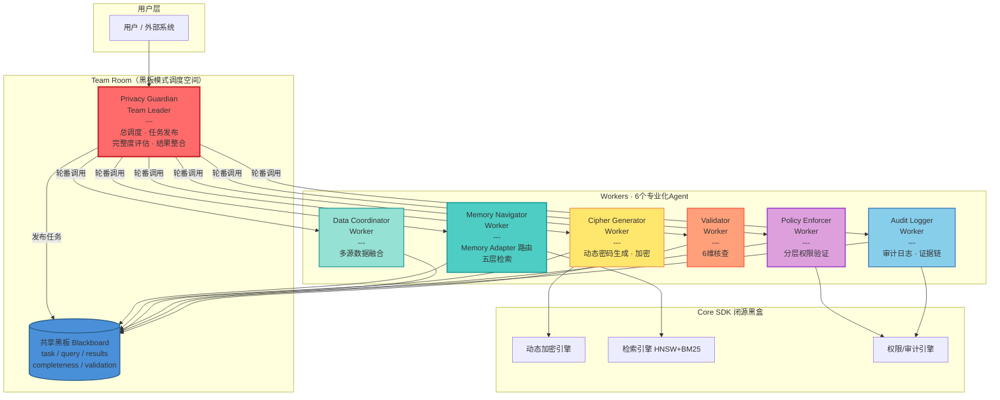
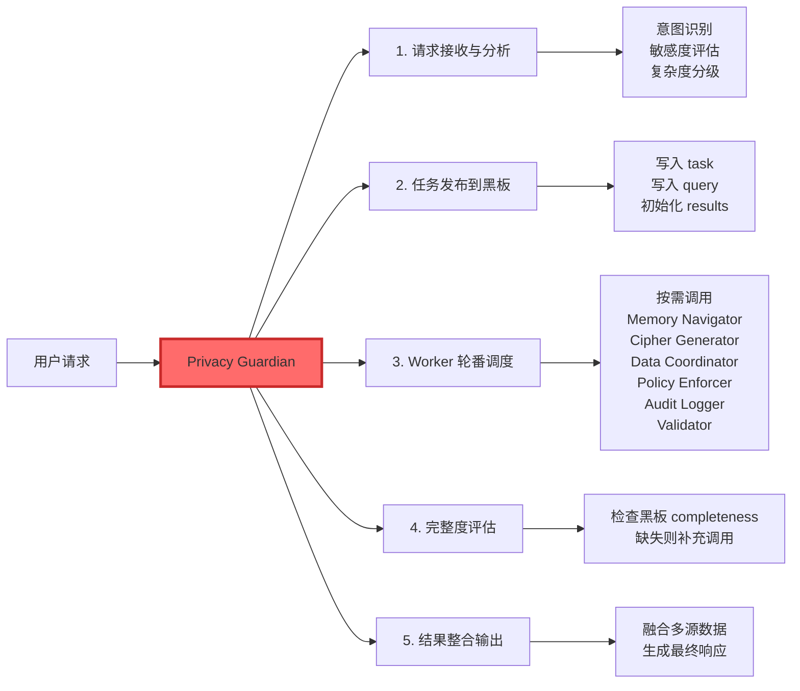
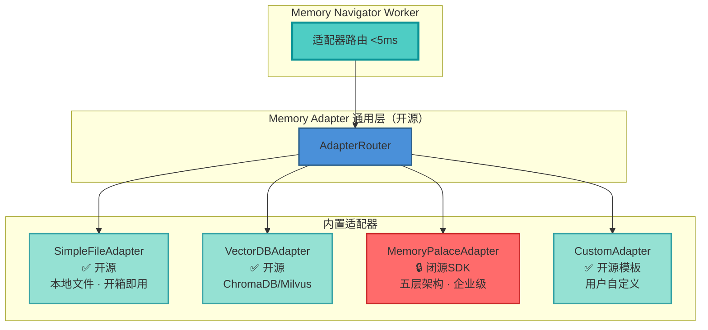
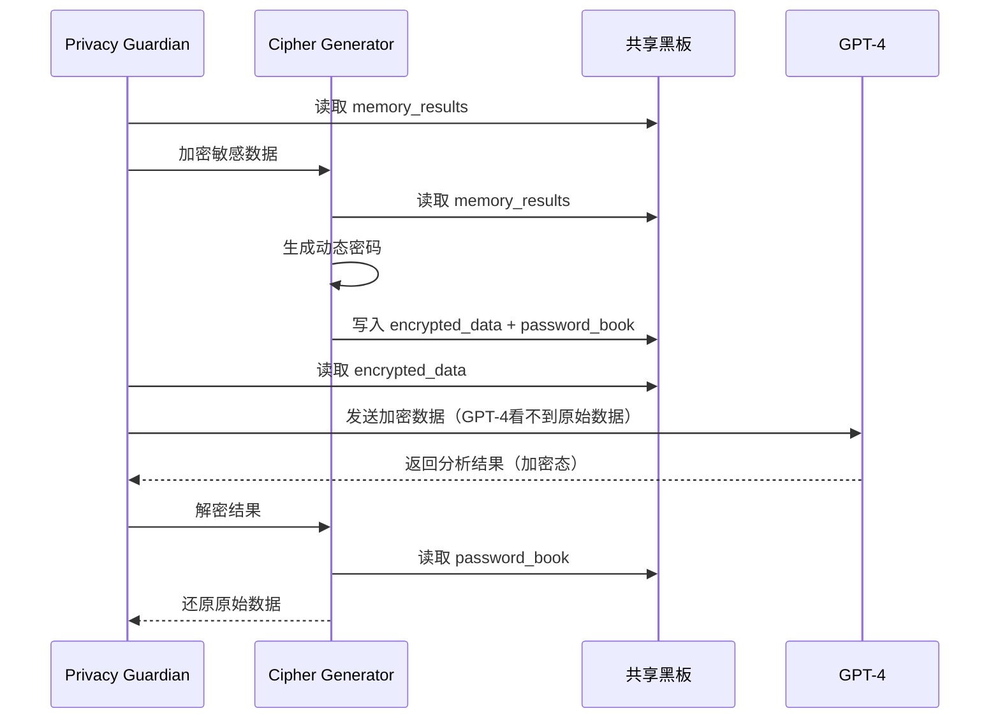
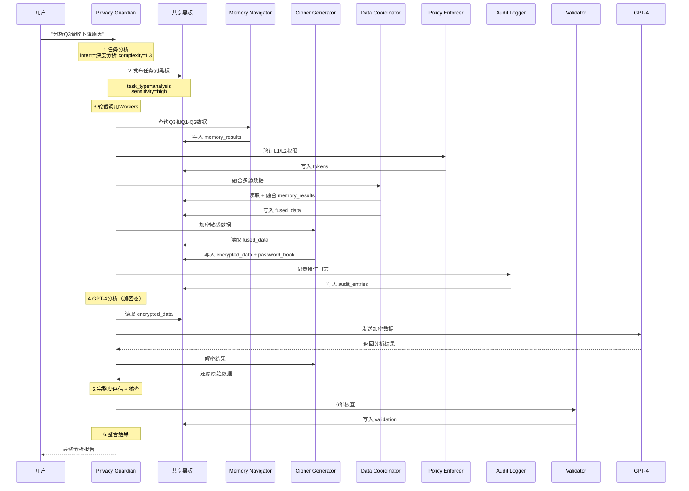

# 02. 多Agent协同与自主闭环

> SelfBrain — 隐私保护的多Agent协同系统（AgentInfra）  
> GOAI 2026 新智基座｜AgentInfra 赛道

---

## 第4页：7-Agent 架构总览

### AgentTeams 黑板协同架构

SelfBrain 采用 **AgentTeams 黑板模式（Blackboard Pattern）**，将复杂的 AI 数据保护任务分解为 **7 个专业化 Agent**。所有 Agent 通过**共享黑板**进行信息交互，由 **Privacy Guardian（Team Leader）** 统一调度与完整度评估。

#### 架构全景图



#### 黑板模式核心机制

| 机制 | 说明 | 优势 |
|------|------|------|
| **Team Room** | 调度空间，Privacy Guardian 统一管理 | 单一入口，清晰职责链 |
| **共享黑板** | 结构化状态：task / results / completeness / validation | 松耦合，可观测，易扩展 |
| **轮番喊人** | Leader 按需轮番调用 Workers | 最小化资源占用 |
| **完整度评估** | Leader 检查黑板状态，决定是否补充调用 | 确保结果质量，形成自主闭环 |

#### 专业化分工一览

| Agent | 核心职责 | 不负责的事情 |
|-------|----------|-------------|
| **Privacy Guardian** | 总调度、黑板发布、完整度评估、结果整合 | ❌ 不做具体记忆、加密 |
| **Memory Navigator** | Memory Adapter 路由 + 五层检索 | ❌ 不做数据加密 |
| **Cipher Generator** | 动态密码生成、加密/解密 | ❌ 不做数据检索 |
| **Data Coordinator** | 多源数据融合、智能路由 | ❌ 不做复杂推理 |
| **Policy Enforcer** | 分层权限验证、令牌分配 | ❌ 不做数据加密 |
| **Audit Logger** | 审计日志、证据链生成 | ❌ 不做业务逻辑 |
| **Validator** | 结果一致性 6 维核查 | ❌ 不做数据检索 |

#### 显存占用与硬件要求

| Agent | 角色 | 参数量 | 精度 | 显存占用 |
|-------|------|--------|------|---------|
| Privacy Guardian | Team Leader | 3B | FP16 | 6.0 GB |
| Memory Navigator | Worker | 1.5B | INT4 | 0.75 GB |
| Cipher Generator | Worker | 1.5B | INT4 | 0.75 GB |
| Data Coordinator | Worker | 3B | INT4 | ~1.5 GB |
| Policy Enforcer | Worker | 规则引擎 | — | 轻量 |
| Audit Logger | Worker | 日志引擎 | — | 轻量 |
| Validator | Worker | 核查引擎 | — | 轻量 |
| **总计** | **7 Agents** | **~6B** | **混合** | **≤ 9 GB** |

> **推荐配置**：RTX 4070 12GB / 32GB RAM / 50GB NVMe SSD

---

## 第5页：Privacy Guardian — Team Leader

### 总调度 · 任务发布 · 完整度评估 · 结果整合

**Privacy Guardian** 是整个 7-Agent 系统的"大脑"。作为 **Team Leader**，它接收用户请求、分析任务复杂度、发布子任务到共享黑板、轮番调度 Workers、评估结果完整度，最终整合输出。

#### 核心职责



#### 黑板模式工作流（Python 伪代码）

```python
class PrivacyGuardian:
    """Team Leader — 调度黑板模式的核心逻辑"""

    def process_request(self, user_query: str, session_id: str) -> str:
        # 步骤1: 任务分析
        analysis = self.analyze_query(user_query)
        # → {"intent": "analysis", "complexity": "L3",
        #    "sensitivity": "high", "requires_external_model": True}

        # 步骤2: 发布任务到黑板
        self.blackboard.publish({
            "task_type": analysis["intent"],
            "user_query": user_query,
            "session_id": session_id,
            "sensitivity": analysis["sensitivity"],
            "results": {},
            "completeness": 0.0
        })

        # 步骤3: 轮番调用 Workers
        self._dispatch_workers(analysis)

        # 步骤4: 完整度评估（自主闭环关键）
        while self.blackboard.completeness < 1.0:
            missing = self.blackboard.get_missing_tasks()
            self._dispatch_workers_for(missing)

        # 步骤5: 整合结果
        return self._integrate_results()

    def _dispatch_workers(self, analysis: dict):
        """按需调用 Workers — 最小化资源占用"""
        self.memory_navigator.execute(analysis["data_requirements"])
        self.policy_enforcer.validate(analysis["permissions"])
        if analysis["requires_external_model"]:
            self.cipher_generator.encrypt_sensitive_data()
        self.data_coordinator.fuse(analysis["sources"])
        self.audit_logger.log(analysis["action"])
```

#### 为什么需要 3B 参数

| 决策能力 | 1.5B 表现 | 3B 表现 | 差距 |
|---------|----------|---------|------|
| 意图理解准确率 | 82% | **95%** | +13% |
| Worker 路由准确率 | 78% | **94%** | +16% |
| 完整度评估准确率 | 70% | **90%** | +20% |
| 多步骤任务分解 | 勉强 | **流畅** | 质的差距 |

#### 渐进式处理策略

```
简单查询（延迟: 50-100ms）：
User → Privacy Guardian → 发布黑板 → Memory Navigator → 返回

复杂分析（延迟: 2-5秒）：
User → Privacy Guardian → 发布黑板
  → Memory Navigator + Cipher Generator + Data Coordinator
  → Policy Enforcer（权限验证）
  → Cipher（加密）→ GPT-4（分析）→ Cipher（解密）
  → Validator（6维核查）→ Audit Logger（记录）
  → Privacy Guardian（整合）→ 返回
```

#### 关键指标

| 指标 | 数值 |
|------|------|
| 模型参数量 | 3B（FP16） |
| 显存占用 | 6.0 GB |
| 意图理解准确率 | **95%** |
| Worker 路由准确率 | **94%** |
| 完整度评估准确率 | **90%** |
| 简单查询延迟 | 50-100 ms |
| 复杂分析延迟 | 2-5 秒 |

---

## 第6页：Memory Navigator — 记忆导航员

### Memory Adapter 通用适配器层 · 五层检索

**Memory Navigator** 是 SelfBrain 的核心 Worker，负责通过 **Memory Adapter 通用接口** 访问任意记忆系统后端。它不依赖任何特定记忆系统——SelfBrain 是真正的通用 AgentInfra。

#### Memory Adapter 四层架构



#### 四种适配器对比

| 适配器 | 定位 | 层级支持 | 开源状态 | 适用人群 |
|-------|------|---------|---------|---------|
| **SimpleFileAdapter** | 本地文件，开箱即用 | 自定义目录 | ✅ 开源 | 个人用户 / 快速验证 |
| **VectorDBAdapter** | ChromaDB / Milvus | 自定义 | ✅ 开源 | 技术用户 / 已有向量库 |
| **MemoryPalaceAdapter** | Memory Palace 五层 | L1/L2/L2.5/L2.7/L3 | 🔒 闭源SDK | 企业用户 / 高级功能 |
| **CustomAdapter** | 用户自定义 | 任意 | ✅ 开源模板 | 高级开发者 |

#### 核心能力与性能指标

| 能力 | 描述 | 性能目标 | 示例 |
|------|------|---------|------|
| **适配器路由** | 根据配置选择记忆系统后端 | **< 5 ms** | `adapter_type="vector_db"` → VectorDBAdapter |
| **地图维护** | 记住当前适配器结构 | 准确率 > 98% | `"L2/finance/revenue"` → 实际路径 |
| **路径查询** | 语义匹配定位目标数据 | **< 50 ms** | "2026年Q3营收" → `L1/finance/revenue/2026_Q3` |
| **增量学习** | 跟踪新增数据位置 | 每 1000 次查询微调 | 新增 `marketing_budget` 后自动学习 |
| **黑板交互** | 从黑板读任务，写入结果 | 响应 < 100 ms | `task_type:"retrieve"` → `retrieval_results` |

#### 三级缓存架构

```
L1 缓存（内存）：1000 条热点查询，命中率 60%，< 1 ms
└─ 未命中 ↓
L2 缓存（Redis）：10000 条历史查询，命中率 30%，< 10 ms
└─ 未命中 ↓
L3 搜索（向量）：完整地图，命中率 100%，< 50 ms
```

#### 查询示例（Python 伪代码）

```python
class MemoryNavigator:
    """Worker — Memory Adapter 路由 + 五层检索"""

    def execute(self, data_requirements: list):
        # 从黑板读取任务（含 adapter_type）
        task = self.blackboard.get("current_task")
        adapter_type = task.get("adapter_type", "simple_file")

        # 路由到对应适配器
        adapter = self.router.get_adapter(adapter_type)

        results = {}
        for req in data_requirements:
            search_req = SearchRequest(
                query=req["query"],
                layers=req.get("layers", ["L1"]),
                top_k=5
            )
            search_results = adapter.search(search_req)
            results[req["id"]] = {
                "data": search_results,
                "adapter_used": adapter_type,
                "latency_ms": search_results.latency
            }

        # 写入黑板
        self.blackboard.update("memory_results", results)

# 查询示例
navigator.locate("今天的会议安排")
# → ("L1/schedule/meetings/2026-08-03", confidence=0.95)

navigator.locate("过去三个月销售趋势")
# → ("L2/sales/trend/2026_Q2_Q3", confidence=0.92)
```

#### 关键指标

| 指标 | SimpleFile | VectorDB | MemoryPalace |
|------|-----------|----------|--------------|
| 查询延迟 | < 20 ms | < 50 ms | < 100 ms |
| 路径准确率 | > 98% | > 96% | > 95% |
| 内存占用 | 轻量 | ~1 GB | ~2 GB |
| 依赖 | 无 | chromadb | memory_palace_sdk |

---

## 第7页：Cipher Generator — 密码生成器

### 动态密码系统（类银行U盾）

**Cipher Generator** 负责动态密码生成、数据加密与解密。采用类银行 U 盾的动态密码机制，确保即使密文被截获，攻击者也无法在有限时间窗口内破解。

#### 密码结构

```
标准格式：{TYPE}_{RANDOM}_{TIMESTAMP}_{SESSION}

示例：AMOUNT_C3D9F2_T1722240900_S7A4B
      │      │       │         │
      │      │       │         └── 会话ID（隔离）
      │      │       └──────────── 时间戳（5分钟TTL）
      │      └──────────────────── 密码学随机数（CSPRNG）
      └─────────────────────────── 数据类型标记

分层格式：{LAYER}_{TYPE}_{RANDOM}_{TIMESTAMP}_{SESSION}
示例：L2_REVENUE_8E2F91_T1722240905_S7A4B
```

#### 五大安全特性

| 特性 | 实现方式 | 防护目标 |
|------|---------|---------|
| ✅ **不可预测** | CSPRNG（密码学安全随机数生成器） | 防止密码猜测 |
| ✅ **不可逆推** | 单向映射函数 | 无法从密码反推原始数据 |
| ✅ **不可重放** | 时间戳 + 会话ID 双重绑定 | 防止重放攻击 |
| ✅ **自动过期** | 5 分钟 TTL（Time-To-Live） | 缩短攻击窗口 |
| ✅ **使用后销毁** | 一次性令牌，使用后立即失效 | 防止二次利用 |

#### 会话隔离机制（Python 伪代码）

```python
class CipherGenerator:
    """Worker — 动态密码生成与加密"""

    def encrypt_sensitive_data(self):
        """从黑板读取记忆结果，加密敏感数据"""
        memory_results = self.blackboard.get("memory_results")
        encrypted_map = {}
        password_book = {}

        for key, item in memory_results.items():
            if item.get("sensitivity") != "public":
                # 生成动态密码
                cipher = self.generate_cipher(
                    data=str(item["data"]),
                    layer=item.get("layer", "L1"),
                    session_id=self.session_id
                )
                encrypted_map[key] = cipher["encrypted"]
                password_book[key] = cipher["token"]

        # 写回黑板
        self.blackboard.update("encrypted_data", encrypted_map)
        self.blackboard.update("password_book", password_book)

# 会话隔离示例
cipher_a = CipherGenerator(session_id="AAA")
pwd_a = cipher_a.encrypt("敏感数据")
# 输出: TEXT_X1Y2Z3_T..._SAAA

cipher_b = CipherGenerator(session_id="BBB")
pwd_b = cipher_b.encrypt("敏感数据")
# 输出: TEXT_A4B5C6_T..._SBBB

# 同一数据，不同会话，密码完全不同，互相无法解密
assert pwd_a != pwd_b
```

#### 加密工作流



#### 关键指标

| 指标 | 数值 |
|------|------|
| 密码复杂度 | 2^256 |
| 密码有效期 | **5 分钟 TTL** |
| 加密/解密延迟 | < 10 ms |
| 会话隔离率 | **100%** |
| 安全评分 | **99/100** |

---

## 第8页：其他 Workers 概览

### Data Coordinator · Policy Enforcer · Audit Logger · Validator

除 Memory Navigator 和 Cipher Generator 外，还有 4 个专业化 Worker 协同工作。

---

#### Data Coordinator（数据协调员）

**定位**：负责多源数据的智能路由、格式转换和融合。

```python
class DataCoordinator:
    """Worker — 多源数据融合"""

    def fuse(self, sources: list):
        fused = {}
        for source in sources:
            intent = self.classify_intent(source["query"])
            layers = self.route(intent)
            results = {}
            for layer in layers:
                data = self.blackboard.get("memory_results", source["id"])
                results[layer] = data
            fused[source["id"]] = self.fuse_results(results)
        self.blackboard.update("fused_data", fused)

    def route(self, intent: str) -> list:
        routing_rules = {
            "RETRIEVE_RECENT":    ["L1"],
            "RETRIEVE_HISTORICAL": ["L1", "L2"],
            "RETRIEVE_RELATED":    ["L2.5"],
            "ANALYZE_TREND":       ["L2"],
            "ANALYZE_COMPARISON":  ["L1", "L2", "L2.5"],
        }
        return routing_rules.get(intent, ["L1"])
```

| 指标 | 数值 |
|------|------|
| 延迟 | < 50 ms |
| 路由准确率 | > 95% |
| 吞吐量 | > 200 QPS |

---

#### Policy Enforcer（策略执行器）

**定位**：逐次验证每个操作的权限，确保最小权限原则。

```python
class PolicyEnforcer:
    """Worker — 分层权限验证"""

    def validate(self, permissions: dict):
        for operation in permissions["operations"]:
            layer = operation["layer"]
            requester = operation["requester"]

            # L2.7 和 L3 仅 SelfBrain 可访问
            if layer in ["L2.7", "L3"] and requester != "SelfBrain":
                self.blackboard.update("permission_denied", {
                    "operation": operation,
                    "reason": f"{requester} cannot access {layer}"
                })
                continue

            # 分配动态令牌（精确到 key，5分钟过期）
            token = self.allocate_token(
                task=operation,
                requester=requester,
                allowed_layers=[layer],
                allowed_keys=operation["keys"],
                ttl_minutes=5
            )
            self.blackboard.update("tokens", {operation["id"]: token})
```

**权限矩阵**：

| 层级 | GPT-4 | Claude | SelfBrain | 加密要求 |
|------|-------|--------|-----------|---------|
| **L1** 立体检索 | ✅ | ✅ | ✅ | ❌ |
| **L2** 时序管理 | ✅ | ✅ | ✅ | ✅ |
| **L2.5** 实体图谱 | ✅ | ✅ | ✅ | ✅ |
| **L2.7** 时序预测 | ❌ | ❌ | ✅ 独占 | ✅ |
| **L3** 完整归档 | ❌ | ❌ | ✅ 独占 | ✅ |

---

#### Audit Logger（审计日志）

**定位**：全程记录所有操作，形成完整证据链，支持合规审计。

```python
class AuditLogger:
    """Worker — 审计日志与证据链"""

    def log(self, action: dict):
        entry = {
            "timestamp": datetime.utcnow().isoformat(),
            "session_id": action["session_id"],
            "action": action["type"],
            "agent": action["agent"],
            "target": action.get("target"),
            "result": action.get("result"),
            "permissions_used": action.get("tokens", []),
            "ip_hash": hash(action.get("ip", "")),
        }
        self.audit_store.append(entry)
        self.blackboard.update("audit_entries", [entry])
```

| 特性 | 说明 |
|------|------|
| 全程记录 | 每个 Agent 的每次操作 |
| 证据链 | 不可篡改的操作序列 |
| 合规支持 | SOC 2 / ISO 27001 / GDPR |

---

#### Validator（结果验证器）

**定位**：对最终结果进行 **6 维一致性核查**，确保输出质量。

```python
class Validator:
    """Worker — 结果一致性6维核查"""

    def validate(self, results: dict) -> dict:
        checks = {
            "accuracy":    self._check_accuracy(results),    # 数据与源一致
            "completeness": self._check_completeness(results), # 所有数据已获取
            "consistency":  self._check_consistency(results),  # 多源无矛盾
            "timeliness":   self._check_timeliness(results),   # 使用最新数据
            "relevance":    self._check_relevance(results),    # 与查询意图匹配
            "security":     self._check_security(results),     # 无数据泄露
        }
        overall_score = sum(checks.values()) / len(checks)
        return {
            "checks": checks,
            "overall_score": overall_score,
            "passed": overall_score >= 0.8,
        }
```

**6 维核查标准**：

| 维度 | 检查内容 | 权重 | 阈值 |
|------|---------|------|------|
| **准确性** | 数据与 Memory Palace 源一致 | 25% | ≥ 95% |
| **完整性** | 所有必需数据已获取 | 20% | ≥ 90% |
| **一致性** | 多源数据无矛盾 | 15% | ≥ 95% |
| **时效性** | 使用最新数据版本 | 10% | ≤ 5 分钟 |
| **相关性** | 结果与查询意图匹配 | 15% | ≥ 85% |
| **安全性** | 无数据泄露，权限合规 | 15% | 100% |

---

## 第9页：黑板模式协同流程

### 端到端任务处理流程

以用户查询 **"分析2026年Q3营收下降原因"** 为例，展示完整的黑板模式协同流程。

#### 端到端时序图



#### 分步详解

**步骤 1：任务分析（Privacy Guardian）**

```python
analysis = {
    "intent": "analysis",
    "complexity": "Level 3",
    "data_requirements": [
        {"type": "quick_lookup", "query": "Q3营收"},
        {"type": "trend_analysis", "query": "Q1-Q3营收趋势"}
    ],
    "sensitivity": "high",
    "requires_external_model": True,
    "encryption_required": True,
    "permissions": {
        "operations": [
            {"id": "op_1", "layer": "L1", "requester": "SelfBrain",
             "keys": ["revenue.Q3.*"]},
            {"id": "op_2", "layer": "L2", "requester": "SelfBrain",
             "keys": ["revenue.trend.*"]}
        ]
    }
}
```

**步骤 2-4：Workers 执行（通过黑板交互）**

```python
# Memory Navigator — 从黑板读取需求，写入结果
navigator.execute(analysis["data_requirements"])
# → blackboard.memory_results = {
#   "Q3营收": {"data": {"revenue": 4200000},
#              "path": "L1/finance/revenue/2026_Q3"},
#   "Q1-Q2趋势": {"data": {"Q1": 4300000, "Q2": 4500000},
#                 "path": "L2/finance/revenue/trend"}
# }

# Policy Enforcer — 验证权限，分配令牌
policy_enforcer.validate(analysis["permissions"])
# → blackboard.tokens = {"op_1": token_L1, "op_2": token_L2}

# Data Coordinator — 从黑板读取，融合后写回
data_coordinator.fuse(analysis["data_requirements"])
# → blackboard.fused_data = {"Q3": ..., "trend": ...}

# Cipher Generator — 加密敏感数据
cipher_generator.encrypt_sensitive_data()
# → blackboard.encrypted_data = {"Q3": "L1_AMOUNT_C3D9F2_...", ...}
```

**步骤 5：Validator 6 维核查**

```python
validation = validator.validate(results)
# → {
#   "checks": {
#     "accuracy": 0.97, "completeness": 0.94,
#     "consistency": 0.96, "timeliness": 1.0,
#     "relevance": 0.93, "security": 1.0
#   },
#   "overall_score": 0.96,
#   "passed": True
# }
```

**步骤 6：Privacy Guardian 整合最终报告**

```python
report = guardian._integrate_results()
# → "2026年Q3营收为420万，环比Q2下降6.7%。
#    主要原因：市场需求放缓、竞争加剧、成本上升..."
```

#### 共享黑板状态流转

| 阶段 | 黑板状态 | 说明 |
|------|---------|------|
| **初始** | `task` + `query` | Privacy Guardian 发布任务 |
| **检索中** | `memory_results` | Memory Navigator 写入结果 |
| **权限验证** | `tokens` | Policy Enforcer 分配令牌 |
| **数据融合** | `fused_data` | Data Coordinator 融合结果 |
| **加密** | `encrypted_data` + `password_book` | Cipher Generator 加密 |
| **审计** | `audit_entries` | Audit Logger 记录 |
| **核查** | `validation` | Validator 6 维核查 |
| **完成** | `completeness = 1.0` | Privacy Guardian 整合输出 |

#### 完整度评估机制

```python
def evaluate_completeness(self) -> float:
    """Privacy Guardian 评估黑板完整度"""
    required_keys = ["memory_results", "tokens", "fused_data"]
    if self.requires_encryption:
        required_keys += ["encrypted_data", "password_book"]
    if self.requires_external_model:
        required_keys += ["gpt4_results"]

    present = sum(1 for key in required_keys if self.blackboard.has(key))
    completeness = present / len(required_keys)

    # Validator 核查通过后才能标记完成
    if completeness == 1.0 and self.blackboard.has("validation"):
        validation = self.blackboard.get("validation")
        if not validation["passed"]:
            completeness = 0.8  # 需要补充

    return completeness
```

#### 关键指标

| 指标 | 数值 |
|------|------|
| 简单查询延迟 | 50-100 ms |
| 复杂分析延迟 | 2-5 秒（含外部模型） |
| 完整度评估准确率 | 90% |
| Validator 通过率 | 95%+ |
| Token 节约率 | **70-80%** |

---

*文档版本: v2.0 | 更新日期: 2026-08-03*
