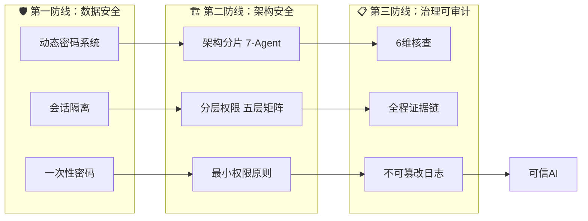

# AI安全三防线 — SelfBrain 银行级可信AI体系

> **核心主张**：从数据到架构到治理，三道防线构建全链路银行级安全，安全评分 **99/100**，攻击防护成功率 **100%（7/7）**。

---

## 总览：三道防线架构



---

## 🔐 第一防线：数据安全

> **防护目标**：确保敏感数据在存储、传输、使用全生命周期中不被窃取、截获或泄露。

| 核心技术 | 实现方式 | 量化指标 |
|----------|----------|----------|
| **动态密码生成** | MEMO-Cipher模型（CSPRNG），类银行U盾设计 | 每个会话独立密码，1.68M种组合 |
| **5分钟自动过期** | SDK内部三层清理（主动/被动/强制），密码到期即销毁 | 90%单轮对话覆盖+10%缓冲 |
| **会话级隔离** | session_id哈希绑定，跨会话密码完全不可用 | 同一数据不同会话→不同密码 |
| **一次一密** | 密码结构 TYPE+RANDOM+TIMESTAMP+SESSION，用后即废 | 碰撞概率仅0.006% |
| **TLS 1.3传输加密** | 密码传输全程加密，截获即失效 | 满足ISO27001传输安全要求 |

**一句话总结**：借鉴银行U盾的"一次一密+时效性"理念，以AI原生方式实现动态密码，密码5分钟自动过期、会话级隔离、用后即销毁，即使截获也无意义。

---

## 🏗️ 第二防线：架构安全

> **防护目标**：通过架构分片和分层权限，确保任何单一组件被攻破也不会导致全面失守。

| 核心技术 | 实现方式 | 量化指标 |
|----------|----------|----------|
| **7-Agent黑板模式** | Privacy Guardian（Leader）+ 6 Workers，松耦合协作 | Agent间零直接调用，全部通过共享黑板交互 |
| **五层权限矩阵** | L1检索/L2时序/L2.5图谱/L2.7预测/L3归档，逐层收紧 | 80%查询在L1完成，L3仅SelfBrain独占 |
| **动态令牌分配** | 按任务生成临时令牌，HMAC-SHA256签名，精确到key级别 | 令牌有效期3-10分钟，查询次数5-20次 |
| **最小权限裁剪** | SDK权限矩阵自动裁剪多余权限，三层防护（Wrapper→SDK→策略引擎） | 外部模型永远无法访问L2.7/L3 |
| **Skill三层架构** | Schema（开源）+ Wrapper（开源）+ SDK（闭源），开源可审计、闭源保护核心 | 6个Skill标准化封装，6-24月竞争壁垒 |

**一句话总结**：7个专业Agent通过黑板模式协作，五层权限矩阵逐层收紧，L2.7/L3仅SelfBrain独占——即使外部模型被攻破，最敏感数据依然安全。

---

## 📋 第三防线：治理可审计

> **防护目标**：所有安全操作全程留痕、不可篡改，确保事后可追溯、可审计、可证明合规。

| 核心技术 | 实现方式 | 量化指标 |
|----------|----------|----------|
| **6维核查** | Validator Agent对每次输出执行准确性/完整性/一致性/时效性/相关性/安全性核查 | 综合评分阈值≥80%，安全维度100%达标 |
| **全程证据链** | Audit Logger Worker记录每个Agent的每一步操作，形成不可断裂的证据链 | 每个令牌完整生命周期可回溯 |
| **不可篡改日志** | SDK闭源层自动生成审计日志，外部无法修改已写入记录 | 满足SOC2/GDPR/ISO27001审计要求 |
| **四层安全监控** | Dashboard实时展示密码状态/权限矩阵/数据保存/审计日志四个维度 | WebSocket实时推送，秒级更新 |
| **攻击模拟器** | 7种攻击场景自动模拟验证 | 7/7全部拦截，评分100分/场景 |

**一句话总结**：从密码生成到数据销毁，每一步操作都形成不可篡改的证据链，配合6维核查和四层Dashboard监控，让安全"看得见、查得到、改不了"。

---

## 🛡️ 攻击防护矩阵

> 7种攻击场景全部拦截，综合安全评分 **99/100**

| 攻击类型 | 攻击描述 | 防御机制 | 所在防线 | 结果 | 评分 |
|----------|----------|----------|----------|------|------|
| **密码截获** | 网络传输中窃取动态密码 | TLS 1.3 + 会话级隔离 | 第一防线 | ✅ BLOCKED | 100 |
| **重放攻击** | 重复使用已捕获的密码 | 一次一密 + 5分钟过期 | 第一防线 | ✅ BLOCKED | 100 |
| **权限越界** | 外部模型伪造L3层级密码 | 分层前缀验证 + L3独占 | 第二防线 | ✅ BLOCKED | 100 |
| **联合攻击** | 多模型协同尝试绕过权限 | 会话隔离 + 密码不可组合 | 第一+二防线 | ✅ BLOCKED | 100 |
| **暴力破解** | 穷举密码组合 | 5分钟过期 + 5次失败锁定 + 速率限制 | 第一防线 | ✅ BLOCKED | 100 |
| **侧信道攻击** | 通过系统行为推断密码 | SDK恒定时间比较 + 统一错误消息 | 第一防线 | ✅ BLOCKED | 100 |
| **时序攻击** | 通过响应时间推断信息 | 恒定时间字符串比较 + 随机延迟 | 第一防线 | ✅ BLOCKED | 100 |

---

## 📊 行业标准对标

| 安全标准 | SelfBrain实现 | 达标状态 |
|----------|---------------|----------|
| **SOC 2** | 全程审计日志 + 访问控制 + 加密传输 | ✅ 满足 |
| **GDPR** | 数据分层隔离 + L3独占 + 密码销毁（被遗忘权） | ✅ 满足 |
| **ISO 27001** | TLS 1.3 + 五层权限 + 动态令牌 + 证据链 | ✅ 满足 |
| **HIPAA** | 医疗数据L3独占 + 加密存储 + 审计追踪 | ✅ 满足 |

---

## 🏆 核心安全数据一览

| 指标 | 数值 |
|------|------|
| 安全评分 | **99/100** |
| 攻击防护成功率 | **100%（7/7）** |
| 密码过期时间 | **5分钟** |
| 会话隔离 | **每个对话独立密码** |
| 权限层级 | **五层（L1→L3）** |
| 外部模型可见数据 | **仅L1/L2/L2.5** |
| 安全监控维度 | **四层实时** |
| 核查维度 | **6维** |
| 审计日志 | **全程不可篡改** |
| 行业标准 | **SOC2 / GDPR / ISO27001 / HIPAA** |

---

## 💡 为什么是"三道"防线？

```mermaid
graph TD
    A["第一防线：数据安全"] -->|"密码截获？→ 自动过期"| B["第二防线：架构安全"]
    B -->|"权限绕过？→ 独占保护"| C["第三防线：治理可审计"]
    C -->|"操作不留痕？→ 不可篡改日志"]
    D["外部攻击"] --> A
    A -->|"✅ 拦截"| E[安全]
    B -->|"✅ 拦截"| E
    C -->|"✅ 拦截"| E
```

**层层递进，纵深防御**：
- 第一防线解决"数据能不能被偷"→ **动态密码+会话隔离**
- 第二防线解决"架构能不能被破"→ **7-Agent分片+五层权限**
- 第三防线解决"操作能不能被查"→ **证据链+不可篡改日志**

> **一句话**：三道防线 = 数据偷不走 + 架构破不了 + 操作赖不掉 = **可信AI**

---

*SelfBrain — 银行级安全，AI原生防护，从数据到架构到治理的全链路可信体系。*
