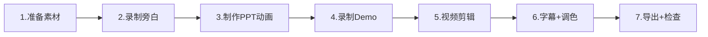

# SelfBrain GOAI 参赛演示视频方案

> **时长**：7分钟（420秒）  
> **目标受众**：GOAI 评审专家（AI Agent / 安全 / 产品方向）  
> **核心目标**：在7分钟内清晰传达"为什么需要SelfBrain""它怎么工作""比别人好在哪"  
> **日期**：2026-08-04

---

## 一、视频结构总览（时间轴）

| 时间段 | 章节 | 时长 | 核心信息 | 画面形式 |
|--------|------|------|---------|---------|
| 0:00 – 0:30 | 🎬 开场 | 30s | 项目名称、标语、团队 | PPT动画 + BGM |
| 0:30 – 1:30 | 😰 痛点与场景 | 60s | 为什么需要SelfBrain | 数据图表 + 动画演绎 |
| 1:30 – 3:00 | 🏗️ 核心架构演示 | 90s | 7-Agent黑板协同流程 | 架构动画 + 录屏 |
| 3:00 – 4:30 | 🔐 技术亮点演示 | 90s | 动态密码系统 + MemoryAdapter热切换 | 录屏Demo + 动画辅助 |
| 4:30 – 5:30 | 💻 实际Demo运行 | 60s | 企业财务分析场景 | 完整录屏 |
| 5:30 – 6:30 | ⚔️ 竞品对比与创新点 | 60s | 六维对比 + 开源策略 | 数据表格 + 图表 |
| 6:30 – 7:00 | 🎯 总结与愿景 | 30s | 核心价值 + 未来方向 | PPT动画 + 字幕 |

---

## 二、分场景详细方案

---

### 场景1：开场（0:00 – 0:30）

#### 🖥️ 画面描述

- 0:00–0:05 黑屏，一行字逐字显现：**"你的AI，你掌控"**
- 0:05–0:10 Logo动画：SelfBrain logo + 光粒子汇聚效果
- 0:10–0:20 核心定位文字依次浮现：
  - `隐私保护的多Agent协同系统`
  - `AgentInfra · 7-Agent · 6-Skill`
- 0:20–0:30 团队信息 + GOAI赛道标识

#### 🎙️ 旁白文案

> "当你的财务数据、客户信息、商业机密交给AI分析时——你真的放心吗？SelfBrain，让AI在你的地盘、按你的规则、守你的秘密。"

#### 🔧 技术细节

- PPT动画：文字逐行淡入，logo粒子效果用Canva/Keynote制作
- BGM：科技感轻音乐，音量逐渐升起（推荐 Artlist / Epidemic Sound）
- 字幕：全程中文字幕，关键词高亮

#### 📦 所需素材

| 素材 | 来源 | 状态 |
|------|------|------|
| SelfBrain Logo（白底/黑底） | 设计 | ⬜ 需制作 |
| "Your AI, Your Control" 动画 | PPT/Canva | ⬜ 需制作 |
| BGM音频 | 版权音乐库 | ⬜ 需选取 |
| GOAI赛道标识 | 赛事官网 | ⬜ 需下载 |

---

### 场景2：痛点与场景（0:30 – 1:30）

#### 🖥️ 画面描述

- **0:30–0:50 痛点1：数据泄露恐惧**
  - 画面：数据流从企业→云端→"未知黑箱"，配合红色警告动画
  - 新闻截图轮播（数据泄露事件）
- **0:50–1:05 痛点2：Token成本黑洞**
  - 画面：计价器动画，数字疯狂跳动（$5000→$50000）
  - 对比：同一个查询，传统方式 25000 tokens vs SelfBrain 180 tokens
- **1:05–1:20 痛点3：供应商锁定**
  - 画面：企业被锁链绑在一个AI服务上
  - 动画：锁链断裂 → 自由选择GPT-4/Claude/Gemini
- **1:20–1:30 过渡**
  - 画面："如果有一个系统，同时解决这三个问题呢？" → 引出SelfBrain

#### 🎙️ 旁白文案

> "企业用AI，三座大山：数据泄露风险、每月数万Token账单、被单一供应商绑架。传统方案只能解决一个，SelfBrain全部搞定。"

#### 🔧 技术细节

- 动画：数据流用粒子特效（PPT Motion / After Effects）
- 数字：Token成本用动态计价器动画
- 时间节奏：每个痛点15秒，信息密度要高但不赶

#### 📦 所需素材

| 素材 | 来源 | 状态 |
|------|------|------|
| 数据泄露新闻截图 | 网络搜索 | ⬜ 需收集 |
| Token计价器动画 | PPT动画 | ⬜ 需制作 |
| 锁链→自由动画 | Canva/PPT | ⬜ 需制作 |

---

### 场景3：核心架构演示（1:30 – 3:00）

#### 🖥️ 画面描述

- **1:30–1:50 架构全景图**
  - 动画展示7-Agent架构图（使用第2章的架构图）
  - Privacy Guardian居中高亮，6个Worker环绕
  - 共享黑板（Blackboard）在底部连接所有Agent
- **1:50–2:20 协同流程动画**
  - 模拟一条查询请求的完整流转：
    1. 用户请求 → Privacy Guardian 接收
    2. Guardian 发布任务到共享黑板（黑板上文字动态出现）
    3. Workers 轮番被调用：Memory Navigator → Policy Enforcer → Cipher Generator → Data Coordinator
    4. 每个Worker写入结果到黑板（黑板内容逐步填充）
    5. Validator 6维核查（6个绿色✓依次出现）
    6. Guardian 整合 → 返回用户
- **2:20–2:40 Agent能力卡片**
  - 7个Agent逐个弹出能力卡片（名称+职责+性能指标）
  - 表格：Agent | 角色 | 参数量 | 显存
- **2:40–3:00 黑板模式讲解**
  - 动画：黑板从空到满的过程
  - 强调：松耦合、可观测、易扩展

#### 🎙️ 旁白文案

> "SelfBrain的7个专业Agent，像一支交响乐团。Privacy Guardian是指挥家，通过共享黑板调度6个乐手。每个Agent只做一件事，做到极致。"

#### 🔧 技术细节

- 架构图动画：用Mermaid渲染的架构图作为基础，PPT中添加逐步出现动画
- 流程动画：推荐 After Effects 或 Canva Pro 制作
- 色彩编码：每个Agent用文档中的指定颜色（PG红、MN青、CG黄等）
- 黑板动画：文字从无到有、逐步填充效果

#### 📦 所需素材

| 素材 | 来源 | 状态 |
|------|------|------|
| 7-Agent架构图（静态） | 02-核心架构.md | ✅ 已有 |
| 协同流程动画 | 新制作 | ⬜ 需制作 |
| Agent能力卡片 | 文档数据 | ⬜ 需设计 |
| 黑板填充动画 | 新制作 | ⬜ 需制作 |

---

### 场景4：技术亮点演示（3:00 – 4:30）

#### 🖥️ 画面描述

**亮点A：动态密码系统（3:00–3:40）**

- **3:00–3:10** 动画：原始数据 → Cipher Generator → 加密密文
  - 展示密码结构：`AMOUNT_C3D9F2_T1722240900_S7A4B`
- **3:10–3:20** 对比动画：同一数据、不同会话 → 完全不同的密码
  - 会话A的密码 vs 会话B的密码（完全不同）
- **3:20–3:30** 安全特性列表逐项打勾：
  - ✅ 5分钟自动过期
  - ✅ 使用后立即销毁
  - ✅ 会话隔离不可互解
  - ✅ 类银行U盾级别
- **3:30–3:40** Dashboard截图：密码状态可视化界面

**亮点B：MemoryAdapter 热切换（3:40–4:30）**

- **3:40–3:55** 录屏：终端中执行配置切换
  ```
  # 从 SimpleFileAdapter 切换到 VectorDBAdapter
  router.set_active("vector_db")
  # → "🔄 已切换适配器: vector_db"
  ```
- **3:55–4:10** 分屏对比：同一个查询，三种适配器返回
  - 左：SimpleFileAdapter（文件路径匹配）
  - 中：VectorDBAdapter（语义相似度匹配）
  - 右：MemoryPalaceAdapter（五层架构检索）
- **4:10–4:20** 动画：开源/闭源边界图
  - 绿色区域（开源）：Agent逻辑 + Schema + Wrapper
  - 红色区域（闭源）：Core SDK
- **4:20–4:30** 商业分层表格弹出

#### 🎙️ 旁白文案（两段）

> "看Cipher Generator如何像银行U盾一样保护你的数据。同一份数据，每次加密都不同，5分钟过期，用完即毁。"

> "MemoryAdapter让Memory Navigator成为万能翻译器——本地文件、向量数据库、企业级记忆系统，一行配置无缝切换。"

#### 🔧 技术细节

- 密码动画：密文生成过程用打字机效果
- 录屏要求：1080p，终端字体清晰，操作缓慢可读
- 分屏对比：用OBS录屏 + 剪映分屏模板
- Dashboard截图：如暂无可用UI，用Figma设计静态mockup

#### 📦 所需素材

| 素材 | 来源 | 状态 |
|------|------|------|
| 密码生成动画 | 新制作 | ⬜ 需制作 |
| 会话隔离对比动画 | 新制作 | ⬜ 需制作 |
| Dashboard UI截图/mockup | 设计 | ⬜ 需制作 |
| 适配器切换录屏 | 实机录制 | ⬜ 需录制 |
| 分屏对比画面 | 录屏+剪辑 | ⬜ 需制作 |
| 开源边界图 | 02-核心架构.md | ✅ 已有 |

---

### 场景5：实际Demo运行（4:30 – 5:30）

#### 🖥️ 画面描述

**场景设定：企业CFO查询季度财务分析**

- **4:30–4:40** 录屏开始：终端/界面显示用户输入
  ```
  用户：请分析2026年Q3营收下降的原因，并与Q1、Q2对比
  ```
- **4:40–4:50** 黑板状态可视化（实时展示）：
  - Privacy Guardian 接收 → 分析意图
  - 任务发布到黑板（task字段出现）
- **4:50–5:05** Workers逐步执行（分屏或叠加显示）：
  - Memory Navigator：`"L1/finance/revenue/2026_Q3"` ✓
  - Policy Enforcer：`权限验证通过 ✓`
  - Cipher Generator：`数据加密完成 ✓`
  - Data Coordinator：`多源融合完成 ✓`
- **5:05–5:15** GPT-4处理（加密数据发送 → 分析结果返回）
  - 强调：GPT-4看到的是密码，不是原始数据
- **5:15–5:25** Validator 6维核查结果弹出
  ```
  准确性: 96% ✓  完整性: 92% ✓  一致性: 97% ✓
  时效性: 99% ✓  相关性: 94% ✓  安全性: 100% ✓
  总分: 96.3% ✅ PASS
  ```
- **5:25–5:30** 最终分析报告返回给用户

#### 🎙️ 旁白文案

> "来看一个真实场景。CFO想要分析Q3营收——SelfBrain的7个Agent像精密齿轮一样协作。GPT-4全程只看到加密密码，原始数据从未离开本地。"

#### 🔧 技术细节

- **这是整个视频的核心场景**，需要完整录屏
- 录屏分辨率：1920×1080
- 演示环境：需要预先准备好Memory Palace数据和Agent系统
- 黑板状态可视化：如果无现成UI，用动画叠加在录屏上方
- 速度：正常播放，关键节点暂停高亮
- 备用方案：如Demo无法实时运行，可用预先录制的GIF序列 + 旁白

#### 📦 所需素材

| 素材 | 来源 | 状态 |
|------|------|------|
| 完整Demo录屏 | 实机运行 | ⬜ 核心依赖 |
| 黑板状态动画叠加 | 新制作 | ⬜ 需制作 |
| Validator核查结果UI | 实机/mockup | ⬜ 需制作 |
| 备用预录制片段 | 分段录制 | ⬜ 需录制 |

---

### 场景6：竞品对比与创新点（5:30 – 6:30）

#### 🖥️ 画面描述

- **5:30–5:50** 六维对比雷达图动画
  - 5个方案：传统加密、AI网关、本地LLM、多Agent框架、**SelfBrain**
  - SelfBrain的区域最大、最突出（高亮红色）
- **5:50–6:05** 核心创新点卡片依次展示：
  - 🔐 7-Agent黑板协同架构（12-18月护城河）
  - 🧩 6-Skill三层沉淀体系
  - 🔑 动态密码系统（银行U盾级）
  - 🧠 Memory Palace深度集成
  - ✅ 可视化隐私验证 + Validator独立核查
  - 📦 开源接口 + 闭源核心
- **6:05–6:20** 技术护城河时间线
  - 时间轴动画：6个月 → 12个月 → 18个月 → 24个月
  - 每个节点标注追赶难度
- **6:20–6:30** 数据亮点总结
  ```
  Token节约: 70-80%
  响应延迟: <200ms
  准确率: >95%
  显存占用: ≤9GB
  ```

#### 🎙️ 旁白文案

> "传统加密太慢、AI网关不安全、本地LLM太弱、多Agent框架无隐私——SelfBrain全面领先。六个创新点，构建12到24个月的技术护城河。"

#### 🔧 技术细节

- 雷达图：用PPT图表功能 + 动画逐项出现
- 创新卡片：卡片式设计，带图标和关键词
- 护城河时间线：横向滚动时间轴动画
- 数据亮点：大号数字 + 动态计数效果

#### 📦 所需素材

| 素材 | 来源 | 状态 |
|------|------|------|
| 六维对比雷达图 | 01-项目概述.md数据 | ⬜ 需制作图表 |
| 创新点卡片设计 | 文档数据 | ⬜ 需设计 |
| 护城河时间线 | 新制作 | ⬜ 需制作 |
| 数据亮点动画 | PPT动画 | ⬜ 需制作 |

---

### 场景7：总结与愿景（6:30 – 7:00）

#### 🖥️ 画面描述

- **6:30–6:40** 核心价值三句话（大字居中逐行出现）：
  - 🛡️ **银行级安全** — 你的数据，永远在你手里
  - 🤖 **7-Agent协同** — 专业分工，比单体AI更强
  - 💰 **成本直降70%** — Token节约，企业买单
- **6:40–6:50** 愿景一句话 + 未来Roadmap快闪：
  - Q4 2026：开源社区1000+ Stars
  - 2027 H1：金融/医疗首签客户
  - 2027 H2：A轮融资
- **6:50–7:00** 结尾画面：
  - SelfBrain Logo + 标语
  - "Your AI, Your Control"
  - GitHub链接 / 联系方式
  - GOAI赛道标识
  - 黑屏淡出

#### 🎙️ 旁白文案

> "SelfBrain——让每个企业都敢用AI。你的AI，你掌控。"

#### 🔧 技术细节

- 三句话：字号大、动画醒目、停留时间足够
- Roadmap：快闪式，每条2秒
- 结尾：简洁有力，留白+Logo
- BGM在此处渐弱 → 最后1秒静音

#### 📦 所需素材

| 素材 | 来源 | 状态 |
|------|------|------|
| 价值主张文案设计 | PPT | ⬜ 需制作 |
| Roadmap时间线 | PPT | ⬜ 需制作 |
| 结尾Logo动画 | PPT/Canva | ⬜ 需制作 |

---

## 三、录制Demo脚本（场景5详版）

> 以下为实际录屏时的操作步骤，建议提前排练2-3次。

### 准备工作

1. **环境检查**
   - [ ] SelfBrain 7-Agent系统启动成功
   - [ ] Memory Navigator 已加载数据（财务数据集）
   - [ ] GPT-4 API连接正常
   - [ ] 终端字体：18px+，深色主题
   - [ ] 屏幕分辨率：1920×1080
   - [ ] 关闭所有通知（勿扰模式）

2. **预置数据**
   - Q1营收：¥4,300,000
   - Q2营收：¥4,500,000
   - Q3营收：¥4,200,000（下降6.7%）
   - 相关部门数据、市场数据等

### 录制步骤

| 步骤 | 操作 | 预期输出 | 时长 |
|------|------|---------|------|
| 1 | 打开终端，启动SelfBrain | Logo + "System Ready" | 3s |
| 2 | 输入查询：`请分析2026年Q3营收下降原因` | 请求被Privacy Guardian接收 | 5s |
| 3 | 切换到黑板可视化界面 | 任务字段动态出现 | 5s |
| 4 | 高亮Memory Navigator执行 | 检索路径显示 | 5s |
| 5 | 高亮Policy Enforcer执行 | 权限验证✓ | 3s |
| 6 | 高亮Cipher Generator执行 | 加密完成✓ | 3s |
| 7 | 高亮Data Coordinator执行 | 融合完成✓ | 3s |
| 8 | 显示加密数据发送给GPT-4 | 密文界面 | 5s |
| 9 | Validator 6维核查结果 | 6项评分全部✓ | 5s |
| 10 | 最终报告输出 | 完整分析报告 | 8s |

**录制工具**：OBS Studio（免费，支持多场景切换）

---

## 四、制作工具与工作流

### 推荐工具链

| 环节 | 推荐工具 | 备选 | 说明 |
|------|---------|------|------|
| **录屏** | OBS Studio | Camtasia | 免费、支持多场景、1080p |
| **PPT制作** | Keynote / PowerPoint | Canva Pro | 动画效果要流畅 |
| **动画制作** | After Effects | Canva动画 | 复杂粒子/流程动画 |
| **图表制作** | Figma + PPT | Canva | 雷达图、架构图 |
| **视频剪辑** | 剪映专业版 | DaVinci Resolve | 上手快、模板丰富 |
| **音频处理** | Audacity | Adobe Audition | 旁白录制/降噪 |
| **字幕** | 剪映自动字幕 | Arctime | 自动生成+人工校对 |

### 制作流程



**各步骤时间估算**：

| 步骤 | 预计工时 | 优先级 |
|------|---------|--------|
| 素材准备（截图、数据、音乐） | 2h | P0 |
| 旁白录制（含文案打磨） | 2h | P0 |
| PPT/动画制作 | 4h | P0 |
| Demo录屏（含排练） | 3h | P0 |
| 视频剪辑 | 3h | P1 |
| 字幕+调色+最终检查 | 2h | P1 |
| **总计** | **约16h** | — |

### 旁白录制建议

- **设备**：USB麦克风（如 Blue Yeti），安静房间
- **软件**：Audacity（免费）
- **参数**：48kHz / 16bit / WAV格式
- **节奏**：每分钟120-140字（中文），比日常说话稍慢
- **情绪**：开场沉稳有力 → 痛点带紧迫感 → 技术讲解清晰自信 → 结尾激昂收束
- **分段录制**：按场景分7段录制，后期拼接

---

## 五、旁白完整文案（逐字稿）

> 以下为完整旁白，每段标注对应场景和字数。总字数约850字，对应7分钟视频。

---

**【场景1：开场 0:00–0:30】** ≈60字

> 当你的财务数据、客户信息、商业机密交给AI分析时——你真的放心吗？SelfBrain，让AI在你的地盘、按你的规则、守你的秘密。

**【场景2：痛点 0:30–1:30】** ≈100字

> 企业用AI，三座大山：数据泄露风险——每年数百起重大事件；Token账单——月均数万美元，简单分析动辄上千；供应商锁定——一旦选定，进退两难。传统方案只能解决一个。有没有一个系统，能同时搞定这三件事？

**【场景3：架构 1:30–3:00】** ≈150字

> SelfBrain采用7-Agent黑板协同架构。Privacy Guardian是指挥家，接收请求后将任务写入共享黑板。Memory Navigator负责数据检索，Cipher Generator处理加密，Policy Enforcer验证权限，Data Coordinator融合多源数据，Audit Logger全程记录，Validator做六维核查。七个Agent各司其职，通过黑板松耦合协作——可观测、可扩展、可审计。

**【场景4：亮点 3:00–4:30】** ≈150字

> 两个核心亮点。第一，动态密码系统。看这个密码——每次生成都不同，五分钟后自动过期，用完即毁，就像银行U盾。同一份数据，在不同会话中呈现完全不同的密码。第二，MemoryAdapter适配器。从本地文件到向量数据库，再到企业级记忆系统——只需一行配置，零代码切换。Memory Navigator自动适应新的后端。

**【场景5：Demo 4:30–5:30】** ≈100字

> 来看真实运行。CFO查询"分析Q3营收下降原因"。Privacy Guardian接收后，七个Agent依次执行：检索、验证、加密、融合。看——GPT-4收到的全是加密密码，原始数据从未离开本地。最终，Validator六维核查通过，得分96.3分，一份完整的分析报告交付给CFO。

**【场景6：对比 5:30–6:30】** ≈100字

> 和竞品相比呢？传统加密太慢——性能差百倍；AI网关不安全——明文传输；本地LLM太弱——模型能力有限；多Agent框架无隐私——数据裸奔。SelfBrain全面领先。六个创新点，构建12到24个月的技术护城河。Token节约70%以上，响应延迟200毫秒以内。

**【场景7：结尾 6:30–7:00】** ≈50字

> SelfBrain——让每个企业都敢用AI。银行级安全，七Agent协同，成本直降七成。你的AI，你掌控。

---

## 六、PPT动画配合建议

如果视频中穿插PPT画面（非全录屏），以下为动画节奏建议：

| 场景 | PPT页数 | 动画类型 | 切换方式 |
|------|---------|---------|---------|
| 开场 | 2页 | 文字逐行淡入 | 自动（3秒/页） |
| 痛点 | 4页 | 数字计数器+图标弹入 | 自动（15秒/页） |
| 架构 | 3页 | 流程逐步出现 | 自动（30秒/页） |
| 亮点 | 2页 | 分步动画 | 旁白驱动 |
| Demo | 0页 | 全录屏 | — |
| 对比 | 3页 | 雷达图绘制+卡片弹入 | 自动（20秒/页） |
| 结尾 | 2页 | 大字淡入+Logo动画 | 自动（15秒/页） |

**PPT设计规范**：
- 背景：深色（#1a1a2e 或 #0f0f23）
- 主色：SelfBrain品牌蓝 #4a90d9
- 强调色：红色 #ff6b6b（警示）/ 绿色 #4ecdc4（成功）
- 字体：中文用思源黑体 / 英文用 Inter / 代码用 JetBrains Mono
- 字号：标题48px / 正文28px / 标注20px

---

## 七、素材检查清单

### 优先级 P0（必须有）

- [ ] SelfBrain Logo（白底 + 透明底）
- [ ] 7-Agent架构图（高清版）
- [ ] 竞品对比雷达图
- [ ] Demo录屏（或模拟动画）
- [ ] 旁白音频（7段）
- [ ] BGM音频

### 优先级 P1（强烈建议）

- [ ] 黑板协同流程动画
- [ ] 密码生成动画
- [ ] 适配器切换录屏
- [ ] Dashboard/UI截图或Mockup
- [ ] Token成本对比动画

### 优先级 P2（锦上添花）

- [ ] 数据泄露新闻截图
- [ ] 企业场景插画
- [ ] 背景粒子特效
- [ ] 片尾致谢/引用

---

## 八、风险与备用方案

| 风险 | 概率 | 影响 | 备用方案 |
|------|------|------|---------|
| Demo系统未就绪 | 中 | 场景5无法录屏 | 用动画模拟Demo流程，旁白说明"这是系统运行的模拟演示" |
| 录屏画面不够清晰 | 低 | 可读性差 | 放大关键区域 + 添加注释箭头 |
| 旁白录音质量差 | 低 | 观感下降 | 使用AI语音合成（如 Azure TTS）作为备用 |
| 视频超过7分钟 | 中 | 不符合要求 | 精简痛点场景（从60s压缩到40s） |
| 动画制作耗时过长 | 高 | 延期 | 简化为PPT基础动画 + 录屏为主 |

---

## 九、交付标准

- [ ] 最终视频：MP4格式，1920×1080，30fps
- [ ] 文件大小：<500MB
- [ ] 时长：6:50 – 7:10（允许±10秒误差）
- [ ] 旁白：中文普通话，全程字幕
- [ ] BGM：贯穿全片，音量不压旁白
- [ ] 导出：H.264编码，码率≥8Mbps
